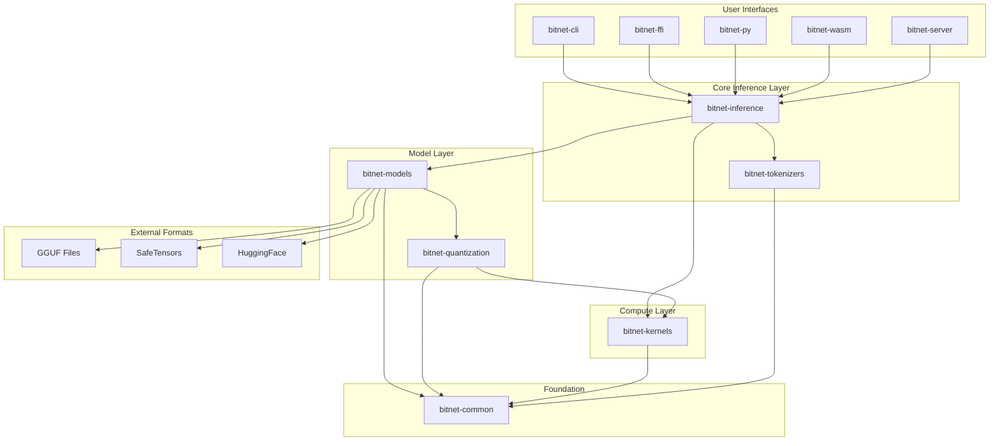

# BitNet.cpp to Rust Migration Design

## Overview

This design document outlines the architecture for migrating BitNet.cpp from Python/C++ to Rust, creating a production-ready, high-performance 1-bit LLM inference framework. The design emphasizes incremental migration, comprehensive testing, and modern Rust ecosystem integration while achieving superior performance and maintainability.

The migration follows a staged approach with FFI bootstrapping, allowing for gradual replacement of components while maintaining functionality throughout the process. The final Rust implementation will be a modular, workspace-based crate suitable for crates.io publication with comprehensive feature flags and cross-platform support.

## Architecture

### Modular System Architecture



### Modular Workspace Structure

```
bitnet-rs/
├── Cargo.toml                 # Workspace root
├── README.md                  # Generated from lib.rs docs
├── THIRD_PARTY.md            # License attributions
├── unsafe_report.md          # Safety documentation
├── .github/
│   └── workflows/
│       ├── ci.yml            # Multi-platform CI/CD
│       ├── release.yml       # Automated releases
│       └── benchmark.yml     # Performance tracking
├── crates/
│   ├── bitnet-common/        # Shared types and utilities
│   │   ├── Cargo.toml
│   │   └── src/
│   │       ├── lib.rs
│   │       ├── config.rs     # Configuration types
│   │       ├── error.rs      # Error types
│   │       ├── tensor.rs     # Tensor abstractions
│   │       └── types.rs      # Common type definitions
│   ├── bitnet-models/        # Model definitions and loading
│   │   ├── Cargo.toml
│   │   └── src/
│   │       ├── lib.rs
│   │       ├── bitnet.rs     # BitNet model implementation
│   │       ├── loader.rs     # Model loading logic
│   │       ├── formats/      # Format-specific loaders
│   │       │   ├── gguf.rs
│   │       │   ├── safetensors.rs
│   │       │   └── huggingface.rs
│   │       └── registry.rs   # Model registry/management
│   ├── bitnet-quantization/  # Quantization algorithms
│   │   ├── Cargo.toml
│   │   └── src/
│   │       ├── lib.rs
│   │       ├── i2s.rs        # I2_S quantization
│   │       ├── tl1.rs        # TL1 quantization (ARM)
│   │       ├── tl2.rs        # TL2 quantization (x86)
│   │       └── utils.rs      # Quantization utilities
│   ├── bitnet-kernels/       # High-performance compute kernels
│   │   ├── Cargo.toml
│   │   ├── build.rs          # Kernel compilation
│   │   └── src/
│   │       ├── lib.rs
│   │       ├── cpu/          # CPU kernels
│   │       │   ├── mod.rs
│   │       │   ├── fallback.rs
│   │       │   ├── avx2.rs   # x86 AVX2 kernels
│   │       │   ├── avx512.rs # x86 AVX-512 kernels
│   │       │   └── neon.rs   # ARM NEON kernels
│   │       ├── gpu/          # GPU kernels
│   │       │   ├── mod.rs
│   │       │   ├── cuda.rs   # CUDA implementation
│   │       │   └── metal.rs  # Metal implementation (future)
│   │       └── ffi/          # FFI to C++ kernels (temporary)
│   │           ├── mod.rs
│   │           └── bindings.rs
│   ├── bitnet-inference/     # Inference engines
│   │   ├── Cargo.toml
│   │   └── src/
│   │       ├── lib.rs
│   │       ├── engine.rs     # Core inference engine
│   │       ├── cpu.rs        # CPU-specific optimizations
│   │       ├── gpu.rs        # GPU-specific optimizations
│   │       ├── streaming.rs  # Streaming generation
│   │       ├── batch.rs      # Batch processing
│   │       └── sampling.rs   # Sampling strategies
│   ├── bitnet-tokenizers/    # Tokenization support
│   │   ├── Cargo.toml
│   │   └── src/
│   │       ├── lib.rs
│   │       ├── gpt2.rs       # GPT-2 tokenizer
│   │       ├── sentencepiece.rs # SentencePiece tokenizer
│   │       └── huggingface.rs # HuggingFace tokenizer integration
│   ├── bitnet-server/        # HTTP server implementation
│   │   ├── Cargo.toml
│   │   └── src/
│   │       ├── lib.rs
│   │       ├── handlers.rs   # Request handlers
│   │       ├── middleware.rs # Middleware
│   │       ├── streaming.rs  # Server-sent events
│   │       └── metrics.rs    # Prometheus metrics
│   ├── bitnet-cli/           # Command-line interface
│   │   ├── Cargo.toml
│   │   └── src/
│   │       ├── main.rs
│   │       ├── commands/     # CLI subcommands
│   │       │   ├── inference.rs
│   │       │   ├── convert.rs
│   │       │   ├── benchmark.rs
│   │       │   └── serve.rs
│   │       └── config.rs     # Configuration management
│   ├── bitnet-ffi/           # C API bindings
│   │   ├── Cargo.toml
│   │   ├── src/
│   │   │   ├── lib.rs
│   │   │   └── c_api.rs      # C-compatible API
│   │   └── include/
│   │       └── bitnet.h      # C header
│   ├── bitnet-py/            # Python bindings
│   │   ├── Cargo.toml
│   │   ├── pyproject.toml    # Maturin configuration
│   │   └── src/
│   │       ├── lib.rs        # PyO3 bindings
│   │       ├── model.rs      # Python model wrapper
│   │       └── inference.rs  # Python inference wrapper
│   └── bitnet-wasm/          # WebAssembly bindings
│       ├── Cargo.toml
│       ├── src/
│       │   ├── lib.rs        # wasm-bindgen bindings
│       │   ├── model.rs      # WASM model wrapper
│       │   └── utils.rs      # WASM utilities
│       └── pkg/              # Generated WASM package
├── examples/                 # Usage examples
│   ├── basic/
│   │   ├── cpu_inference.rs
│   │   ├── gpu_inference.rs
│   │   └── streaming.rs
│   ├── server/
│   │   ├── simple_server.rs
│   │   ├── load_balanced.rs
│   │   └── docker/
│   ├── integrations/
│   │   ├── axum_server.rs
│   │   ├── warp_server.rs
│   │   └── jupyter_notebook.ipynb
│   ├── wasm/
│   │   ├── browser_demo.html
│   │   ├── worker_demo.js
│   │   └── npm_package/
│   └── python/
│       ├── basic_usage.py
│       ├── migration_example.py
│       └── async_streaming.py
├── tests/                    # Integration tests
│   ├── cross_validation/     # Python parity tests
│   ├── model_tests/          # Model loading tests
│   ├── kernel_tests/         # Kernel correctness tests
│   ├── wasm_tests/           # WebAssembly tests
│   └── performance/          # Performance regression tests
├── benches/                  # Comprehensive benchmarks
│   ├── inference.rs          # Inference benchmarks
│   ├── kernels.rs           # Kernel benchmarks
│   ├── quantization.rs      # Quantization benchmarks
│   └── memory.rs            # Memory usage benchmarks
└── kernels/                  # C++ kernels (temporary)
    ├── ggml-bitnet-lut.cpp
    ├── ggml-bitnet-mad.cpp
    └── include/
        └── ggml-bitnet.h
```

### Crate Dependencies and Feature Flags

#### Workspace Dependencies
```toml
# Cargo.toml (workspace root)
[workspace]
members = [
    "crates/bitnet-common",
    "crates/bitnet-models", 
    "crates/bitnet-quantization",
    "crates/bitnet-kernels",
    "crates/bitnet-inference",
    "crates/bitnet-tokenizers",
    "crates/bitnet-server",
    "crates/bitnet-cli",
    "crates/bitnet-ffi",
    "crates/bitnet-py",
    "crates/bitnet-wasm",
]

[workspace.dependencies]
# Shared dependencies across crates
anyhow = "1.0"
thiserror = "1.0"
serde = { version = "1.0", features = ["derive"] }
candle-core = "0.8"
```

#### Individual Crate Features
```toml
# bitnet-kernels features
[features]
default = ["cpu-fallback"]
cpu-fallback = []            # Basic CPU kernels
cpu-optimized = ["avx2", "neon"]  # Optimized SIMD kernels
avx2 = []                    # x86 AVX2 support
avx512 = []                  # x86 AVX-512 support  
neon = []                    # ARM NEON support
cuda = ["cudarc"]            # CUDA GPU support
metal = ["metal-rs"]         # Metal GPU support (future)
ffi-bridge = ["cc", "bindgen"]  # C++ FFI bridge

# bitnet-inference features
[features]
default = ["cpu"]
cpu = ["bitnet-kernels/cpu-optimized"]
gpu = ["bitnet-kernels/cuda"]
streaming = ["tokio", "futures"]
batch = ["rayon"]

# bitnet-wasm features
[features]
default = ["browser"]
browser = ["wasm-bindgen", "js-sys", "web-sys"]
nodejs = ["wasm-bindgen"]
embedded = []                # no_std support

# Top-level convenience features
[features]
default = ["cpu"]
cpu = ["bitnet-inference/cpu"]
gpu = ["bitnet-inference/gpu"] 
wasm = ["bitnet-wasm"]
python = ["bitnet-py"]
server = ["bitnet-server"]
full = ["cpu", "gpu", "python", "server"]
```

## Components and Interfaces

### Foundation Layer (bitnet-common)

#### Shared Types and Configuration
```rust
// bitnet-common/src/lib.rs
pub mod config;
pub mod error;
pub mod tensor;
pub mod types;

// Common configuration types
#[derive(Debug, Clone, Serialize, Deserialize)]
pub struct BitNetConfig {
    pub model: ModelConfig,
    pub inference: InferenceConfig,
    pub quantization: QuantizationConfig,
    pub performance: PerformanceConfig,
}

// Unified error handling
#[derive(Error, Debug)]
pub enum BitNetError {
    #[error("Model error: {0}")]
    Model(#[from] ModelError),
    #[error("Quantization error: {0}")]
    Quantization(#[from] QuantizationError),
    #[error("Kernel error: {0}")]
    Kernel(#[from] KernelError),
    #[error("Inference error: {0}")]
    Inference(#[from] InferenceError),
}

// Tensor abstraction
pub trait Tensor: Send + Sync {
    fn shape(&self) -> &[usize];
    fn dtype(&self) -> DType;
    fn device(&self) -> &Device;
    fn as_slice<T>(&self) -> Result<&[T]>;
}
```

### Model Layer (bitnet-models)

#### Model Definitions and Loading
```rust
// bitnet-models/src/lib.rs
use bitnet_common::{BitNetConfig, BitNetError, Tensor};

pub trait Model: Send + Sync {
    type Config: ModelConfig;
    
    fn config(&self) -> &Self::Config;
    fn forward(&self, input: &dyn Tensor, cache: &mut KVCache) -> Result<Box<dyn Tensor>>;
    fn generate(&self, tokens: &[u32], config: &GenerationConfig) -> Result<Vec<u32>>;
}

pub struct BitNetModel {
    config: BitNetConfig,
    layers: Vec<TransformerBlock>,
    embeddings: Embedding,
    output: Linear,
    quantization: QuantizationType,
}

// Model loading with pluggable format support
pub struct ModelLoader {
    device: Device,
    dtype: DType,
    loaders: HashMap<String, Box<dyn FormatLoader>>,
}

pub trait FormatLoader: Send + Sync {
    fn can_load(&self, path: &Path) -> bool;
    fn load(&self, path: &Path, config: &LoadConfig) -> Result<Box<dyn Model>>;
}

// Format-specific implementations
pub struct GgufLoader;
pub struct SafeTensorsLoader;
pub struct HuggingFaceLoader;
```

### Quantization Layer (bitnet-quantization)

#### Quantization Algorithms
```rust
// bitnet-quantization/src/lib.rs
use bitnet_common::{Tensor, BitNetError};

#[derive(Debug, Clone, Copy)]
pub enum QuantizationType {
    I2S,    // 2-bit signed
    TL1,    // Table lookup 1 (ARM optimized)
    TL2,    // Table lookup 2 (x86 optimized)
}

pub trait Quantize {
    fn quantize(&self, qtype: QuantizationType) -> Result<QuantizedTensor>;
    fn dequantize(&self) -> Result<Box<dyn Tensor>>;
}

pub struct QuantizedTensor {
    data: Vec<u8>,
    scales: Vec<f32>,
    shape: Vec<usize>,
    qtype: QuantizationType,
}

// Modular quantization implementations
pub mod i2s;
pub mod tl1;
pub mod tl2;
```

### Compute Layer (bitnet-kernels)

#### High-Performance Kernels
```rust
// bitnet-kernels/src/lib.rs
use bitnet_common::BitNetError;

pub trait KernelProvider: Send + Sync {
    fn name(&self) -> &'static str;
    fn is_available(&self) -> bool;
    fn matmul_i2s(&self, a: &[i8], b: &[u8], c: &mut [f32], m: usize, n: usize, k: usize) -> Result<()>;
    fn quantize(&self, input: &[f32], output: &mut [u8], scales: &mut [f32], qtype: QuantizationType) -> Result<()>;
}

// Kernel selection and management
pub struct KernelManager {
    providers: Vec<Box<dyn KernelProvider>>,
    selected: Option<usize>,
}

impl KernelManager {
    pub fn new() -> Self {
        let mut providers: Vec<Box<dyn KernelProvider>> = vec![
            Box::new(FallbackKernel),
        ];
        
        #[cfg(target_arch = "x86_64")]
        {
            if is_x86_feature_detected!("avx2") {
                providers.push(Box::new(Avx2Kernel));
            }
            if is_x86_feature_detected!("avx512f") {
                providers.push(Box::new(Avx512Kernel));
            }
        }
        
        #[cfg(target_arch = "aarch64")]
        {
            if std::arch::is_aarch64_feature_detected!("neon") {
                providers.push(Box::new(NeonKernel));
            }
        }
        
        #[cfg(feature = "cuda")]
        {
            if let Ok(cuda_kernel) = CudaKernel::new() {
                providers.push(Box::new(cuda_kernel));
            }
        }
        
        Self {
            providers,
            selected: None,
        }
    }
    
    pub fn select_best(&mut self) -> Result<&dyn KernelProvider> {
        // Select the best available kernel
        for (i, provider) in self.providers.iter().enumerate() {
            if provider.is_available() {
                self.selected = Some(i);
                return Ok(provider.as_ref());
            }
        }
        Err(BitNetError::Kernel("No available kernel provider".into()))
    }
}

// Individual kernel implementations
pub mod cpu;
pub mod gpu;
pub mod ffi;
```

### Inference Layer (bitnet-inference)

#### Inference Engines
```rust
// bitnet-inference/src/lib.rs
use bitnet_models::Model;
use bitnet_tokenizers::Tokenizer;
use bitnet_kernels::KernelManager;
use bitnet_common::{BitNetConfig, BitNetError};

pub struct InferenceEngine {
    model: Box<dyn Model>,
    tokenizer: Arc<dyn Tokenizer>,
    kernels: KernelManager,
    device: Device,
    config: InferenceConfig,
}

impl InferenceEngine {
    pub fn new(
        model: Box<dyn Model>,
        tokenizer: Arc<dyn Tokenizer>,
        device: Device,
    ) -> Result<Self> {
        let mut kernels = KernelManager::new();
        kernels.select_best()?;
        
        Ok(Self {
            model,
            tokenizer,
            kernels,
            device,
            config: InferenceConfig::default(),
        })
    }
    
    pub fn generate(&mut self, prompt: &str) -> Result<String> {
        let tokens = self.tokenizer.encode(prompt, false)?;
        let generated = self.generate_tokens(&tokens, &self.config)?;
        Ok(self.tokenizer.decode(&generated, true)?)
    }
    
    pub fn generate_stream(&mut self, prompt: &str) -> impl Stream<Item = Result<String>> {
        GenerationStream::new(self, prompt)
    }
}

// Specialized engines for different backends
pub mod cpu;
pub mod gpu;
pub mod streaming;
pub mod batch;
```

### Tokenization Layer (bitnet-tokenizers)

#### Tokenizer Abstraction
```rust
// bitnet-tokenizers/src/lib.rs
use bitnet_common::BitNetError;

pub trait Tokenizer: Send + Sync {
    fn encode(&self, text: &str, add_special_tokens: bool) -> Result<Vec<u32>>;
    fn decode(&self, tokens: &[u32], skip_special_tokens: bool) -> Result<String>;
    fn vocab_size(&self) -> usize;
    fn eos_token_id(&self) -> Option<u32>;
    fn pad_token_id(&self) -> Option<u32>;
}

// Tokenizer implementations
pub struct Gpt2Tokenizer {
    inner: tokenizers::Tokenizer,
}

pub struct SentencePieceTokenizer {
    processor: sentencepiece::SentencePieceProcessor,
}

pub struct HuggingFaceTokenizer {
    tokenizer: tokenizers::Tokenizer,
}

// Tokenizer factory
pub struct TokenizerBuilder;

impl TokenizerBuilder {
    pub fn from_pretrained(name: &str) -> Result<Box<dyn Tokenizer>> {
        match name {
            "gpt2" => Ok(Box::new(Gpt2Tokenizer::new()?)),
            name if name.contains("sentencepiece") => {
                Ok(Box::new(SentencePieceTokenizer::from_file(name)?))
            }
            _ => Ok(Box::new(HuggingFaceTokenizer::from_pretrained(name)?)),
        }
    }
}
```

### Server Layer (bitnet-server)

#### HTTP Server Implementation

```rust
// Core model traits and implementations
pub trait Model: Send + Sync {
    type Config: ModelConfig;
    
    fn config(&self) -> &Self::Config;
    fn forward(&self, input: &Tensor, cache: &mut KVCache) -> Result<Tensor>;
    fn generate(&self, tokens: &[u32], config: &GenerationConfig) -> Result<Vec<u32>>;
}

pub struct BitNetModel {
    config: BitNetConfig,
    layers: Vec<TransformerBlock>,
    embeddings: Embedding,
    output: Linear,
    quantization: QuantizationType,
}

impl Model for BitNetModel {
    type Config = BitNetConfig;
    
    fn forward(&self, input: &Tensor, cache: &mut KVCache) -> Result<Tensor> {
        let mut hidden = self.embeddings.forward(input)?;
        
        for (i, layer) in self.layers.iter().enumerate() {
            hidden = layer.forward(hidden, &mut cache.layers[i])?;
        }
        
        self.output.forward(hidden)
    }
}

// Model loading with format detection
pub struct ModelLoader {
    device: Device,
    dtype: DType,
}

impl ModelLoader {
    pub fn load<P: AsRef<Path>>(&self, path: P) -> Result<Box<dyn Model>> {
        let path = path.as_ref();
        match path.extension().and_then(|s| s.to_str()) {
            Some("gguf") => self.load_gguf(path),
            Some("safetensors") => self.load_safetensors(path),
            _ => self.detect_and_load(path),
        }
    }
    
    fn load_gguf<P: AsRef<Path>>(&self, path: P) -> Result<Box<dyn Model>> {
        let file = std::fs::File::open(path)?;
        let mmap = unsafe { memmap2::Mmap::map(&file)? };
        let reader = GgufReader::new(&mmap)?;
        
        let config = BitNetConfig::from_gguf(&reader)?;
        let tensors = self.load_tensors_from_gguf(&reader, &config)?;
        
        Ok(Box::new(BitNetModel::from_tensors(config, tensors)?))
    }
}
```

#### Quantization System

```rust
// Quantization trait and implementations
pub trait Quantize {
    fn quantize(&self, qtype: QuantizationType) -> Result<QuantizedTensor>;
    fn dequantize(&self) -> Result<Tensor>;
}

#[derive(Debug, Clone, Copy)]
pub enum QuantizationType {
    I2S,    // 2-bit signed
    TL1,    // Table lookup 1 (ARM optimized)
    TL2,    // Table lookup 2 (x86 optimized)
}

pub struct QuantizedTensor {
    data: Vec<u8>,
    scales: Vec<f32>,
    shape: Vec<usize>,
    qtype: QuantizationType,
}

impl Quantize for Tensor {
    fn quantize(&self, qtype: QuantizationType) -> Result<QuantizedTensor> {
        match qtype {
            QuantizationType::I2S => quantize_i2s(self),
            QuantizationType::TL1 => quantize_tl1(self),
            QuantizationType::TL2 => quantize_tl2(self),
        }
    }
}

// Architecture-specific quantization implementations
#[cfg(target_arch = "aarch64")]
fn quantize_tl1(tensor: &Tensor) -> Result<QuantizedTensor> {
    use crate::kernels::arm::tl1_quantize;
    
    let data = tensor.as_slice::<f32>()?;
    let scale = data.iter().map(|x| x.abs()).fold(0.0f32, f32::max);
    
    let mut quantized = vec![0u8; data.len() / 4]; // 2 bits per weight
    let mut scales = vec![scale];
    
    unsafe {
        tl1_quantize(
            data.as_ptr(),
            quantized.as_mut_ptr(),
            scales.as_mut_ptr(),
            data.len(),
        );
    }
    
    Ok(QuantizedTensor {
        data: quantized,
        scales,
        shape: tensor.shape().to_vec(),
        qtype: QuantizationType::TL1,
    })
}
```

#### Inference Engine

```rust
// Inference engine with CPU/GPU backends
pub struct InferenceEngine {
    model: Box<dyn Model>,
    tokenizer: Arc<Tokenizer>,
    device: Device,
    config: InferenceConfig,
}

impl InferenceEngine {
    pub fn new(
        model: Box<dyn Model>,
        tokenizer: Arc<Tokenizer>,
        device: Device,
    ) -> Self {
        Self {
            model,
            tokenizer,
            device,
            config: InferenceConfig::default(),
        }
    }
    
    pub fn generate(&mut self, prompt: &str) -> Result<String> {
        let tokens = self.tokenizer.encode(prompt, false)?;
        let generated = self.generate_tokens(&tokens, &self.config)?;
        Ok(self.tokenizer.decode(&generated, true)?)
    }
    
    pub fn generate_stream(&mut self, prompt: &str) -> impl Stream<Item = Result<String>> {
        let tokens = self.tokenizer.encode(prompt, false).unwrap();
        GenerationStream::new(self, tokens)
    }
    
    fn generate_tokens(&mut self, input: &[u32], config: &GenerationConfig) -> Result<Vec<u32>> {
        let mut cache = KVCache::new(self.model.config(), config.max_length);
        let mut tokens = input.to_vec();
        
        for _ in 0..config.max_new_tokens {
            let input_tensor = Tensor::from_slice(&tokens, &[tokens.len()], &self.device)?;
            let logits = self.model.forward(&input_tensor, &mut cache)?;
            
            let next_token = self.sample_token(&logits, config)?;
            tokens.push(next_token);
            
            if next_token == self.tokenizer.eos_token_id() {
                break;
            }
        }
        
        Ok(tokens[input.len()..].to_vec())
    }
}

// Streaming generation
pub struct GenerationStream<'a> {
    engine: &'a mut InferenceEngine,
    tokens: Vec<u32>,
    cache: KVCache,
    position: usize,
    config: GenerationConfig,
}

impl<'a> Stream for GenerationStream<'a> {
    type Item = Result<String>;
    
    fn poll_next(mut self: Pin<&mut Self>, cx: &mut Context<'_>) -> Poll<Option<Self::Item>> {
        if self.position >= self.config.max_new_tokens {
            return Poll::Ready(None);
        }
        
        // Generate next token
        let input_tensor = Tensor::from_slice(&self.tokens, &[self.tokens.len()], &self.engine.device)?;
        let logits = self.engine.model.forward(&input_tensor, &mut self.cache)?;
        let next_token = self.engine.sample_token(&logits, &self.config)?;
        
        self.tokens.push(next_token);
        self.position += 1;
        
        if next_token == self.engine.tokenizer.eos_token_id() {
            return Poll::Ready(None);
        }
        
        let decoded = self.engine.tokenizer.decode(&[next_token], false)?;
        Poll::Ready(Some(Ok(decoded)))
    }
}
```

### Kernel System

#### CPU Kernels with SIMD Optimization

```rust
// CPU kernel abstraction
pub mod kernels {
    pub mod cpu {
        use std::arch::x86_64::*;
        use std::arch::aarch64::*;
        
        pub trait CpuKernel {
            fn matmul_i2s(&self, a: &[i8], b: &[u8], c: &mut [f32], m: usize, n: usize, k: usize);
            fn quantize_tl1(&self, input: &[f32], output: &mut [u8], scales: &mut [f32]);
        }
        
        pub struct AvxKernel;
        pub struct NeonKernel;
        pub struct FallbackKernel;
        
        #[cfg(target_arch = "x86_64")]
        impl CpuKernel for AvxKernel {
            #[target_feature(enable = "avx2")]
            unsafe fn matmul_i2s(&self, a: &[i8], b: &[u8], c: &mut [f32], m: usize, n: usize, k: usize) {
                // Vectorized matrix multiplication using AVX2
                for i in (0..m).step_by(8) {
                    for j in (0..n).step_by(8) {
                        let mut acc = _mm256_setzero_ps();
                        
                        for l in (0..k).step_by(32) {
                            let a_vec = _mm256_loadu_si256(a.as_ptr().add(i * k + l) as *const __m256i);
                            let b_vec = _mm256_loadu_si256(b.as_ptr().add(l * n + j) as *const __m256i);
                            
                            // Unpack and multiply
                            let prod = _mm256_maddubs_epi16(a_vec, b_vec);
                            let prod_32 = _mm256_madd_epi16(prod, _mm256_set1_epi16(1));
                            let prod_f32 = _mm256_cvtepi32_ps(prod_32);
                            
                            acc = _mm256_add_ps(acc, prod_f32);
                        }
                        
                        _mm256_storeu_ps(c.as_mut_ptr().add(i * n + j), acc);
                    }
                }
            }
        }
        
        #[cfg(target_arch = "aarch64")]
        impl CpuKernel for NeonKernel {
            #[target_feature(enable = "neon")]
            unsafe fn matmul_i2s(&self, a: &[i8], b: &[u8], c: &mut [f32], m: usize, n: usize, k: usize) {
                // Vectorized matrix multiplication using NEON
                for i in (0..m).step_by(4) {
                    for j in (0..n).step_by(4) {
                        let mut acc = vdupq_n_f32(0.0);
                        
                        for l in (0..k).step_by(16) {
                            let a_vec = vld1q_s8(a.as_ptr().add(i * k + l));
                            let b_vec = vld1q_u8(b.as_ptr().add(l * n + j));
                            
                            // Convert and multiply
                            let a_i16 = vmovl_s8(vget_low_s8(a_vec));
                            let b_i16 = vmovl_u8(vget_low_u8(b_vec));
                            let prod = vmull_s16(vget_low_s16(a_i16), vget_low_s16(b_i16));
                            
                            acc = vaddq_f32(acc, vcvtq_f32_s32(prod));
                        }
                        
                        vst1q_f32(c.as_mut_ptr().add(i * n + j), acc);
                    }
                }
            }
        }
        
        // Runtime kernel selection
        pub fn select_kernel() -> Box<dyn CpuKernel> {
            #[cfg(target_arch = "x86_64")]
            {
                if is_x86_feature_detected!("avx2") {
                    Box::new(AvxKernel)
                } else {
                    Box::new(FallbackKernel)
                }
            }
            #[cfg(target_arch = "aarch64")]
            {
                if std::arch::is_aarch64_feature_detected!("neon") {
                    Box::new(NeonKernel)
                } else {
                    Box::new(FallbackKernel)
                }
            }
            #[cfg(not(any(target_arch = "x86_64", target_arch = "aarch64")))]
            {
                Box::new(FallbackKernel)
            }
        }
    }
}
```

#### GPU Kernels with CUDA Integration

```rust
// GPU kernel system using cudarc
#[cfg(feature = "cuda")]
pub mod gpu {
    use cudarc::prelude::*;
    use std::sync::Arc;
    
    pub struct GpuKernel {
        device: Arc<CudaDevice>,
        module: CudaModule,
        streams: Vec<CudaStream>,
    }
    
    impl GpuKernel {
        pub fn new() -> Result<Self> {
            let device = CudaDevice::new(0)?;
            
            // Compile CUDA kernels at runtime
            let ptx = compile_ptx_with_opts(
                include_str!("kernels/bitnet.cu"),
                PtxJitOptions::default(),
            )?;
            
            let module = device.load_ptx(ptx, "bitnet", &["bitnet_matmul", "bitnet_quantize"])?;
            
            let streams = (0..4)
                .map(|_| device.fork_default_stream())
                .collect::<Result<Vec<_>, _>>()?;
            
            Ok(Self {
                device,
                module,
                streams,
            })
        }
        
        pub fn matmul_i2s(
            &self,
            a: &CudaSlice<i8>,
            b: &CudaSlice<u8>,
            c: &mut CudaSlice<f32>,
            m: usize,
            n: usize,
            k: usize,
        ) -> Result<()> {
            let func = self.module.get_func("bitnet_matmul")?;
            let stream = &self.streams[0];
            
            let config = LaunchConfig {
                grid_dim: ((m + 15) / 16, (n + 15) / 16, 1),
                block_dim: (16, 16, 1),
                shared_mem_bytes: 0,
            };
            
            unsafe {
                func.launch_on_stream(
                    stream,
                    config,
                    (a, b, c, m as i32, n as i32, k as i32),
                )?;
            }
            
            stream.synchronize()?;
            Ok(())
        }
        
        pub fn quantize_tl1(
            &self,
            input: &CudaSlice<f32>,
            output: &mut CudaSlice<u8>,
            scales: &mut CudaSlice<f32>,
        ) -> Result<()> {
            let func = self.module.get_func("bitnet_quantize")?;
            let stream = &self.streams[1];
            
            let config = LaunchConfig {
                grid_dim: ((input.len() + 255) / 256, 1, 1),
                block_dim: (256, 1, 1),
                shared_mem_bytes: 1024,
            };
            
            unsafe {
                func.launch_on_stream(
                    stream,
                    config,
                    (input, output, scales, input.len() as i32),
                )?;
            }
            
            stream.synchronize()?;
            Ok(())
        }
    }
}
```

### CLI Interface

```rust
// Command-line interface using Clap
use clap::{Parser, Subcommand};

#[derive(Parser)]
#[command(name = "bitnet")]
#[command(about = "BitNet 1-bit LLM inference framework")]
#[command(version)]
pub struct Cli {
    #[command(subcommand)]
    pub command: Commands,
    
    #[arg(long, global = true)]
    pub config: Option<PathBuf>,
    
    #[arg(long, global = true)]
    pub log_level: Option<String>,
}

#[derive(Subcommand)]
pub enum Commands {
    /// Run inference on a model
    Inference {
        /// Path to the model file
        #[arg(short, long)]
        model: PathBuf,
        
        /// Input prompt
        #[arg(short, long)]
        prompt: String,
        
        /// Maximum number of tokens to generate
        #[arg(short, long, default_value = "128")]
        max_tokens: usize,
        
        /// Temperature for sampling
        #[arg(long, default_value = "0.8")]
        temperature: f32,
        
        /// Enable streaming output
        #[arg(long)]
        stream: bool,
        
        /// Use GPU acceleration
        #[arg(long)]
        gpu: bool,
    },
    
    /// Convert model between formats
    Convert {
        /// Input model path
        #[arg(short, long)]
        input: PathBuf,
        
        /// Output model path
        #[arg(short, long)]
        output: PathBuf,
        
        /// Target quantization type
        #[arg(short, long)]
        quantization: Option<String>,
        
        /// Output format (gguf, safetensors)
        #[arg(long, default_value = "gguf")]
        format: String,
    },
    
    /// Run performance benchmarks
    Benchmark {
        /// Path to the model file
        #[arg(short, long)]
        model: PathBuf,
        
        /// Number of tokens to generate
        #[arg(short, long, default_value = "512")]
        tokens: usize,
        
        /// Number of benchmark iterations
        #[arg(long, default_value = "10")]
        iterations: usize,
        
        /// Batch sizes to test
        #[arg(long, default_values = &["1", "4", "8"])]
        batch_sizes: Vec<usize>,
    },
    
    /// Download and manage models
    Model {
        #[command(subcommand)]
        action: ModelCommands,
    },
}

#[derive(Subcommand)]
pub enum ModelCommands {
    /// List available models
    List,
    
    /// Download a model
    Download {
        /// Model identifier (e.g., microsoft/BitNet-b1.58-2B-4T)
        model: String,
        
        /// Output directory
        #[arg(short, long, default_value = "models")]
        output: PathBuf,
    },
    
    /// Verify model integrity
    Verify {
        /// Path to model file
        path: PathBuf,
    },
}
```

### WebAssembly Integration

```rust
// WebAssembly bindings for browser deployment
#[cfg(target_arch = "wasm32")]
pub mod wasm {
    use wasm_bindgen::prelude::*;
    use js_sys::{Promise, Uint8Array};
    use web_sys::console;
    
    // Set up panic hook for better error reporting
    #[wasm_bindgen(start)]
    pub fn main() {
        console_error_panic_hook::set_once();
    }
    
    #[wasm_bindgen]
    pub struct WasmBitNetModel {
        inner: BitNetModel,
        tokenizer: Arc<Tokenizer>,
    }
    
    #[wasm_bindgen]
    impl WasmBitNetModel {
        #[wasm_bindgen(constructor)]
        pub fn new(model_bytes: &[u8]) -> Result<WasmBitNetModel, JsValue> {
            let loader = ModelLoader::new(Device::Cpu, DType::F32);
            let model = loader.load_from_bytes(model_bytes)
                .map_err(|e| JsValue::from_str(&e.to_string()))?;
            
            let tokenizer = Arc::new(
                Tokenizer::from_bytes(include_bytes!("../assets/tokenizer.json"))
                    .map_err(|e| JsValue::from_str(&e.to_string()))?
            );
            
            Ok(WasmBitNetModel {
                inner: model,
                tokenizer,
            })
        }
        
        #[wasm_bindgen]
        pub fn generate(&mut self, prompt: &str, max_tokens: usize) -> Result<String, JsValue> {
            let mut engine = InferenceEngine::new(
                Box::new(self.inner.clone()),
                self.tokenizer.clone(),
                Device::Cpu,
            );
            
            let config = GenerationConfig {
                max_new_tokens: max_tokens,
                ..Default::default()
            };
            
            engine.generate(prompt)
                .map_err(|e| JsValue::from_str(&e.to_string()))
        }
        
        #[wasm_bindgen]
        pub fn generate_stream(&mut self, prompt: &str, max_tokens: usize) -> Result<js_sys::AsyncIterator, JsValue> {
            // Implementation for streaming generation in WASM
            let stream = self.create_generation_stream(prompt, max_tokens)?;
            Ok(stream.into())
        }
        
        // Memory-optimized inference for WASM constraints
        #[wasm_bindgen]
        pub fn set_memory_limit(&mut self, limit_mb: usize) {
            // Configure memory limits for browser environments
        }
        
        #[wasm_bindgen]
        pub fn get_memory_usage(&self) -> usize {
            // Return current memory usage in bytes
            0 // Placeholder
        }
    }
    
    // Utility functions for WASM deployment
    #[wasm_bindgen]
    pub fn init_logging() {
        console_log::init_with_level(log::Level::Info).unwrap();
    }
    
    #[wasm_bindgen]
    pub fn get_version() -> String {
        env!("CARGO_PKG_VERSION").to_string()
    }
}

// no_std support for embedded deployment
#[cfg(all(not(feature = "std"), feature = "alloc"))]
pub mod embedded {
    extern crate alloc;
    use alloc::{vec::Vec, string::String, boxed::Box};
    use core::mem::MaybeUninit;
    
    pub struct EmbeddedInferenceEngine {
        model: BitNetModel,
        // Minimal state for embedded deployment
    }
    
    impl EmbeddedInferenceEngine {
        pub fn new_in_place(
            buffer: &mut [MaybeUninit<u8>],
            model_data: &[u8],
        ) -> Result<&mut Self, BitNetError> {
            // Zero-allocation model loading for embedded systems
            todo!("Implement embedded model loading")
        }
        
        pub fn generate_bounded(
            &mut self,
            prompt: &str,
            output_buffer: &mut [u8],
            max_tokens: usize,
        ) -> Result<usize, BitNetError> {
            // Bounded generation for embedded systems
            todo!("Implement bounded generation")
        }
    }
}

### C API for FFI

```rust
// C-compatible API for integration
use std::ffi::{CStr, CString};
use std::os::raw::{c_char, c_int, c_float};
use std::ptr;

#[repr(C)]
pub struct BitNetModel {
    inner: Box<dyn Model>,
}

#[repr(C)]
pub struct BitNetConfig {
    pub max_tokens: c_int,
    pub temperature: c_float,
    pub top_p: c_float,
    pub use_gpu: c_int,
}

impl Default for BitNetConfig {
    fn default() -> Self {
        Self {
            max_tokens: 128,
            temperature: 0.8,
            top_p: 0.9,
            use_gpu: 0,
        }
    }
}

#[no_mangle]
pub extern "C" fn bitnet_model_load(path: *const c_char) -> *mut BitNetModel {
    if path.is_null() {
        return ptr::null_mut();
    }
    
    let path_str = match unsafe { CStr::from_ptr(path) }.to_str() {
        Ok(s) => s,
        Err(_) => return ptr::null_mut(),
    };
    
    let loader = ModelLoader::new(Device::Cpu, DType::F32);
    let model = match loader.load(path_str) {
        Ok(m) => m,
        Err(_) => return ptr::null_mut(),
    };
    
    Box::into_raw(Box::new(BitNetModel { inner: model }))
}

#[no_mangle]
pub extern "C" fn bitnet_inference(
    model: *mut BitNetModel,
    prompt: *const c_char,
    config: *const BitNetConfig,
) -> *mut c_char {
    if model.is_null() || prompt.is_null() {
        return ptr::null_mut();
    }
    
    let model = unsafe { &mut *model };
    let prompt_str = match unsafe { CStr::from_ptr(prompt) }.to_str() {
        Ok(s) => s,
        Err(_) => return ptr::null_mut(),
    };
    
    let config = if config.is_null() {
        BitNetConfig::default()
    } else {
        unsafe { *config }
    };
    
    // Create inference engine and generate
    let tokenizer = Arc::new(Tokenizer::from_pretrained("gpt2", None).unwrap());
    let mut engine = InferenceEngine::new(
        // Note: This is simplified - in practice we'd need to handle the model ownership differently
        Box::new(model.inner.clone()),
        tokenizer,
        Device::Cpu,
    );
    
    let result = match engine.generate(prompt_str) {
        Ok(text) => text,
        Err(_) => return ptr::null_mut(),
    };
    
    match CString::new(result) {
        Ok(c_string) => c_string.into_raw(),
        Err(_) => ptr::null_mut(),
    }
}

#[no_mangle]
pub extern "C" fn bitnet_free_string(s: *mut c_char) {
    if !s.is_null() {
        unsafe {
            let _ = CString::from_raw(s);
        }
    }
}

#[no_mangle]
pub extern "C" fn bitnet_model_free(model: *mut BitNetModel) {
    if !model.is_null() {
        unsafe {
            let _ = Box::from_raw(model);
        }
    }
}
```

## Data Models

### Configuration System

```rust
// Hierarchical configuration with validation
use serde::{Deserialize, Serialize};
use std::path::PathBuf;

#[derive(Debug, Clone, Serialize, Deserialize)]
pub struct BitNetConfig {
    pub model: ModelConfig,
    pub inference: InferenceConfig,
    pub quantization: QuantizationConfig,
    pub performance: PerformanceConfig,
}

#[derive(Debug, Clone, Serialize, Deserialize)]
pub struct ModelConfig {
    pub vocab_size: usize,
    pub hidden_size: usize,
    pub num_layers: usize,
    pub num_heads: usize,
    pub num_kv_heads: Option<usize>,
    pub intermediate_size: usize,
    pub max_position_embeddings: usize,
    pub rope_theta: f32,
    pub rms_norm_eps: f32,
}

#[derive(Debug, Clone, Serialize, Deserialize)]
pub struct InferenceConfig {
    pub max_new_tokens: usize,
    pub temperature: f32,
    pub top_p: f32,
    pub top_k: Option<usize>,
    pub repetition_penalty: f32,
    pub do_sample: bool,
    pub pad_token_id: Option<u32>,
    pub eos_token_id: Option<u32>,
    pub use_cache: bool,
}

#[derive(Debug, Clone, Serialize, Deserialize)]
pub struct QuantizationConfig {
    pub qtype: QuantizationType,
    pub block_size: usize,
    pub quantize_embeddings: bool,
    pub quantize_output: bool,
}

#[derive(Debug, Clone, Serialize, Deserialize)]
pub struct PerformanceConfig {
    pub num_threads: Option<usize>,
    pub batch_size: usize,
    pub use_gpu: bool,
    pub gpu_device_id: usize,
    pub enable_cuda_graphs: bool,
    pub memory_pool_size: Option<usize>,
}

impl BitNetConfig {
    pub fn from_file<P: AsRef<Path>>(path: P) -> Result<Self> {
        let content = std::fs::read_to_string(path)?;
        let config: Self = toml::from_str(&content)?;
        config.validate()?;
        Ok(config)
    }
    
    pub fn validate(&self) -> Result<()> {
        if self.model.vocab_size == 0 {
            return Err(anyhow::anyhow!("vocab_size must be greater than 0"));
        }
        
        if self.model.num_layers == 0 {
            return Err(anyhow::anyhow!("num_layers must be greater than 0"));
        }
        
        if self.inference.temperature < 0.0 {
            return Err(anyhow::anyhow!("temperature must be non-negative"));
        }
        
        if self.inference.top_p <= 0.0 || self.inference.top_p > 1.0 {
            return Err(anyhow::anyhow!("top_p must be in (0, 1]"));
        }
        
        Ok(())
    }
}
```

### Tensor System

```rust
// Tensor abstraction with device support
use candle_core::{Device, DType, Tensor as CandleTensor};

#[derive(Debug, Clone)]
pub struct Tensor {
    inner: CandleTensor,
}

impl Tensor {
    pub fn new(data: Vec<f32>, shape: &[usize], device: &Device) -> Result<Self> {
        let tensor = CandleTensor::from_vec(data, shape, device)?;
        Ok(Self { inner: tensor })
    }
    
    pub fn zeros(shape: &[usize], dtype: DType, device: &Device) -> Result<Self> {
        let tensor = CandleTensor::zeros(shape, dtype, device)?;
        Ok(Self { inner: tensor })
    }
    
    pub fn shape(&self) -> &[usize] {
        self.inner.shape().dims()
    }
    
    pub fn dtype(&self) -> DType {
        self.inner.dtype()
    }
    
    pub fn device(&self) -> &Device {
        self.inner.device()
    }
    
    pub fn matmul(&self, other: &Self) -> Result<Self> {
        let result = self.inner.matmul(&other.inner)?;
        Ok(Self { inner: result })
    }
    
    pub fn quantize(&self, qtype: QuantizationType) -> Result<QuantizedTensor> {
        match qtype {
            QuantizationType::I2S => self.quantize_i2s(),
            QuantizationType::TL1 => self.quantize_tl1(),
            QuantizationType::TL2 => self.quantize_tl2(),
        }
    }
    
    fn quantize_i2s(&self) -> Result<QuantizedTensor> {
        let data = self.inner.to_vec1::<f32>()?;
        let scale = data.iter().map(|x| x.abs()).fold(0.0f32, f32::max);
        
        let mut quantized = Vec::with_capacity(data.len() / 4);
        for chunk in data.chunks(4) {
            let mut packed = 0u8;
            for (i, &value) in chunk.iter().enumerate() {
                let quantized_value = if value.abs() < 1e-6 {
                    1u8 // 0 in {-1, 0, 1} mapping
                } else if value > 0.0 {
                    2u8 // 1 in {-1, 0, 1} mapping
                } else {
                    0u8 // -1 in {-1, 0, 1} mapping
                };
                packed |= quantized_value << (i * 2);
            }
            quantized.push(packed);
        }
        
        Ok(QuantizedTensor {
            data: quantized,
            scales: vec![scale],
            shape: self.shape().to_vec(),
            qtype: QuantizationType::I2S,
        })
    }
}
```

## Error Handling

### Comprehensive Error System

```rust
// Structured error handling with context
use thiserror::Error;

#[derive(Error, Debug)]
pub enum BitNetError {
    #[error("Model loading failed: {source}")]
    ModelLoad {
        #[from]
        source: ModelLoadError,
    },
    
    #[error("Inference failed: {message}")]
    Inference { message: String },
    
    #[error("Quantization error: {qtype:?} - {message}")]
    Quantization {
        qtype: QuantizationType,
        message: String,
    },
    
    #[error("Kernel execution failed: {kernel} - {message}")]
    Kernel { kernel: String, message: String },
    
    #[error("Configuration error: {message}")]
    Config { message: String },
    
    #[error("IO error: {0}")]
    Io(#[from] std::io::Error),
    
    #[error("CUDA error: {0}")]
    #[cfg(feature = "cuda")]
    Cuda(#[from] cudarc::driver::DriverError),
    
    #[error("Tokenization error: {0}")]
    Tokenizer(#[from] tokenizers::Error),
}

#[derive(Error, Debug)]
pub enum ModelLoadError {
    #[error("Unsupported model format: {format}")]
    UnsupportedFormat { format: String },
    
    #[error("Invalid model file: {path} - {reason}")]
    InvalidFile { path: String, reason: String },
    
    #[error("Missing required tensor: {name}")]
    MissingTensor { name: String },
    
    #[error("Tensor shape mismatch: expected {expected:?}, got {actual:?}")]
    ShapeMismatch {
        expected: Vec<usize>,
        actual: Vec<usize>,
    },
}

// Error context and recovery
impl BitNetError {
    pub fn add_context(self, context: &str) -> Self {
        match self {
            BitNetError::Inference { message } => BitNetError::Inference {
                message: format!("{}: {}", context, message),
            },
            other => other,
        }
    }
    
    pub fn is_recoverable(&self) -> bool {
        matches!(
            self,
            BitNetError::Inference { .. } | BitNetError::Tokenizer(_)
        )
    }
}

// Result type alias
pub type Result<T> = std::result::Result<T, BitNetError>;
```

## Testing Strategy

### Multi-Level Testing Approach

```rust
// Property-based testing for numerical correctness
#[cfg(test)]
mod tests {
    use super::*;
    use proptest::prelude::*;
    use approx::assert_relative_eq;
    
    // Property-based quantization testing
    proptest! {
        #[test]
        fn quantization_preserves_scale(
            weights in prop::collection::vec(-1.0f32..1.0f32, 100..1000)
        ) {
            let tensor = Tensor::from_vec(weights.clone(), &[weights.len()], &Device::Cpu)?;
            
            for qtype in [QuantizationType::I2S, QuantizationType::TL1, QuantizationType::TL2] {
                let quantized = tensor.quantize(qtype)?;
                let dequantized = quantized.dequantize()?;
                let dequant_data = dequantized.to_vec1::<f32>()?;
                
                // Check that the scale is preserved
                let original_scale = weights.iter().map(|x| x.abs()).fold(0.0f32, f32::max);
                let recovered_scale = dequant_data.iter().map(|x| x.abs()).fold(0.0f32, f32::max);
                
                assert_relative_eq!(original_scale, recovered_scale, epsilon = 0.01);
            }
        }
        
        #[test]
        fn kernel_matmul_correctness(
            m in 1usize..64,
            n in 1usize..64,
            k in 1usize..64,
        ) {
            let a = (0..m*k).map(|i| (i % 256) as i8 - 128).collect::<Vec<_>>();
            let b = (0..k*n).map(|i| (i % 256) as u8).collect::<Vec<_>>();
            
            let mut c_reference = vec![0.0f32; m * n];
            let mut c_optimized = vec![0.0f32; m * n];
            
            // Reference implementation
            reference_matmul(&a, &b, &mut c_reference, m, n, k);
            
            // Optimized kernel
            let kernel = kernels::cpu::select_kernel();
            kernel.matmul_i2s(&a, &b, &mut c_optimized, m, n, k);
            
            // Compare results
            for (ref_val, opt_val) in c_reference.iter().zip(c_optimized.iter()) {
                assert_relative_eq!(ref_val, opt_val, epsilon = 1e-5);
            }
        }
    }
    
    // Cross-validation with Python implementation
    #[test]
    fn python_parity_inference() {
        let model_path = "tests/fixtures/test_model.gguf";
        let prompt = "Hello, world!";
        
        // Rust inference
        let loader = ModelLoader::new(Device::Cpu, DType::F32);
        let model = loader.load(model_path).unwrap();
        let tokenizer = Arc::new(Tokenizer::from_pretrained("gpt2", None).unwrap());
        let mut engine = InferenceEngine::new(model, tokenizer, Device::Cpu);
        let rust_result = engine.generate(prompt).unwrap();
        
        // Python inference (via subprocess)
        let python_result = run_python_inference(model_path, prompt).unwrap();
        
        // Compare token sequences
        let rust_tokens = engine.tokenizer.encode(&rust_result, false).unwrap();
        let python_tokens = engine.tokenizer.encode(&python_result, false).unwrap();
        
        assert_eq!(rust_tokens, python_tokens, "Token sequences should match");
    }
    
    // Performance regression testing
    #[test]
    fn performance_regression() {
        let model_path = "tests/fixtures/benchmark_model.gguf";
        let prompt = "The quick brown fox";
        
        let loader = ModelLoader::new(Device::Cpu, DType::F32);
        let model = loader.load(model_path).unwrap();
        let tokenizer = Arc::new(Tokenizer::from_pretrained("gpt2", None).unwrap());
        let mut engine = InferenceEngine::new(model, tokenizer, Device::Cpu);
        
        let start = std::time::Instant::now();
        let _result = engine.generate(prompt).unwrap();
        let duration = start.elapsed();
        
        // Load baseline performance from file
        let baseline = load_baseline_performance("cpu_inference").unwrap();
        let regression_threshold = baseline * 1.1; // 10% regression threshold
        
        assert!(
            duration <= regression_threshold,
            "Performance regression detected: {:?} > {:?}",
            duration,
            regression_threshold
        );
    }
}

// Integration testing utilities
fn run_python_inference(model_path: &str, prompt: &str) -> Result<String> {
    use std::process::Command;
    
    let output = Command::new("python")
        .args(&[
            "tests/python_reference.py",
            "--model", model_path,
            "--prompt", prompt,
        ])
        .output()?;
    
    if !output.status.success() {
        return Err(BitNetError::Inference {
            message: String::from_utf8_lossy(&output.stderr).to_string(),
        });
    }
    
    Ok(String::from_utf8_lossy(&output.stdout).trim().to_string())
}
```

### Benchmark Suite

```rust
// Criterion benchmarks for performance tracking
use criterion::{black_box, criterion_group, criterion_main, Criterion, BenchmarkId};

fn benchmark_inference(c: &mut Criterion) {
    let model_path = "benches/fixtures/benchmark_model.gguf";
    let loader = ModelLoader::new(Device::Cpu, DType::F32);
    let model = loader.load(model_path).unwrap();
    let tokenizer = Arc::new(Tokenizer::from_pretrained("gpt2", None).unwrap());
    
    let mut group = c.benchmark_group("inference");
    
    for tokens in [128, 256, 512, 1024].iter() {
        group.bench_with_input(
            BenchmarkId::new("cpu", tokens),
            tokens,
            |b, &tokens| {
                let mut engine = InferenceEngine::new(
                    model.clone(),
                    tokenizer.clone(),
                    Device::Cpu,
                );
                
                b.iter(|| {
                    engine.generate_tokens(
                        black_box(&[1, 2, 3, 4]), // dummy input
                        &GenerationConfig {
                            max_new_tokens: tokens,
                            ..Default::default()
                        },
                    )
                });
            },
        );
    }
    
    #[cfg(feature = "cuda")]
    {
        for tokens in [128, 256, 512, 1024].iter() {
            group.bench_with_input(
                BenchmarkId::new("gpu", tokens),
                tokens,
                |b, &tokens| {
                    let mut engine = InferenceEngine::new(
                        model.clone(),
                        tokenizer.clone(),
                        Device::new_cuda(0).unwrap(),
                    );
                    
                    b.iter(|| {
                        engine.generate_tokens(
                            black_box(&[1, 2, 3, 4]),
                            &GenerationConfig {
                                max_new_tokens: tokens,
                                ..Default::default()
                            },
                        )
                    });
                },
            );
        }
    }
    
    group.finish();
}

fn benchmark_kernels(c: &mut Criterion) {
    let mut group = c.benchmark_group("kernels");
    
    let kernel = kernels::cpu::select_kernel();
    
    for size in [64, 128, 256, 512].iter() {
        let m = *size;
        let n = *size;
        let k = *size;
        
        let a = vec![1i8; m * k];
        let b = vec![1u8; k * n];
        let mut c = vec![0.0f32; m * n];
        
        group.bench_with_input(
            BenchmarkId::new("matmul_i2s", size),
            size,
            |bench, _| {
                bench.iter(|| {
                    kernel.matmul_i2s(
                        black_box(&a),
                        black_box(&b),
                        black_box(&mut c),
                        m, n, k,
                    );
                });
            },
        );
    }
    
    group.finish();
}

criterion_group!(benches, benchmark_inference, benchmark_kernels);
criterion_main!(benches);
```

This comprehensive design provides a solid foundation for the BitNet.cpp to Rust migration, incorporating all the production-quality requirements while maintaining the incremental migration strategy. The design emphasizes safety, performance, and maintainability while ensuring compatibility with existing systems through FFI and API layers.