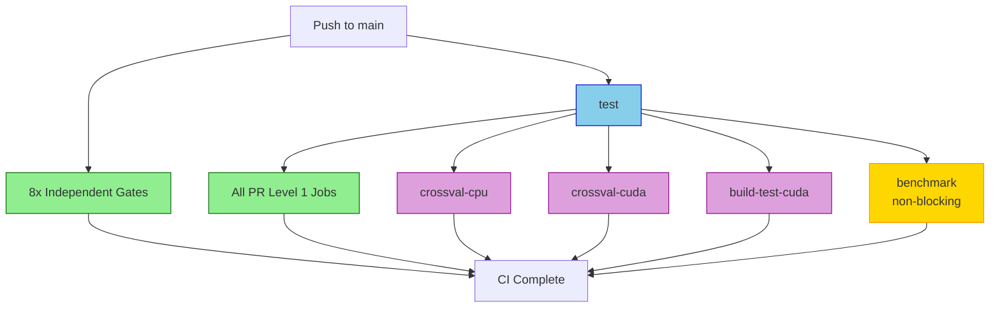

# CI DAG Visual Dependency Graph

**Generated**: 2025-10-23
**Source**: `.github/workflows/ci.yml`

## Job Dependency Table

| Job | Needs | Continue on Error | Conditional |
|-----|-------|------------------|-------------|
| test | - |  |  |
| guard-fixture-integrity | - |  |  |
| guard-serial-annotations | - |  |  |
| guard-feature-consistency | - |  |  |
| guard-ignore-annotations | - |  |  |
| env-mutation-guard | - |  |  |
| security | - |  |  |
| quality | - |  |  |
| feature-matrix | test |  |  |
| doctest-matrix | test |  |  |
| doctest | test |  |  |
| ffi-smoke | test |  |  |
| ffi-zero-warning-windows | test |  |  |
| ffi-zero-warning-linux | test |  |  |
| crossval-cpu-smoke | test |  |  |
| perf-smoke | test |  |  |
| api-compat | test | ✓ | PR only |
| crossval-cpu | test |  | main/dispatch |
| build-test-cuda | test |  | main/dispatch/schedule |
| crossval-cuda | test |  | main/dispatch/schedule |
| benchmark | test | ✓ | main only |
| feature-hack-check | test, feature-matrix | ✓ |  |

## ASCII DAG Visualization

```
┌─────────────────────────────────────────────────────────────────────┐
│ Level 0: Independent Gates (Parallel Execution)                    │
└─────────────────────────────────────────────────────────────────────┘
     │
     ├─── test (Primary Test Suite)
     │     └──┬─────────────────────────────────────────┐
     │        │                                         │
     ├─── guard-fixture-integrity                      │
     ├─── guard-serial-annotations                     │
     ├─── guard-feature-consistency                    │
     ├─── guard-ignore-annotations                     │
     ├─── env-mutation-guard                           │
     ├─── security                                     │
     └─── quality                                      │
                                                        │
┌───────────────────────────────────────────────────────┴─────────────┐
│ Level 1: Primary Dependent Gates (After test passes)               │
└─────────────────────────────────────────────────────────────────────┘
          │
          ├─── feature-matrix ──────┐
          │                         │
          ├─── doctest-matrix       │
          ├─── doctest              │
          ├─── ffi-smoke            │
          ├─── ffi-zero-warning-windows
          ├─── ffi-zero-warning-linux
          ├─── crossval-cpu-smoke   │
          ├─── perf-smoke           │
          │                         │
          ├─── api-compat           │  (PR only, non-blocking)
          ├─── crossval-cpu         │  (main/dispatch)
          ├─── build-test-cuda      │  (main/dispatch/schedule)
          ├─── crossval-cuda        │  (main/dispatch/schedule)
          └─── benchmark            │  (main only, non-blocking)
                                    │
┌───────────────────────────────────┴─────────────────────────────────┐
│ Level 2: Advanced Observers (After test + feature-matrix)          │
└─────────────────────────────────────────────────────────────────────┘
          │
          └─── feature-hack-check (non-blocking)
```

## Detailed Flow Diagram

### Standard PR Flow

```mermaid
graph TD
    %% Level 0 - Independent gates
    START[PR Push/Update] --> TEST[test]
    START --> G1[guard-fixture-integrity]
    START --> G2[guard-serial-annotations]
    START --> G3[guard-feature-consistency]
    START --> G4[guard-ignore-annotations]
    START --> G5[env-mutation-guard]
    START --> SEC[security]
    START --> QUAL[quality]

    %% Level 1 - Test dependents
    TEST --> FM[feature-matrix]
    TEST --> DTM[doctest-matrix]
    TEST --> DT[doctest]
    TEST --> FFI1[ffi-smoke]
    TEST --> FFI2[ffi-zero-warning-windows]
    TEST --> FFI3[ffi-zero-warning-linux]
    TEST --> XV1[crossval-cpu-smoke]
    TEST --> PERF[perf-smoke]
    TEST --> API[api-compat<br/>non-blocking]

    %% Level 2 - Feature matrix dependents
    TEST --> FHC[feature-hack-check<br/>non-blocking]
    FM --> FHC

    %% Terminal
    G1 --> DONE[CI Complete]
    G2 --> DONE
    G3 --> DONE
    G4 --> DONE
    G5 --> DONE
    SEC --> DONE
    QUAL --> DONE
    FM --> DONE
    DTM --> DONE
    DT --> DONE
    FFI1 --> DONE
    FFI2 --> DONE
    FFI3 --> DONE
    XV1 --> DONE
    PERF --> DONE
    API --> DONE
    FHC --> DONE

    %% Styling
    classDef gate fill:#90EE90,stroke:#006400
    classDef observer fill:#FFD700,stroke:#FF8C00
    classDef primary fill:#87CEEB,stroke:#0000CD

    class G1,G2,G3,G4,G5,SEC,QUAL,FM,DTM,DT,FFI1,FFI2,FFI3,XV1 gate
    class API,FHC,PERF observer
    class TEST primary
```



### Main Branch Flow



## Execution Patterns

### Scenario 1: Fast Failure (test fails)

```
Time →

t=0  ┌──────────────────────────────────────┐
     │ Level 0 jobs start (8 gates + test)│
     └──────────────────────────────────────┘

t=5  ┌──────────────────────────────────────┐
     │ test FAILS                           │
     └──────────────────────────────────────┘

t=5  ┌──────────────────────────────────────┐
     │ All Level 1+ jobs SKIPPED           │
     │ - feature-matrix: skipped            │
     │ - doctest-matrix: skipped            │
     │ - ffi-smoke: skipped                 │
     │ - ... (11 jobs skipped)              │
     └──────────────────────────────────────┘

t=10 ┌──────────────────────────────────────┐
     │ Level 0 gates complete               │
     │ CI FAILS (test failed)               │
     └──────────────────────────────────────┘

Savings: ~70% of compute time (11 jobs skipped)
```

### Scenario 2: Success Path

```
Time →

t=0  ┌──────────────────────────────────────┐
     │ Level 0 jobs start (8 gates + test)│
     └──────────────────────────────────────┘

t=10 ┌──────────────────────────────────────┐
     │ test PASSES                          │
     │ Level 0 gates complete               │
     └──────────────────────────────────────┘

t=10 ┌──────────────────────────────────────┐
     │ Level 1 jobs start (12 jobs)        │
     └──────────────────────────────────────┘

t=20 ┌──────────────────────────────────────┐
     │ feature-matrix PASSES                │
     └──────────────────────────────────────┘

t=20 ┌──────────────────────────────────────┐
     │ Level 2 jobs start                   │
     │ - feature-hack-check (non-blocking)  │
     └──────────────────────────────────────┘

t=30 ┌──────────────────────────────────────┐
     │ All jobs complete                    │
     │ CI PASSES                            │
     └──────────────────────────────────────┘

Runtime: No overhead vs before (same parallelism)
```

### Scenario 3: Partial Failure (feature-matrix fails)

```
Time →

t=0  ┌──────────────────────────────────────┐
     │ Level 0 jobs start                   │
     └──────────────────────────────────────┘

t=10 ┌──────────────────────────────────────┐
     │ test PASSES                          │
     │ Level 1 jobs start                   │
     └──────────────────────────────────────┘

t=15 ┌──────────────────────────────────────┐
     │ feature-matrix FAILS                 │
     └──────────────────────────────────────┘

t=15 ┌──────────────────────────────────────┐
     │ Level 2 jobs SKIPPED                 │
     │ - feature-hack-check: skipped        │
     └──────────────────────────────────────┘

t=20 ┌──────────────────────────────────────┐
     │ Other Level 1 jobs complete          │
     │ CI FAILS (feature-matrix failed)     │
     └──────────────────────────────────────┘

Impact: Only feature-hack-check skipped (minimal savings)
Benefit: Targeted failure isolation
```

## Key Characteristics

### Fail-Fast Properties

✅ **test failure**: Skips all 12+ Level 1 jobs
✅ **feature-matrix failure**: Skips only Level 2 jobs (1 job)
✅ **Independent gates**: Never skip (always provide feedback)

### Parallelism Properties

✅ **Level 0**: 9 jobs run in parallel
✅ **Level 1**: Up to 12 jobs run in parallel (after test passes)
✅ **Level 2**: 1 job runs (after test + feature-matrix pass)

### Resource Optimization

✅ **Best case (success)**: No overhead, same total runtime
✅ **Worst case (test fails)**: ~70% compute savings from skipped jobs
✅ **Average case (partial failure)**: Targeted job skipping

## Related Documentation

- `ci/CI_DAG_OPTIMIZATION_SUMMARY.md` - Detailed rationale
- `ci/CI_DAG_QUICK_DEPS.md` - Quick dependency reference
- `ci/CI_EXPLORATION_SUMMARY.md` - Full CI architecture
