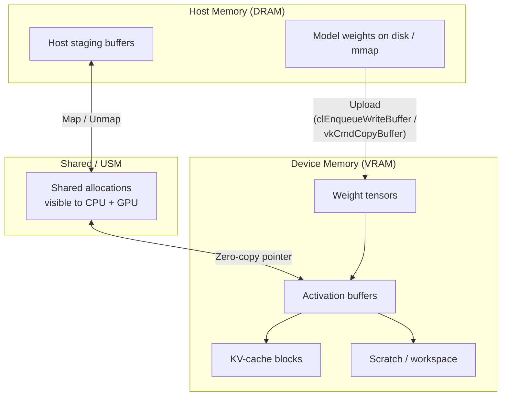
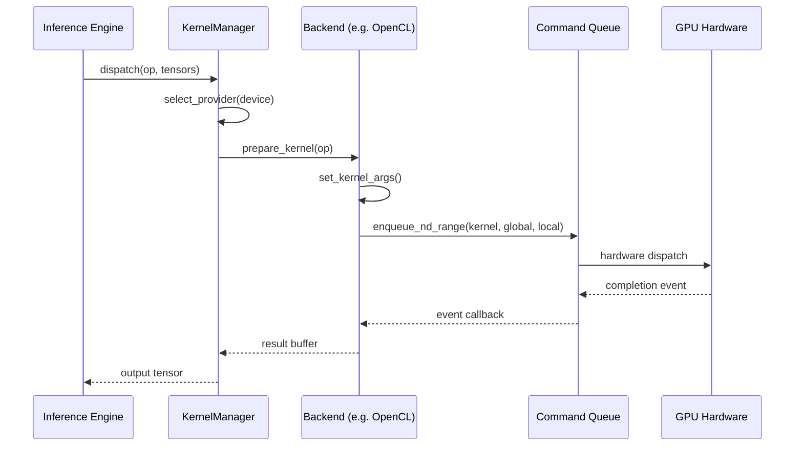
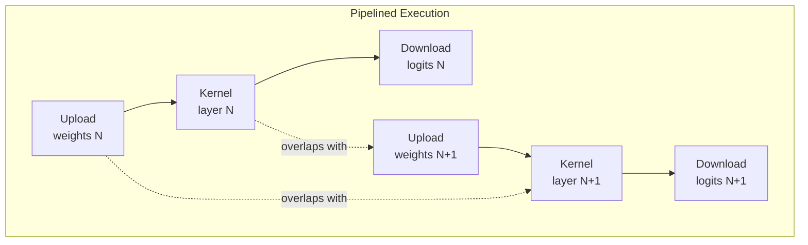
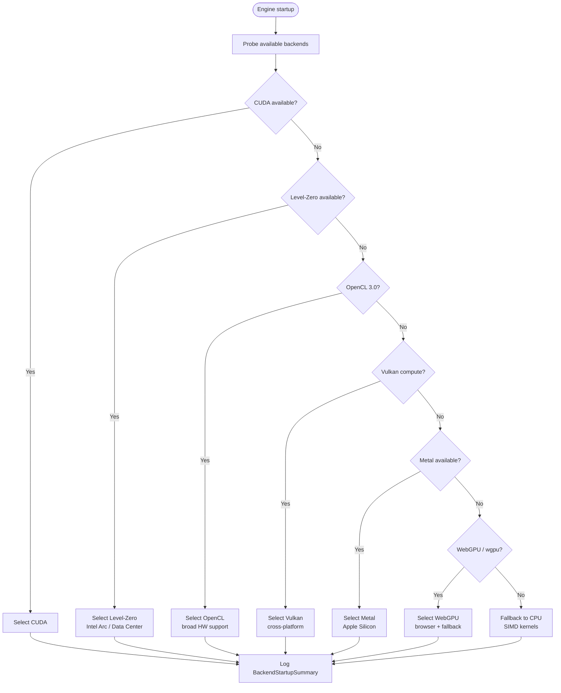

# GPU Internals Deep-Dive

> Architecture and implementation details for bitnet-rs GPU compute backends.

This document explains how bitnet-rs orchestrates GPU inference across multiple
backends (OpenCL, Vulkan, ROCm/HIP, Metal, WebGPU, Level-Zero). It is aimed at
contributors who need to understand the data flow, memory model, and kernel
execution mechanics.

---

## Table of Contents

1. [GPU Memory Model](#gpu-memory-model)
2. [Kernel Execution Model](#kernel-execution-model)
3. [Command Queue Pipeline](#command-queue-pipeline)
4. [Buffer Lifecycle](#buffer-lifecycle)
5. [Backend Selection](#backend-selection)
6. [Error Handling Flow](#error-handling-flow)
7. [Performance Tips — Intel Arc](#performance-tips--intel-arc)
8. [Troubleshooting](#troubleshooting)

---

## GPU Memory Model

GPU compute operates across three memory domains. Each backend maps these to
its native API (OpenCL SVM, Vulkan `VkDeviceMemory`, Level-Zero `zeMemAlloc*`,
etc.), but the conceptual model is the same everywhere.

| Domain | Visible to | Latency | Typical Use |
|--------|-----------|---------|-------------|
| **Host** | CPU only | ~100 ns | Weight loading, tokenization |
| **Device** | GPU only | ~1-5 ns | Activations, KV-cache |
| **Shared / USM** | CPU + GPU | ~10-50 ns | Zero-copy staging, small buffers |

### Memory Hierarchy



### Transfer Modes (OpenCL USM)

`bitnet-opencl` detects SVM capabilities at runtime via
`CL_DEVICE_SVM_CAPABILITIES`:

| Capability | Transfer Mode | Copy Cost |
|-----------|---------------|-----------|
| Fine-grain system | `TransferMode::Unified` | Zero-copy |
| Fine-grain buffer | `TransferMode::Unified` | Zero-copy |
| Coarse-grain buffer | `TransferMode::ExplicitCopy` | Enqueue R/W |
| None | `TransferMode::ExplicitCopy` | Staging buffer |

The `DataPath` enum in `bitnet_opencl::usm` transparently selects the best path:

```rust
let caps = detect_usm_capabilities(raw_device_caps);
let path = DataPath::new(caps);
let device_data = path.upload(host_bytes)?;
```

### Level-Zero Memory Types

Level-Zero exposes three allocation verbs via `MemoryAllocBuilder`:

- **`device(size)`** — GPU-local, fastest for compute.
- **`host(size)`** — Pinned host memory, DMA-accessible from GPU.
- **`shared(size)`** — Unified allocation, migrated on demand.

---

## Kernel Execution Model

### Work-Group / Work-Item Hierarchy

All backends share the same 3-level dispatch model:

```
Global dispatch
 └── Work-groups (thread groups / threadgroups)
      └── Work-items (threads / invocations)
           └── Subgroups (warps / waves / SIMD lanes)
```

| Backend | Work-group | Work-item | Subgroup |
|---------|-----------|-----------|----------|
| OpenCL | `local_work_size` | NDRange item | `cl_khr_subgroups` |
| Vulkan | `vkCmdDispatch(gx,gy,gz)` | Shader invocation | `gl_SubgroupSize` |
| ROCm/HIP | `dim3 block` | Thread | Wavefront (64) |
| Metal | Threadgroup | Thread | SIMD group (32) |
| WebGPU | `@workgroup_size(x,y,z)` | Invocation | — |
| Level-Zero | `ze_group_count_t` | Work-item | Subgroup |

### Kernel Launch Sequence



### Dispatch Dimensions

Level-Zero and ROCm both use builder patterns for launch configuration:

```rust
// Level-Zero
let dims = DispatchDimensions::new_2d(rows / 16, cols / 16);
let gs = GroupSize::new_1d(256);
let kernel = KernelBuilder::new("matmul").group_size(gs).build(&module)?;

// ROCm/HIP
let config = LaunchConfig::grid_2d(rows, cols, 16, 16);
unsafe { launch_kernel(function, &config, args)?; }
```

---

## Command Queue Pipeline

The inference engine pipelines host-to-device transfers, kernel execution, and
device-to-host readback to keep the GPU busy:



### Queue Types

| Backend | Queue Abstraction | Async Support |
|---------|-------------------|---------------|
| OpenCL | `cl_command_queue` (in-order / out-of-order) | Event-based |
| Vulkan | `vkQueue` + fences / semaphores | Timeline semaphores |
| ROCm | `Stream` (wraps `hipStream_t`) | Stream-ordered |
| Metal | `MTLCommandBuffer` / `MTLCommandQueue` | Commit + waitUntilCompleted |
| WebGPU | `wgpu::Queue` | `queue.submit()` + `buffer.map_async` |
| Level-Zero | `ze_command_list_handle_t` | Events + barriers |

### ROCm Stream Management

```rust
let stream = Stream::new()?;          // Non-blocking stream
let buf = DeviceBuffer::alloc(size)?; // hipMalloc
buf.copy_from_host(host_data)?;       // hipMemcpyHtoD
// ... launch kernel on stream ...
stream.synchronize()?;                // hipStreamSynchronize
buf.copy_to_host(&mut output)?;       // hipMemcpyDtoH
```

---

## Buffer Lifecycle

### Vulkan Buffer Lifecycle

```mermaid
stateDiagram-v2
    [*] --> Described: BufferDescriptor::new()
    Described --> Allocated: allocate_buffer()
    Allocated --> Bound: vkBindBufferMemory
    Bound --> InUse: recorded into command buffer
    InUse --> InUse: dispatch / copy
    InUse --> ReadBack: vkCmdCopyBuffer to staging
    ReadBack --> Mapped: vkMapMemory
    Mapped --> Destroyed: GpuBuffer::destroy()
    Destroyed --> [*]
```

### Buffer Usage Types (Vulkan)

| `BufferUsage` | Memory Property | Use Case |
|--------------|-----------------|----------|
| `Staging` | Host-visible, host-coherent | CPU-to-GPU upload / GPU-to-CPU readback |
| `DeviceLocal` | Device-local | Intermediate activations |
| `Storage` | Device-local | Shader read/write (SSBO) |

### WebGPU Buffer Lifecycle

```rust
// Create + upload
let buf = GpuBuffer::from_slice(&device, &data, "weights");

// Use in compute pass (bind to pipeline)
let bg = pipeline.bind_group(&device, &[&buf.storage, &output.storage, &params]);

// Read back
let result: Vec<f32> = buf.read_back(&device, &queue).await?;
```

### Level-Zero Memory Lifecycle

```rust
let ctx = ContextBuilder::new(driver_index).build()?;

// Allocate device memory
let buf = MemoryAllocBuilder::device(4096)
    .alignment(64)
    .allocate(&ctx)?;

assert!(buf.is_allocated());
assert_eq!(buf.size(), 4096);
// Dropped -> zeMemFree
```

---

## Backend Selection

The `KernelManager` in `bitnet-kernels` probes available backends at startup
and selects the best one. The selection priority is:



The chosen backend is recorded in `BackendStartupSummary`:
```
requested=auto detected=[level-zero, opencl] selected=level-zero
```

### Feature Gates

GPU code is gated behind the unified predicate — never `#[cfg(feature = "cuda")]` alone:

```rust
#[cfg(any(feature = "gpu", feature = "cuda"))]
pub fn gpu_kernel() { ... }
```

Runtime checks use `bitnet_kernels::device_features::{gpu_compiled, gpu_available_runtime}`.

---

## Error Handling Flow

Every backend maps its native error codes to a crate-local error enum that
implements `std::error::Error` + `Send + Sync`. The pattern is consistent:

```
Native error code (u32 / i32)
  -> Backend-specific enum (e.g. LevelZeroError, VulkanError, RocmError)
    -> bitnet_common::GpuError (unified)
      -> Propagated to inference engine
```

### Error Categories by Backend

| Backend | Error Enum | Key Variants |
|---------|-----------|--------------|
| Level-Zero | `LevelZeroError` | `RuntimeNotFound`, `ApiError`, `NoDevice`, `ModuleCompilationFailed`, `KernelNotFound`, `AllocationFailed`, `InvalidArgument`, `UnsupportedVersion` |
| Vulkan | `VulkanError` | `InstanceCreation`, `NoDevice`, `DeviceCreation`, `PipelineCreation`, `ShaderCompilation`, `BufferAllocation`, `MemoryTypeNotFound`, `CommandBufferError`, `QueueError`, `VkError(i32)` |
| ROCm | `RocmError` | Uses `HipErrorCode` (Success, InvalidValue, OutOfMemory, NotInitialized, Deinitialized, ...) |
| Metal | `MetalError` | Crate-local error enum |
| WebGPU | `WebGpuError` | Crate-local error enum |
| OpenCL | `KernelValidationError` | `NoKernelsFound`, `EmptyArgList`, `ArgCountMismatch`, `DuplicateKernelName` |
| OpenCL USM | `UsmError` | `UsmNotSupported`, `AllocationFailed`, `NullPointer`, `ZeroSizeLayout` |

### Recovery Strategy

```rust
match backend.run_kernel(&op, &tensors) {
    Ok(output) => output,
    Err(GpuError::OutOfMemory) => {
        // Free caches, retry with smaller batch
        backend.clear_scratch_buffers();
        backend.run_kernel(&op, &tensors)?
    }
    Err(GpuError::DeviceLost) => {
        // Re-enumerate devices, select next best
        let new_backend = select_fallback_backend()?;
        new_backend.run_kernel(&op, &tensors)?
    }
    Err(e) => return Err(e.into()),
}
```

---

## Performance Tips — Intel Arc

### Hardware Characteristics

| Property | Intel Arc A770 | Intel Arc A380 |
|----------|---------------|----------------|
| Execution Units | 512 | 128 |
| VRAM | 16 GB GDDR6 | 6 GB GDDR6 |
| Subgroup size | 16 / 32 | 16 / 32 |
| Preferred work-group | 256 | 256 |
| Memory bandwidth | 560 GB/s | 186 GB/s |

### Tuning Recommendations

1. **Use Level-Zero over OpenCL** — Level-Zero is the native API for Intel
   discrete GPUs. It provides lower overhead, direct access to EU scheduling,
   and explicit memory management.

2. **Subgroup size = 16** — Intel Xe HPG cores process 16 lanes natively.
   Match your `@workgroup_size` / `local_work_size` to multiples of 16.

3. **Prefer shared memory for small tensors** — USM shared allocations avoid
   explicit copy overhead for tensors < 64 KiB. Use device-local for large
   weight matrices.

4. **Tile matmul at 16x16** — The Vulkan and Level-Zero matmul shaders use
   `TILE_SIZE = 16`, matching the EU array width. Larger tiles increase
   register pressure without improving throughput on Xe HPG.

5. **Overlap upload and compute** — Use separate command lists / queues for
   memory transfers and kernel execution. Level-Zero supports immediate
   command lists for low-latency dispatch.

6. **Batch small kernels** — Per-kernel launch overhead on Level-Zero is
   ~2-5 us. Group element-wise ops (add, mul, relu, silu) into fused kernels
   where possible.

7. **Pin host memory** — Use `MemoryAllocBuilder::host()` for staging buffers
   to enable DMA transfers without page faults.

8. **Monitor thermal throttling** — Arc GPUs aggressively throttle above 90C.
   Use `intel_gpu_top` or Level-Zero telemetry to monitor.

---

## Troubleshooting

### Common Issues

| Symptom | Likely Cause | Fix |
|---------|-------------|-----|
| `RuntimeNotFound` at startup | Level-Zero loader not installed | Install `level-zero` package: `apt install level-zero` or `intel-level-zero-gpu` |
| `NoDevice` after probe | GPU not visible to runtime | Check `ls /dev/dri/render*` permissions; add user to `render` group |
| `OutOfMemory` during weight upload | Model exceeds VRAM | Use `--device cpu` for layers that don't fit; enable weight streaming |
| `ModuleCompilationFailed` | SPIR-V incompatible with driver | Update GPU driver; check SPIR-V version with `spirv-val` |
| `AllocationFailed` with USM | SVM not supported by device | Falls back to `ExplicitCopy` automatically; check `SvmCapabilities` |
| Slow P2P transfers | Direct P2P not available | `FallbackProbe` stages through host; expected on consumer GPUs |
| Validation layer errors (Vulkan) | API misuse caught by `VK_LAYER_KHRONOS_validation` | Enable validation in debug builds via `InstanceConfig { enable_validation: true }` |
| WebGPU `RequestDeviceFailed` | No compatible adapter | Check `wgpu` backend features; try `WGPU_BACKEND=vulkan` env var |
| Zero throughput on Intel Arc | Wrong backend selected | Force Level-Zero: set `BITNET_GPU_BACKEND=level-zero` |
| Kernel produces NaN | Float precision mismatch | Check shader uses `precise` qualifier; avoid `fast-relaxed-math` for norm ops |

### Diagnostic Commands

```bash
# Check Level-Zero devices
cargo run -p xtask -- device-probe

# OpenCL device list
clinfo --list

# Vulkan device info
vulkaninfo --summary

# Intel GPU monitoring
sudo intel_gpu_top

# Verify SPIR-V modules
spirv-val < shader.spv

# Enable verbose GPU logging
RUST_LOG=bitnet_kernels=debug,bitnet_opencl=trace cargo run ...
```

### Environment Variables

| Variable | Description |
|----------|-------------|
| `BITNET_GPU_BACKEND` | Force a specific backend (`level-zero`, `opencl`, `vulkan`, `cuda`) |
| `BITNET_GPU_DEVICE` | Select device by index (default: 0) |
| `BITNET_GPU_FAKE` | Use mock GPU path (blocked by `BITNET_STRICT_MODE=1`) |
| `BITNET_STRICT_MODE` | Reject mock/fake GPU paths; fail on suspicious weights |
| `RUST_LOG` | Standard `tracing` filter for GPU diagnostics |
| `WGPU_BACKEND` | Force wgpu backend (`vulkan`, `metal`, `dx12`, `gl`) |
| `VK_INSTANCE_LAYERS` | Enable Vulkan validation: `VK_LAYER_KHRONOS_validation` |
