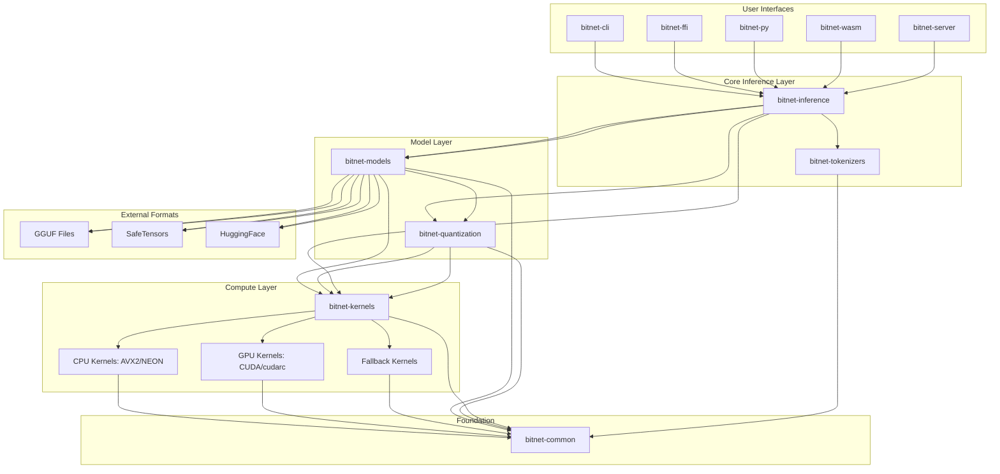

# Architecture

This document provides a high-level overview of the BitNet.rs architecture. It is intended for developers and contributors who want to understand the structure of the project and how the different components interact.

The design emphasizes modularity, performance, and a clean separation of concerns, allowing for independent development and testing of each part of the system.

## Modular System Architecture

The following diagram illustrates the high-level components of BitNet.rs and their relationships:



## Modular Workspace Structure

The repository is organized as a Rust workspace with multiple specialized crates. This structure promotes code reuse, clear ownership, and efficient builds.

```
bitnet-rs/
├── Cargo.toml                 # Workspace root
├── README.md                  # Main project README
├── .github/                   # CI/CD workflows
├── crates/
│   ├── bitnet-common/        # Shared types and utilities
│   ├── bitnet-models/        # Model definitions and loading
│   ├── bitnet-quantization/  # Quantization algorithms
│   ├── bitnet-kernels/       # High-performance compute kernels
│   ├── bitnet-inference/     # Inference engines
│   ├── bitnet-tokenizers/    # Tokenization support
│   ├── bitnet-server/        # HTTP server implementation
│   ├── bitnet-cli/           # Command-line interface
│   ├── bitnet-ffi/           # C API bindings
│   ├── bitnet-py/            # Python bindings
│   └── bitnet-wasm/          # WebAssembly bindings
├── examples/                 # Usage examples
├── tests/                    # Integration tests
├── benches/                  # Comprehensive benchmarks
└── docs/                     # Project documentation
```
