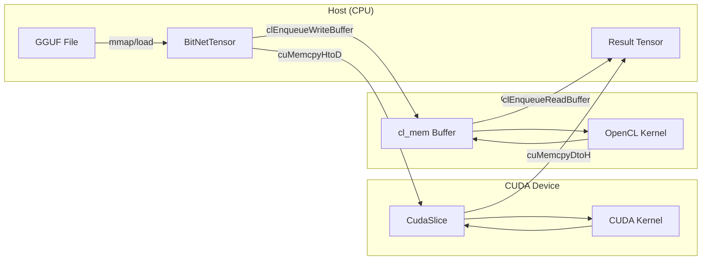
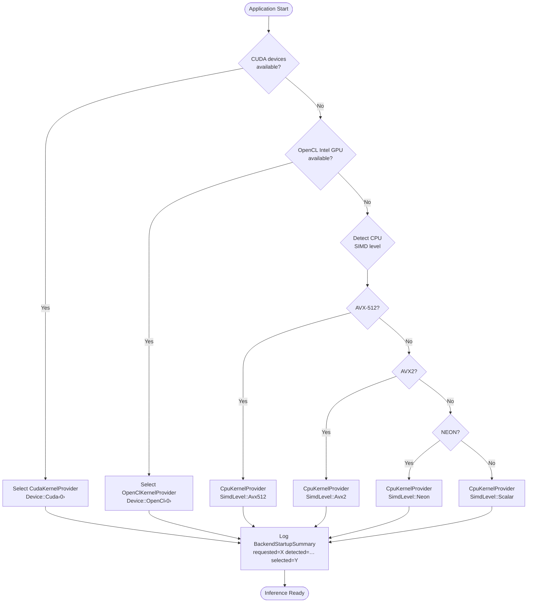
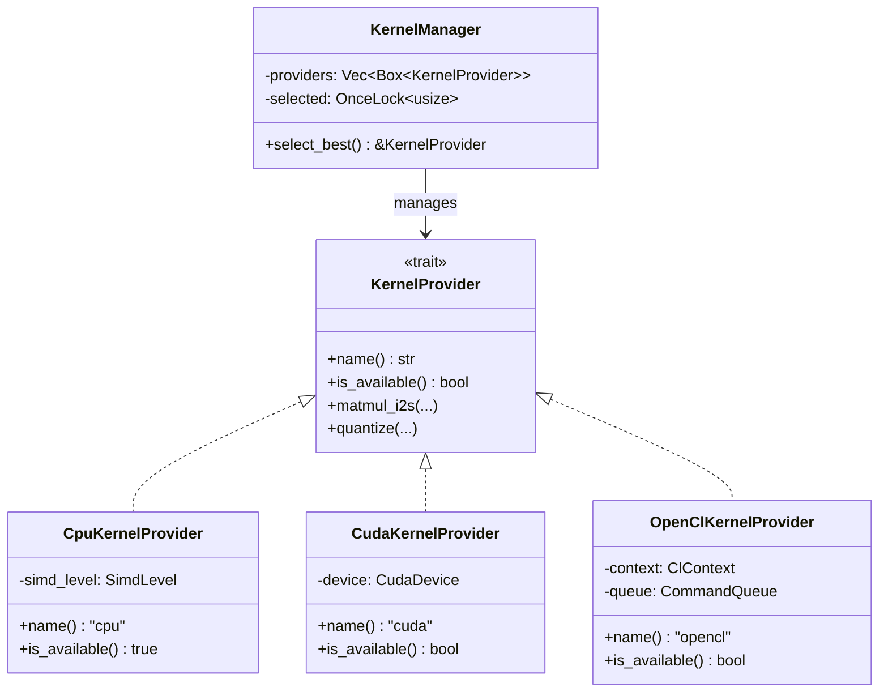

# Multi-GPU Backend Architecture

> **Status**: Living document — reflects the multi-backend design after the Intel GPU / OpenCL integration (PRs #1032–#1052).

This document describes how BitNet-rs supports multiple GPU backends
(CUDA, OpenCL/oneAPI, and future Vulkan/Level-Zero) while maintaining a
single unified inference path.

---

## 1. Current Architecture

### Device Enum

The `Device` enum in `crates/bitnet-common/src/types.rs` represents the
compute target for tensor operations:

```rust
pub enum Device {
    Cpu,
    Cuda(usize),   // CUDA device index
    Metal,          // macOS/iOS Metal
    OpenCl(usize),  // OpenCL device index (Intel GPU, etc.)
}
```

Each variant carries enough information to address a specific hardware
device. The `usize` parameter is the zero-based device ordinal reported
by the platform driver.

### KernelProvider Trait

`KernelProvider` (in `crates/bitnet-kernels/src/lib.rs`) is the
abstraction layer that every compute backend must implement:

```rust
pub trait KernelProvider: Send + Sync {
    fn name(&self) -> &str;
    fn is_available(&self) -> bool;
    fn matmul_i2s(&self, ...) -> Result<...>;
    fn quantize(&self, ...) -> Result<...>;
}
```

Each backend (CPU/AVX2, CPU/AVX-512, CPU/NEON, CUDA, OpenCL) provides
its own `KernelProvider` implementation.

### KernelManager Selection

`KernelManager` holds a `Vec<Box<dyn KernelProvider>>` and selects the
best available provider at startup via a priority-ordered scan:

```rust
pub struct KernelManager {
    providers: Vec<Box<dyn KernelProvider>>,
    selected: OnceLock<usize>,
}
```

On first use, `KernelManager` iterates providers in priority order,
calling `is_available()` on each. The first provider that returns `true`
becomes the selected backend for the lifetime of the process.

---

## 2. Backend Priority

The selection order is deterministic and fixed:

```
CUDA  >  OneAPI/OpenCL  >  CPU (AVX-512 > AVX2 > NEON > scalar)
```

| Priority | Backend | Feature Flag | Provider |
|----------|---------|-------------|----------|
| 1 | NVIDIA CUDA | `gpu` or `cuda` | `CudaKernelProvider` |
| 2 | Intel OpenCL (via oneAPI) | `oneapi` | `OpenClKernelProvider` |
| 3 | CPU — AVX-512 | `cpu` | `CpuKernelProvider` |
| 4 | CPU — AVX2 | `cpu` | `CpuKernelProvider` |
| 5 | CPU — NEON | `cpu` | `CpuKernelProvider` |
| 6 | CPU — scalar fallback | `cpu` | `CpuKernelProvider` |

The CPU provider internally selects the best SIMD level available on the
host via `SimdLevel` detection.

---

## 3. Backend Coexistence

### Feature Flags

Multiple GPU backends can be compiled into the same binary:

```toml
[features]
gpu    = [...]        # GPU umbrella — enables common GPU infrastructure
cuda   = ["gpu"]      # NVIDIA CUDA backend
oneapi = ["gpu"]      # Intel OpenCL backend (via oneAPI runtime)
metal  = ["gpu"]      # Apple Metal backend
vulkan = ["gpu"]      # Vulkan compute backend
```

All GPU features imply `gpu`, which gates shared infrastructure
(device memory management, host↔device transfers, kernel dispatch).

Combinations are valid:

```bash
# CUDA only
cargo build --features cuda

# Intel GPU only
cargo build --features oneapi

# Both CUDA and OpenCL compiled in
cargo build --features cuda,oneapi

# CPU-only (no GPU code compiled)
cargo build --features cpu
```

### Runtime Selection

When multiple backends are compiled in, `KernelManager` probes each at
startup. The runtime check calls into the platform SDK:

- **CUDA**: `cudarc::driver::CudaDevice::count()` — returns number of
  NVIDIA GPUs visible to the CUDA runtime.
- **OpenCL**: `opencl3::platform::get_platforms()` → filter for Intel
  devices with `CL_DEVICE_TYPE_GPU`.
- **CPU**: Always available; SIMD level detected via `is_x86_feature_detected!`.

Only providers whose `is_available()` returns `true` are eligible for
selection. The highest-priority available backend wins.

### KernelManager Picks Best Provider

```
┌─────────────────────────────────────┐
│         KernelManager::init()       │
│                                     │
│  for provider in &self.providers {  │
│      if provider.is_available() {   │
│          selected = provider;       │
│          break;                     │
│      }                              │
│  }                                  │
└─────────────────────────────────────┘
```

The selected provider is cached in a `OnceLock` — no repeated probing
after initial selection.

---

## 4. Data Flow

Tensors in BitNet-rs are CPU-resident by default (`BitNetTensor` backed
by `Vec<u8>` or memory-mapped GGUF data). GPU backends transfer data to
device memory on demand.

### CPU Path

```
GGUF file → mmap → BitNetTensor (CPU) → CpuKernelProvider::matmul_i2s()
                                       → result tensor (CPU)
```

### CUDA Path

```
BitNetTensor (CPU) → cudarc::CudaSlice (GPU) → CUDA kernel launch
                                               → CudaSlice (GPU)
                                               → copy back to CPU
```

### OpenCL Path

```
BitNetTensor (CPU) → cl_mem buffer (GPU) → clEnqueueNDRangeKernel
                                          → cl_mem buffer (GPU)
                                          → clEnqueueReadBuffer → CPU
```

### Data Flow Diagram



---

## 5. Device Selection Algorithm

The complete device selection algorithm executed at startup:



**Steps:**

1. **Check CUDA devices** — query CUDA runtime for device count. If ≥ 1
   CUDA device is found, use CUDA.
2. **Check OpenCL Intel devices** — enumerate OpenCL platforms, filter
   for Intel GPU devices. If found, use OpenCL.
3. **Fall back to CPU** — detect SIMD level (AVX-512 > AVX2 > NEON >
   scalar) and use the best available CPU path.

The result is logged as a `BackendStartupSummary`:
```
requested=auto detected=[cuda, opencl, avx512] selected=cuda
```

---

## 6. Memory Model

Each backend manages its own device memory independently. There is no
shared GPU memory pool across backends.

| Backend | Memory API | Allocation | Lifetime |
|---------|-----------|------------|----------|
| CUDA | `cudarc::CudaSlice<T>` | Per-kernel launch | Dropped after result readback |
| OpenCL | `opencl3::memory::Buffer<T>` | Per-kernel enqueue | Dropped after result readback |
| CPU | `Vec<u8>` / mmap | Owned by `BitNetTensor` | Model lifetime |

### Key Properties

- **No cross-backend transfers**: A tensor on a CUDA device is never
  sent directly to an OpenCL device. All inter-backend transfers go
  through CPU memory.
- **Model weights stay on CPU**: GGUF weights are memory-mapped and
  remain host-resident. Each kernel invocation copies the needed slice
  to GPU, computes, and copies back. (Future optimization: persistent
  GPU weight caching.)
- **Activation tensors are transient**: Intermediate activations are
  allocated per-layer and freed after the next layer consumes them.

---

## 7. KernelProvider Trait Hierarchy



---

## 8. Future Path

### Near-Term (v0.3–v0.4)

- **Persistent GPU weight caching**: Keep model weights resident on GPU
  memory across inference calls to eliminate repeated H2D transfers.
- **Tiled matrix multiplication**: CUDA and OpenCL kernels using shared
  memory / local memory tiling for higher arithmetic intensity.
- **SPIR-V pre-compilation**: Pre-compile OpenCL kernels to SPIR-V at
  build time for faster startup.

### Medium-Term (v0.5+)

- **Level-Zero backend**: Intel's low-level GPU API for maximum
  performance on Intel discrete GPUs (Arc, Data Center Max).
- **Vulkan compute path**: Cross-vendor GPU compute via Vulkan compute
  shaders — potential single backend for Intel, AMD, and NVIDIA.
- **Attention / Softmax / RoPE / RMSNorm GPU kernels**: Currently only
  `matmul_i2s` and `quantize` are GPU-accelerated. Full GPU inference
  requires porting the remaining operators.

### Long-Term

- **Multi-device inference**: Split model layers across multiple
  devices (e.g., layers 0–15 on CUDA, layers 16–31 on OpenCL) for
  larger-than-single-GPU models.
- **Pipeline parallelism**: Overlap compute on GPU N with data transfer
  for GPU N+1 to hide transfer latency.
- **Unified memory** (where supported): Use CUDA Unified Memory or
  OpenCL SVM to eliminate explicit copies on supported hardware.

---

## Related Documentation

- [`docs/architecture/README.md`](README.md) — architecture document index
- [`docs/reference/dual-backend-roadmap.md`](../reference/dual-backend-roadmap.md) — implementation roadmap
- [`docs/gpu-kernel-architecture.md`](../gpu-kernel-architecture.md) — GPU kernel design details
- [`crates/bitnet-common/src/kernel_registry.rs`](../../crates/bitnet-common/src/kernel_registry.rs) — kernel/backend type definitions
- [`crates/bitnet-kernels/src/lib.rs`](../../crates/bitnet-kernels/src/lib.rs) — KernelProvider trait and KernelManager
