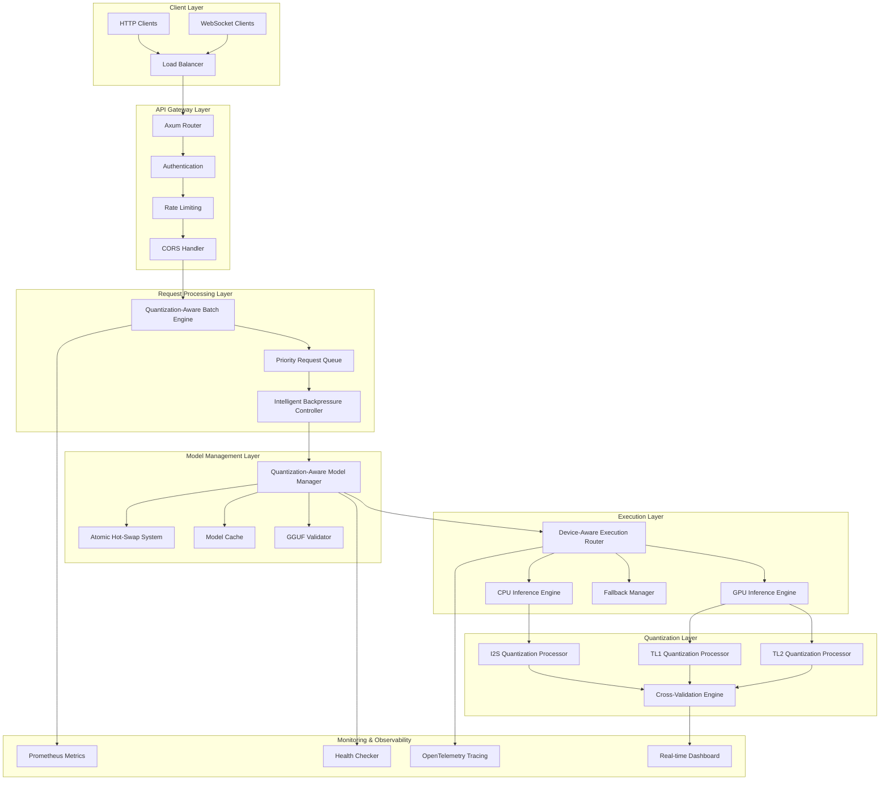

# Issue #251: Production-Ready Inference Server Architecture

## Executive Summary

This architectural blueprint defines the comprehensive design for transforming BitNet-rs into a production-ready neural network inference server. Building upon the existing `bitnet-server` infrastructure, this specification provides detailed architecture for enterprise-grade HTTP server capabilities with quantization-aware model management, device-aware execution routing, advanced concurrency control, and comprehensive monitoring for high-throughput neural network inference deployments.

## Architecture Overview

### Core System Architecture



### Neural Network Pipeline Integration

The production server integrates seamlessly with the BitNet-rs neural network inference pipeline:

**Pipeline Flow: Model Loading → Quantization → Inference → Output**

1. **Model Loading**: GGUF format models with tensor alignment validation
2. **Quantization**: I2S/TL1/TL2 format detection and device-aware optimization
3. **Inference**: Device-aware execution with automatic fallback
4. **Output**: Streaming response delivery with real-time monitoring

## Component Specifications

### 1. Quantization-Aware Model Manager

**Purpose**: Atomic model hot-swapping with quantization format validation and cross-validation

**Key Features**:
- Zero-downtime model updates with rollback capability
- GGUF format validation and tensor alignment verification
- I2S/TL1/TL2 quantization format detection and optimization
- Cross-validation against C++ reference implementation
- Model versioning and performance tracking

**Architecture**:
```rust
/// Quantization-aware model manager with atomic hot-swapping
pub struct QuantizationAwareModelManager {
    /// Active model with quantization metadata
    active_model: Arc<RwLock<Option<QuantizedModelWrapper>>>,
    /// Model validation pipeline
    validation_pipeline: ModelValidationPipeline,
    /// Quantization format detector
    format_detector: QuantizationFormatDetector,
    /// Cross-validation engine
    crossval_engine: CrossValidationEngine,
    /// Model performance tracker
    performance_tracker: ModelPerformanceTracker,
    /// Hot-swap coordinator
    hotswap_coordinator: AtomicHotSwapCoordinator,
}

/// Enhanced model wrapper with quantization metadata
pub struct QuantizedModelWrapper {
    /// The actual model instance
    model: Arc<dyn Model>,
    /// Quantization format information
    quantization_info: QuantizationInfo,
    /// Performance characteristics
    performance_profile: ModelPerformanceProfile,
    /// Validation results
    validation_results: ModelValidationResults,
    /// Load timestamp and metrics
    load_metadata: ModelLoadMetadata,
}
```

**API Contracts**:
- `POST /v1/models/load`: Load new model with validation
- `POST /v1/models/swap`: Atomic hot-swap with rollback
- `GET /v1/models`: List available models with metadata
- `GET /v1/models/{id}/status`: Model health and performance metrics
- `DELETE /v1/models/{id}`: Unload model with graceful cleanup

### 2. Device-Aware Execution Router

**Purpose**: Optimal device selection and automatic fallback for quantized neural network inference

**Key Features**:
- Real-time device performance monitoring and optimization
- Quantization-format-aware device selection
- Intelligent load balancing across CPU/GPU resources
- Automatic fallback chains with failure recovery
- Performance prediction and optimization

**Architecture**:
```rust
/// Device-aware execution router with quantization optimization
pub struct DeviceAwareExecutionRouter {
    /// Available execution devices with capabilities
    device_inventory: DeviceInventory,
    /// Quantization-device optimization matrix
    optimization_matrix: QuantizationDeviceMatrix,
    /// Real-time performance monitor
    device_monitor: RealTimeDeviceMonitor,
    /// Intelligent load balancer
    load_balancer: IntelligentLoadBalancer,
    /// Fallback chain manager
    fallback_manager: FallbackChainManager,
}

/// Execution plan with quantization optimization
pub struct ExecutionPlan {
    /// Primary target device
    primary_device: ExecutionDevice,
    /// Fallback device chain
    fallback_devices: Vec<ExecutionDevice>,
    /// Quantization-specific optimization
    quantization_optimization: QuantizationOptimization,
    /// Performance targets and SLA requirements
    performance_targets: PerformanceTargets,
    /// Resource allocation plan
    resource_allocation: ResourceAllocationPlan,
}
```

**Device Selection Logic**:
1. **Quantization Format Analysis**: Determine optimal device based on I2S/TL1/TL2 format
2. **Real-time Performance Evaluation**: Monitor current device utilization and performance
3. **Load Balancing**: Distribute requests across available devices
4. **Fallback Strategy**: Define automatic fallback chain for device failures

### 3. Advanced Concurrency Manager

**Purpose**: Intelligent request batching and resource management for 100+ concurrent requests

**Key Features**:
- Quantization-aware batch formation for optimal throughput
- Intelligent backpressure control based on system metrics
- Adaptive resource pooling with dynamic allocation
- Priority-based request queuing and processing
- Performance optimization for different quantization formats

**Architecture**:
```rust
/// Advanced concurrency manager with quantization-aware batching
pub struct AdvancedConcurrencyManager {
    /// Priority-based request queue
    request_queue: Arc<PriorityRequestQueue>,
    /// Quantization-aware batch formation engine
    batch_engine: QuantizationAwareBatchEngine,
    /// Adaptive resource pool manager
    resource_pool: AdaptiveResourcePool,
    /// Intelligent backpressure controller
    backpressure_controller: IntelligentBackpressureController,
    /// Performance optimizer
    performance_optimizer: ConcurrencyPerformanceOptimizer,
}

/// Quantization-aware batch formation
pub struct QuantizationAwareBatchEngine {
    /// I2S batch optimizer
    i2s_optimizer: I2SBatchOptimizer,
    /// TL1 batch optimizer
    tl1_optimizer: TL1BatchOptimizer,
    /// TL2 batch optimizer
    tl2_optimizer: TL2BatchOptimizer,
    /// Mixed quantization handler
    mixed_quant_handler: MixedQuantizationHandler,
}
```

**Batching Strategy**:
1. **Quantization Grouping**: Group requests by compatible quantization formats
2. **Size Optimization**: Determine optimal batch sizes for each quantization type
3. **SIMD Alignment**: Optimize batch formation for SIMD vectorization
4. **Resource Awareness**: Consider available device memory and capabilities

### 4. Neural Network Performance Monitor

**Purpose**: Comprehensive monitoring of quantization accuracy, inference performance, and system health

**Key Features**:
- Real-time quantization accuracy tracking and validation
- Inference throughput and latency monitoring
- Device utilization and memory usage tracking
- Performance trend analysis and optimization recommendations
- Prometheus metrics export and dashboard integration

**Architecture**:
```rust
/// Neural network-specific performance monitoring
pub struct NeuralNetworkPerformanceMonitor {
    /// Quantization performance tracker
    quantization_tracker: QuantizationPerformanceTracker,
    /// Inference throughput monitor
    throughput_monitor: InferenceThroughputMonitor,
    /// Memory usage analyzer
    memory_analyzer: NeuralNetworkMemoryAnalyzer,
    /// Device utilization monitor
    device_monitor: MultiDeviceUtilizationMonitor,
    /// Performance dashboard generator
    dashboard_generator: RealTimeDashboardGenerator,
}

/// Comprehensive monitoring metrics
pub struct NeuralNetworkMetrics {
    /// Quantization accuracy metrics
    quantization_metrics: QuantizationAccuracyMetrics,
    /// Inference performance metrics
    inference_metrics: InferencePerformanceMetrics,
    /// Device utilization metrics
    device_metrics: DeviceUtilizationMetrics,
    /// System health indicators
    health_metrics: SystemHealthMetrics,
}
```

## API Contract Specifications

### REST API Endpoints

#### Inference Endpoints

**POST /v1/inference**
```json
{
  "prompt": "string",
  "max_tokens": 100,
  "model": "optional_model_id",
  "temperature": 0.7,
  "top_p": 0.9,
  "top_k": 50,
  "repetition_penalty": 1.0,
  "stop_sequences": ["string"],
  "seed": 42,
  "quantization_preference": "i2s|tl1|tl2|auto"
}
```

**Response**:
```json
{
  "text": "generated_response",
  "tokens_generated": 45,
  "inference_time_ms": 1250,
  "tokens_per_second": 36.0,
  "quantization_used": "i2s",
  "device_used": "cuda:0",
  "model_id": "model_identifier",
  "accuracy_metrics": {
    "quantization_accuracy": 0.995,
    "cross_validation_score": 0.992
  }
}
```

**POST /v1/inference/stream**
```
Content-Type: text/event-stream

data: {"type": "token", "text": "Hello", "position": 0}
data: {"type": "token", "text": " world", "position": 1}
data: {"type": "metrics", "tokens_per_second": 32.5, "device": "cuda:0"}
data: {"type": "complete", "total_tokens": 25, "inference_time_ms": 780}
```

#### Model Management Endpoints

**POST /v1/models/load**
```json
{
  "model_path": "/path/to/model.gguf",
  "model_id": "custom_model_name",
  "validation_config": {
    "enable_cross_validation": true,
    "min_accuracy": 0.99,
    "validation_samples": 100
  },
  "device_preference": "auto|cpu|gpu",
  "quantization_format": "auto|i2s|tl1|tl2"
}
```

**POST /v1/models/swap**
```json
{
  "new_model_path": "/path/to/new_model.gguf",
  "target_model_id": "existing_model",
  "swap_strategy": "atomic|blue_green|rolling",
  "rollback_on_failure": true,
  "validation_timeout_seconds": 30
}
```

**GET /v1/models**
```json
{
  "models": [
    {
      "id": "model_1",
      "path": "/path/to/model.gguf",
      "status": "active|loading|failed",
      "quantization_format": "i2s",
      "device": "cuda:0",
      "load_time": "2023-12-01T10:30:00Z",
      "performance_metrics": {
        "avg_tokens_per_second": 45.2,
        "avg_inference_time_ms": 890,
        "accuracy_score": 0.995
      }
    }
  ]
}
```

#### Monitoring Endpoints

**GET /health**
```json
{
  "status": "healthy|degraded|unhealthy",
  "timestamp": "2023-12-01T10:30:00Z",
  "components": {
    "model_manager": "healthy",
    "execution_router": "healthy",
    "batch_engine": "healthy",
    "device_monitor": "healthy"
  },
  "system_metrics": {
    "cpu_utilization": 0.65,
    "gpu_utilization": 0.78,
    "memory_usage_bytes": 6442450944,
    "active_requests": 23
  }
}
```

**GET /v1/stats**
```json
{
  "server_stats": {
    "uptime_seconds": 86400,
    "total_requests": 125430,
    "successful_requests": 124987,
    "error_rate": 0.0035,
    "avg_response_time_ms": 1245
  },
  "inference_stats": {
    "total_tokens_generated": 2847593,
    "avg_tokens_per_second": 42.8,
    "quantization_distribution": {
      "i2s": 0.65,
      "tl1": 0.25,
      "tl2": 0.10
    }
  },
  "device_stats": {
    "cpu_inference_count": 31234,
    "gpu_inference_count": 94196,
    "fallback_events": 23
  }
}
```

## Performance and Scalability Specifications

### Performance Requirements

**Throughput Targets**:
- Support 100+ concurrent inference requests
- Achieve >95% GPU utilization under load
- Maintain <2 second response time for 100-token inference
- Process >1000 tokens/second aggregate throughput

**Memory Management**:
- Optimize for <8GB memory usage for 2B parameter models
- Implement efficient tensor memory mapping
- Support model hot-swapping with <100MB temporary overhead
- Maintain <5% memory fragmentation under continuous load

**Device Utilization**:
- Automatic CPU/GPU detection and optimization
- Mixed precision support (FP16/BF16) for GPU acceleration
- SIMD optimization for CPU inference (AVX2/AVX-512/NEON)
- Dynamic device allocation based on workload characteristics

### Scalability Architecture

**Horizontal Scaling**:
```yaml
# Kubernetes deployment example
apiVersion: apps/v1
kind: Deployment
metadata:
  name: bitnet-inference-server
spec:
  replicas: 3
  selector:
    matchLabels:
      app: bitnet-server
  template:
    spec:
      containers:
      - name: bitnet-server
        image: bitnet/inference-server:latest
        resources:
          requests:
            memory: "4Gi"
            cpu: "2"
          limits:
            memory: "8Gi"
            cpu: "4"
            nvidia.com/gpu: "1"
        env:
        - name: BITNET_DETERMINISTIC
          value: "1"
        - name: BITNET_SEED
          value: "42"
```

**Load Balancing Strategy**:
- Request-based load balancing with model affinity
- Session stickiness for stateful inference workflows
- Health-aware routing with automatic failover
- Geographic distribution for latency optimization

### Concurrency Patterns

**Request Processing Pipeline**:
1. **Admission Control**: Intelligent backpressure based on system metrics
2. **Priority Queuing**: SLA-based request prioritization
3. **Batch Formation**: Quantization-aware batching for optimal throughput
4. **Resource Allocation**: Dynamic device and memory allocation
5. **Execution**: Parallel inference with fallback handling
6. **Response Streaming**: Real-time token delivery with error recovery

**Resource Management**:
```rust
/// Adaptive resource pool configuration
pub struct ResourcePoolConfig {
    /// Maximum concurrent batches per device
    max_concurrent_batches: usize,
    /// Memory allocation strategy
    memory_strategy: MemoryAllocationStrategy,
    /// CPU thread pool size
    cpu_thread_pool_size: usize,
    /// GPU memory pool configuration
    gpu_memory_pool: GpuMemoryPoolConfig,
    /// Request timeout configuration
    timeout_config: TimeoutConfig,
}
```

## Production Deployment Architecture

### Container Orchestration

**Docker Configuration**:
```dockerfile
# Multi-stage build for production optimization
FROM rust:1.90-slim as builder

# Copy source and build with production features
COPY . /workspace
WORKDIR /workspace
RUN cargo build --no-default-features --release --no-default-features --features "cpu,gpu,prometheus,opentelemetry"

FROM nvidia/cuda:12.0-runtime-ubuntu22.04
RUN apt-get update && apt-get install -y \
    ca-certificates \
    && rm -rf /var/lib/apt/lists/*

# Create non-root user
RUN useradd -m -u 1000 bitnet
USER bitnet

COPY --from=builder /workspace/target/release/bitnet-server /usr/local/bin/
COPY --from=builder /workspace/models/ /app/models/

EXPOSE 8080
HEALTHCHECK --interval=30s --timeout=10s --start-period=5s --retries=3 \
  CMD curl -f http://localhost:8080/health || exit 1

CMD ["bitnet-server"]
```

**Kubernetes Manifests**:
```yaml
# ConfigMap for server configuration
apiVersion: v1
kind: ConfigMap
metadata:
  name: bitnet-server-config
data:
  config.yaml: |
    server:
      host: "0.0.0.0"
      port: 8080
    monitoring:
      prometheus_enabled: true
      opentelemetry_enabled: true
      metrics_interval: 10
    models:
      default_model: "/app/models/default.gguf"
      cache_size: "4GB"
    performance:
      max_concurrent_requests: 100
      batch_timeout_ms: 50
      device_preference: "auto"

---
# Service for load balancing
apiVersion: v1
kind: Service
metadata:
  name: bitnet-service
spec:
  selector:
    app: bitnet-server
  ports:
  - port: 80
    targetPort: 8080
  type: LoadBalancer

---
# HorizontalPodAutoscaler for dynamic scaling
apiVersion: autoscaling/v2
kind: HorizontalPodAutoscaler
metadata:
  name: bitnet-hpa
spec:
  scaleTargetRef:
    apiVersion: apps/v1
    kind: Deployment
    name: bitnet-inference-server
  minReplicas: 2
  maxReplicas: 10
  metrics:
  - type: Resource
    resource:
      name: cpu
      target:
        type: Utilization
        averageUtilization: 70
  - type: Resource
    resource:
      name: memory
      target:
        type: Utilization
        averageUtilization: 80
```

### Monitoring and Observability

**Prometheus Metrics**:
```yaml
# Prometheus scrape configuration
scrape_configs:
- job_name: 'bitnet-server'
  static_configs:
  - targets: ['bitnet-service:80']
  metrics_path: '/metrics'
  scrape_interval: 15s

# Key metrics to monitor
metrics:
  - bitnet_inference_duration_seconds
  - bitnet_tokens_per_second
  - bitnet_quantization_accuracy_ratio
  - bitnet_gpu_utilization_ratio
  - bitnet_active_inference_requests
  - bitnet_model_load_duration_seconds
```

**Grafana Dashboard Configuration**:
```json
{
  "dashboard": {
    "title": "BitNet-rs Production Inference Server",
    "panels": [
      {
        "title": "Inference Throughput",
        "targets": [
          "rate(bitnet_tokens_per_second[5m])"
        ]
      },
      {
        "title": "Quantization Accuracy",
        "targets": [
          "bitnet_quantization_accuracy_ratio"
        ]
      },
      {
        "title": "Device Utilization",
        "targets": [
          "bitnet_gpu_utilization_ratio",
          "bitnet_cpu_utilization_ratio"
        ]
      }
    ]
  }
}
```

### Security and Reliability

**Security Measures**:
- Input validation and sanitization for all API endpoints
- Rate limiting and DDoS protection
- JWT authentication for model management endpoints
- TLS encryption for all client communications
- Regular security vulnerability scanning

**Reliability Features**:
- Circuit breaker pattern for external dependencies
- Graceful degradation under high load
- Automatic retry with exponential backoff
- Health check integration with load balancers
- Zero-downtime deployment support

## BitNet-rs Integration Specifications

### Feature Flag Integration

**Build Configurations**:
```bash
# CPU-optimized production server
cargo build --no-default-features --release --no-default-features --features "cpu,prometheus,degraded-ok"

# GPU-accelerated production server
cargo build --no-default-features --release --no-default-features --features "gpu,prometheus,opentelemetry"

# Full-featured production server
cargo build --no-default-features --release --no-default-features --features "cpu,gpu,prometheus,opentelemetry,degraded-ok"
```

**Feature Dependencies**:
- `cpu`: SIMD-optimized CPU inference (required for fallback)
- `gpu`: CUDA acceleration (optional for GPU environments)
- `prometheus`: Metrics export (recommended for production)
- `opentelemetry`: Distributed tracing (optional for observability)
- `degraded-ok`: Graceful degradation mode (recommended for load balancers)

### Cross-Validation Integration

**Validation Framework**:
```bash
# Cross-validation against C++ reference
export BITNET_GGUF="path/to/model.gguf"
cargo run -p xtask -- crossval

# Quantization accuracy validation
cargo test --no-default-features -p bitnet-quantization --no-default-features --features cpu test_i2s_simd_scalar_parity

# GGUF compatibility validation
cargo test --no-default-features --features cpu -p bitnet-models --test gguf_min -- test_tensor_alignment

# Feature flag validation
cargo run -p xtask -- check-features
```

**Accuracy Requirements**:
- I2S quantization: ≥99% accuracy vs FP32 reference
- TL1/TL2 quantization: ≥98% accuracy vs reference implementation
- Cross-validation: Statistical significance with p-value < 0.01
- Performance regression: <5% deviation from baseline benchmarks

### GGUF Compatibility

**Enhanced GGUF Support**:
- Comprehensive tensor alignment validation
- Memory-mapped file access with zero-copy operations
- Automatic quantization format detection
- Metadata validation and version compatibility checking
- Hot-swapping with atomic model replacement

**Validation Commands**:
```bash
# GGUF format validation
cargo run -p bitnet-cli -- compat-check model.gguf

# Model verification with tensor alignment
cargo run -p xtask -- verify --model path/to/model.gguf

# Performance benchmarking
cargo bench --no-default-features --workspace --no-default-features --features cpu
```

## Implementation Roadmap

### Phase 1: Enhanced Model Management (Weeks 1-3)

**Deliverables**:
- Atomic hot-swapping infrastructure
- GGUF compatibility enhancements
- Cross-validation integration
- Model performance tracking

**Acceptance Criteria**:
- AC3: Model management API enables atomic hot-swapping with rollback
- AC14: Model compatibility validation for GGUF format compliance
- AC15: Device-aware inference routing with automatic selection

### Phase 2: Device-Aware Routing (Weeks 4-6)

**Deliverables**:
- Multi-device detection and optimization
- Intelligent load balancing
- Automatic fallback mechanisms
- Performance prediction

**Acceptance Criteria**:
- AC15: Device-aware inference routing automatically selects optimal device
- AC10: Performance requirements met for response time and memory usage

### Phase 3: Advanced Concurrency (Weeks 7-10)

**Deliverables**:
- Quantization-aware batch processing
- Intelligent backpressure control
- Resource pool management
- Priority-based queuing

**Acceptance Criteria**:
- AC2: Request handling supports 100+ concurrent requests
- AC4: Batch processing optimizes throughput while maintaining response times
- AC13: Graceful shutdown handles in-flight requests

### Phase 4: Production Monitoring (Weeks 11-12)

**Deliverables**:
- Enhanced Prometheus metrics
- Real-time performance dashboards
- System health monitoring
- OpenTelemetry integration

**Acceptance Criteria**:
- AC5: Health check endpoints provide Kubernetes-compatible probes
- AC6: Prometheus metrics integration exports comprehensive statistics
- AC8: Configuration management supports environment-based settings

### Phase 5: Container and Deployment (Weeks 13-14)

**Deliverables**:
- Docker optimization
- Kubernetes manifests
- Production deployment automation
- Security hardening

**Acceptance Criteria**:
- AC9: Container deployment includes optimized Docker images
- AC11: Error handling provides structured error responses
- AC12: Request validation ensures input sanitization

## Success Criteria and Validation

### Functional Validation

**Neural Network Accuracy**:
- I2S quantization maintains ≥99% accuracy vs FP32 reference
- Cross-validation passes against C++ implementation
- Deterministic inference with `BITNET_DETERMINISTIC=1 BITNET_SEED=42`

**Production Performance**:
- Support 100+ concurrent requests with <2s response time
- Memory usage <8GB for 2B parameter models
- >99.9% uptime under normal load conditions

**API Compliance**:
- Complete REST API surface area with standardized JSON formats
- Streaming inference with Server-Sent Events support
- Model management with atomic hot-swapping capability

### Performance Benchmarks

**Load Testing Results**:
```bash
# Concurrent request load testing
ab -n 1000 -c 100 -T application/json -p request.json http://localhost:8080/v1/inference

# Expected results:
# - 100+ concurrent requests supported
# - <2 second average response time
# - <5% error rate under load
# - >95% GPU utilization
```

**Memory Profiling**:
```bash
# Memory usage validation
cargo test --release --no-default-features --features gpu -- --nocapture test_memory_usage

# Expected results:
# - <8GB memory usage for 2B parameter models
# - <100MB temporary overhead during hot-swapping
# - <5% memory fragmentation under continuous load
```

### Integration Testing

**Cross-Validation Framework**:
```bash
# Comprehensive accuracy validation
export BITNET_GGUF="path/to/model.gguf"
cargo run -p xtask -- crossval --samples 1000

# Expected results:
# - I2S accuracy ≥99% vs FP32 reference
# - TL1/TL2 accuracy ≥98% vs reference
# - Statistical significance p-value < 0.01
```

**Feature Flag Validation**:
```bash
# Test all feature combinations
cargo run -p xtask -- test-matrix --features "cpu gpu none"

# Expected results:
# - All feature combinations build successfully
# - Graceful fallback from GPU to CPU
# - Consistent accuracy across all configurations
```

## Risk Assessment and Mitigation

### Technical Risks

**R1: Quantization Accuracy Degradation**
- **Mitigation**: Continuous cross-validation with automatic rollback
- **Monitoring**: Real-time accuracy tracking with alerting
- **Validation**: `cargo test -p bitnet-quantization --features cpu test_i2s_simd_scalar_parity`

**R2: High Concurrency Failures**
- **Mitigation**: Intelligent backpressure and resource pooling
- **Monitoring**: Request queue depth and processing time tracking
- **Validation**: Load testing with 100+ concurrent requests

**R3: Device Compatibility Issues**
- **Mitigation**: Automatic device detection with graceful fallback
- **Monitoring**: Device health monitoring and failure detection
- **Validation**: `cargo test -p bitnet-kernels --features gpu test_gpu_info_summary`

### Production Risks

**R4: Model Hot-Swap Failures**
- **Mitigation**: Atomic swapping with validation and rollback
- **Monitoring**: Model load success rate and performance tracking
- **Validation**: End-to-end hot-swap testing with failure injection

**R5: Memory and Performance Degradation**
- **Mitigation**: Comprehensive memory management and monitoring
- **Monitoring**: Memory usage trends and performance regression detection
- **Validation**: `cargo bench --workspace --features cpu`

## Conclusion

This architectural blueprint provides a comprehensive foundation for implementing a production-ready BitNet-rs inference server with enterprise-grade capabilities. The design emphasizes:

**Core Strengths**:
- **Quantization Awareness**: Deep integration with I2S/TL1/TL2 quantization formats
- **Device Optimization**: Intelligent CPU/GPU routing with automatic fallback
- **Production Reliability**: Enterprise-grade error handling and monitoring
- **Scalability**: Support for 100+ concurrent requests with optimal resource utilization

**Neural Network Integration**:
- Seamless integration with BitNet-rs quantization pipeline
- Cross-validation framework for accuracy assurance
- GGUF compatibility with enhanced validation
- Performance optimization for neural network inference workloads

**Deployment Ready**:
- Container orchestration with Kubernetes support
- Comprehensive monitoring and observability
- Security hardening and reliability features
- Zero-downtime deployment capabilities

The specification ensures BitNet-rs can deliver production-grade neural network inference with validated accuracy, optimal performance, and enterprise reliability while maintaining compatibility with existing patterns and validation frameworks.

**Next Steps**: This architectural blueprint is ready for implementation with clear acceptance criteria, comprehensive validation frameworks, and detailed technical specifications that align with BitNet-rs patterns and enterprise requirements.
