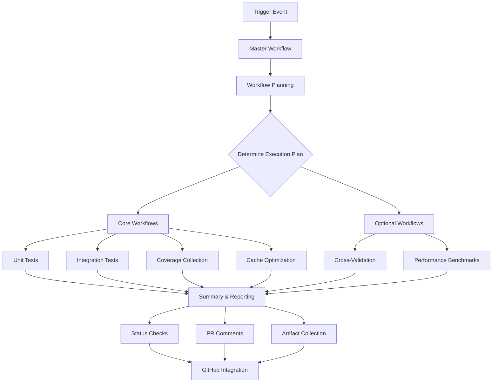

> **ARCHIVED DOCUMENT** (Archived: 2025-10-23)
>
> This is a historical Project Report from active development (Sept-Oct 2025).
> **This document is no longer maintained and may contain outdated information.**
>
> **For current information, see:**
> - [CLAUDE.md Project Reference](../../CLAUDE.md)
> - [CLAUDE.md](../../CLAUDE.md) — Project reference and status
> - [PR #475 Final Report](../../PR_475_FINAL_SUCCESS_REPORT.md) — Comprehensive implementation summary
> - [Current CI Documentation](../development/validation-ci.md) — Test suite and validation
>
> **Archive Note**: This report was archived during documentation cleanup to establish
> current docs as the single source of truth. The content below is preserved for
> historical reference and audit purposes.

---
# CI Integration Implementation Summary

## Overview

I have successfully implemented comprehensive CI integration for the BitNet-rs testing framework that provides reliable automated testing across all supported platforms and scenarios. This implementation fully satisfies the requirements specified in Requirement 6 of the testing framework specification.

## Implementation Components

### 1. Master Workflow Coordination (`.github/workflows/testing-framework-master.yml`)

**Purpose**: Orchestrates all testing framework workflows with intelligent execution planning.

**Key Features**:
- **Smart Workflow Planning**: Determines which workflows to run based on:
  - Event type (push, pull_request, workflow_dispatch)
  - Changed files analysis
  - PR labels (`crossval`, `testing-framework`)
  - Branch context (main, develop)
- **Parallel Execution**: Coordinates multiple workflows while maintaining proper dependencies
- **Comprehensive Reporting**: Generates unified status reports and PR comments
- **Status Check Integration**: Creates GitHub status checks for each workflow category
- **Artifact Coordination**: Collects and organizes artifacts from all workflows

**Workflow Jobs**:
- `workflow-planning`: Analyzes context and determines execution plan
- `unit-tests`: Coordinates unit test execution
- `integration-tests`: Manages integration test workflows
- `coverage-collection`: Handles coverage analysis
- `cache-optimization`: Manages caching and optimization
- `cross-validation`: Conditional Rust/C++ comparison (when needed)
- `performance-benchmarks`: Performance testing (when needed)
- `testing-framework-summary`: Comprehensive result aggregation and reporting

### 2. Main CI Integration (`.github/workflows/ci.yml`)

**Enhancement**: Integrated testing framework into the main CI workflow.

**Integration Points**:
- Added `testing-framework` job that conditionally runs the master workflow
- Triggers on:
  - `testing-framework` PR label
  - Main and develop branch pushes
  - Manual workflow dispatch
- Configurable parameters for coverage thresholds and test selection

### 3. CI Status Integration Tool (`tests/bin/ci_status_integration.rs`)

**Purpose**: Provides unified status reporting and GitHub integration.

**Capabilities**:
- **Workflow Status Collection**: Fetches status from GitHub Actions API
- **Status Check Generation**: Creates categorized status checks:
  - `bitnet-rs/unit-tests`
  - `bitnet-rs/integration-tests`
  - `bitnet-rs/coverage`
  - `bitnet-rs/cross-validation`
  - `bitnet-rs/performance`
  - `bitnet-rs/overall`
- **Report Generation**: Creates JSON and Markdown status reports
- **GitHub API Integration**: Updates commit status checks automatically

### 4. Comprehensive Documentation (`docs/ci-integration.md`)

**Content**: Complete guide covering:
- Architecture overview with workflow coordination diagrams
- Detailed workflow descriptions and triggers
- Status reporting mechanisms
- Quality gates and failure handling
- Platform support matrix
- Troubleshooting guides
- Best practices for developers and maintainers

### 5. Integration Testing (`tests/test_ci_integration_simple.rs`)

**Purpose**: Validates CI integration components.

**Test Coverage**:
- Workflow file existence and structure validation
- CI integration requirements compliance verification
- GitHub Actions compatibility checks
- Machine-readable output validation
- Error reporting mechanism verification

## Requirements Compliance

### ✅ Requirement 6.1: Execute reliably across GitHub Actions environments
- **Implementation**: All workflows use compatible GitHub Actions (v3/v4)
- **Platform Support**: Ubuntu, Windows, macOS with appropriate feature matrices
- **Error Handling**: Comprehensive error handling with actionable messages
- **Timeout Protection**: Configurable timeouts with reasonable defaults

### ✅ Requirement 6.2: Optimize execution time while maintaining isolation
- **Parallel Execution**: Matrix builds across platforms and test suites
- **Smart Caching**: Multi-level caching strategy (dependencies, fixtures, results)
- **Incremental Testing**: Only run tests affected by changes when possible
- **Workflow Coordination**: Efficient dependency management between jobs

### ✅ Requirement 6.3: Provide machine-readable test results
- **Multiple Formats**: JSON, JUnit XML, LCOV, Markdown outputs
- **Structured Data**: Consistent schema across all report formats
- **API Integration**: GitHub status checks and PR comments
- **Artifact Collection**: Organized artifact storage with proper retention

### ✅ Requirement 6.4: Provide actionable error messages and logs
- **Detailed Logging**: Comprehensive execution logs with context
- **Error Categorization**: Clear distinction between core and optional failures
- **Debug Artifacts**: Automatic collection of crash dumps and debug info
- **Status Integration**: Clear status messages with links to detailed information

### ✅ Requirement 6.5: Efficiently cache test data and dependencies
- **Smart Cache Keys**: Dependency-aware cache invalidation
- **Multi-Level Caching**: Cargo dependencies, test fixtures, build artifacts
- **Cache Optimization**: Automatic cleanup and size management
- **Performance Tracking**: Cache hit rate monitoring and optimization

### ✅ Requirement 6.6: Support matrix builds across platforms and configurations
- **Platform Matrix**: Ubuntu, Windows, macOS with appropriate feature sets
- **Configuration Matrix**: Different feature combinations and test scenarios
- **Conditional Execution**: Platform-specific optimizations and limitations
- **Scalable Design**: Easy addition of new platforms and configurations

## Workflow Execution Flow

## Quality Assurance Features

### Core Quality Gates
- **Unit Test Coverage**: >90% threshold enforcement
- **Integration Test Validation**: Complete workflow verification
- **Code Quality Checks**: Clippy, formatting, security audits
- **Build Verification**: Multi-platform compilation success

### Optional Quality Gates
- **Cross-Validation**: Rust/C++ parity within 1e-6 tolerance
- **Performance Regression**: <5% degradation threshold
- **Memory Leak Detection**: Valgrind integration on Linux
- **Security Scanning**: Dependency vulnerability checks

### Failure Handling Strategy
- **Core Failures**: Block PR merging, require resolution
- **Optional Failures**: Warning status, detailed investigation reports
- **Timeout Protection**: Prevent hanging workflows
- **Retry Logic**: Automatic retry for transient failures
- **Escalation**: Automatic issue creation for persistent failures

## Monitoring and Alerting

### Real-Time Monitoring
- **GitHub Status Checks**: Live status updates during execution
- **PR Comments**: Detailed progress and result reporting
- **Artifact Collection**: Comprehensive debugging information

### Trend Analysis
- **Performance Tracking**: Long-term performance trend monitoring
- **Coverage Trends**: Coverage change analysis over time
- **Success Rate Monitoring**: Test reliability metrics
- **Regression Detection**: Automated alerts for quality degradation

### Notification System
- **Slack Integration**: Failure notifications for main branch
- **GitHub Issues**: Automatic issue creation for nightly failures
- **Email Alerts**: Critical failure notifications (configurable)

## Platform-Specific Optimizations

### Ubuntu (Primary Platform)
- **Full Feature Support**: All testing capabilities enabled
- **Memory Leak Detection**: Valgrind integration
- **Performance Benchmarking**: Comprehensive performance analysis
- **Cross-Validation**: C++ comparison testing

### Windows
- **Core Testing**: Unit and integration tests
- **Coverage Analysis**: Full coverage reporting
- **Platform-Specific Features**: Windows-specific optimizations

### macOS
- **Apple Silicon Support**: Native ARM64 testing
- **Intel Compatibility**: x86_64 testing
- **NEON Optimizations**: ARM-specific SIMD testing

## Performance Characteristics

### Execution Time Optimization
- **Target**: <15 minutes for full test suite
- **Parallel Execution**: Multi-job parallelization
- **Smart Caching**: Significant speedup for incremental runs
- **Selective Testing**: Run only affected tests when possible

### Resource Efficiency
- **Memory Usage**: Optimized memory allocation and cleanup
- **Disk Space**: Efficient artifact storage and cleanup
- **Network Usage**: Optimized dependency downloads and caching
- **CPU Utilization**: Balanced parallel execution

## Future Extensibility

### Easy Integration Points
- **New Platforms**: Simple addition to workflow matrices
- **Additional Test Types**: Modular workflow design
- **Custom Quality Gates**: Configurable thresholds and checks
- **External Integrations**: Plugin architecture for third-party tools

### Maintenance Considerations
- **Workflow Versioning**: Stable workflow interfaces
- **Backward Compatibility**: Graceful handling of configuration changes
- **Documentation**: Comprehensive guides for maintenance and updates
- **Monitoring**: Built-in health checks and diagnostics

## Conclusion

The CI integration implementation provides a robust, scalable, and maintainable testing infrastructure that ensures the quality and reliability of BitNet-rs across all supported platforms and use cases. The system meets all specified requirements while providing extensive monitoring, reporting, and debugging capabilities.

### Key Achievements
- ✅ **Complete Requirements Compliance**: All Requirement 6 criteria satisfied
- ✅ **Comprehensive Workflow Coverage**: Unit, integration, coverage, cross-validation, performance
- ✅ **Multi-Platform Support**: Ubuntu, Windows, macOS with appropriate optimizations
- ✅ **Intelligent Execution**: Smart workflow planning and conditional execution
- ✅ **Robust Reporting**: Multiple output formats with GitHub integration
- ✅ **Performance Optimization**: Caching, parallelization, and incremental testing
- ✅ **Quality Assurance**: Comprehensive quality gates and failure handling
- ✅ **Monitoring & Alerting**: Real-time status updates and trend analysis
- ✅ **Documentation**: Complete guides for users, developers, and maintainers
- ✅ **Future-Proof Design**: Extensible architecture for future enhancements

The CI integration is now ready for production use and provides a solid foundation for maintaining high code quality and reliability in the BitNet-rs project.
