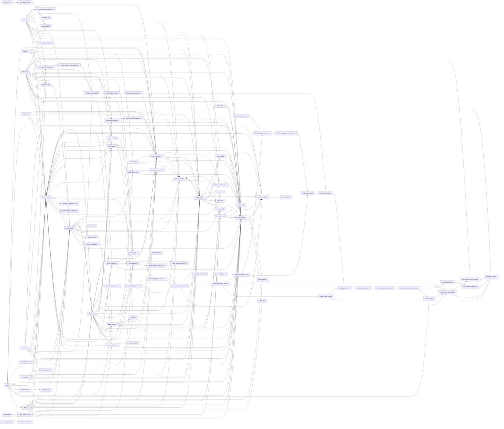

# Crate Dependency Graph

Generated by `scripts/maintenance/generate_deps_graph.py`.

```mermaid
graph LR
  bitnet --> bitnet_common
  bitnet --> bitnet_device_probe
  bitnet --> bitnet_ggml_ffi
  bitnet --> bitnet_inference
  bitnet --> bitnet_kernels
  bitnet --> bitnet_logits
  bitnet --> bitnet_math
  bitnet --> bitnet_models
  bitnet --> bitnet_quantization
  bitnet --> bitnet_rope
  bitnet --> bitnet_tests
  bitnet --> bitnet_tokenizers
  bitnet --> bitnet_transformer
  bitnet --> bitnet_warn_once
  bitnet_bdd_grid --> bitnet_bdd_grid_core
  bitnet_bdd_grid --> bitnet_runtime_feature_flags
  bitnet_cli --> bitnet_cli_sampling_core
  bitnet_cli --> bitnet_common
  bitnet_cli --> bitnet_eval_core
  bitnet_cli --> bitnet_ggml_ffi
  bitnet_cli --> bitnet_inference
  bitnet_cli --> bitnet_kernels
  bitnet_cli --> bitnet_models
  bitnet_cli --> bitnet_prompt_templates
  bitnet_cli --> bitnet_quantization
  bitnet_cli --> bitnet_repl_core
  bitnet_cli --> bitnet_runtime_bootstrap
  bitnet_cli --> bitnet_startup_contract_guard
  bitnet_cli --> bitnet_tokenizer_discovery_core
  bitnet_cli --> bitnet_tokenizers
  bitnet_cli --> bitnet_validation
  bitnet_common --> bitnet_math
  bitnet_common --> bitnet_test_support
  bitnet_common --> bitnet_warn_once
  bitnet_compat --> bitnet_common
  bitnet_compat --> bitnet_models
  bitnet_compat --> bitnet_tokenizers
  bitnet_crossval --> bitnet_common
  bitnet_crossval --> bitnet_ggml_ffi
  bitnet_crossval --> bitnet_inference
  bitnet_crossval --> bitnet_models
  bitnet_crossval --> bitnet_sys
  bitnet_crossval --> bitnet_tokenizers
  bitnet_device_probe --> bitnet_common
  bitnet_device_probe --> bitnet_intel_gpu_id
  bitnet_download --> bitnet_http_retry
  bitnet_engine_core --> bitnet_common
  bitnet_engine_core --> bitnet_generation
  bitnet_engine_core --> bitnet_logits
  bitnet_feature_contract --> bitnet_bdd_grid
  bitnet_feature_contract --> bitnet_feature_matrix
  bitnet_feature_matrix --> bitnet_runtime_profile_core
  bitnet_ffi --> bitnet_common
  bitnet_ffi --> bitnet_compat
  bitnet_ffi --> bitnet_inference
  bitnet_ffi --> bitnet_models
  bitnet_ffi --> bitnet_tokenizers
  bitnet_fuzz --> bitnet_bdd_grid_core
  bitnet_fuzz --> bitnet_common
  bitnet_fuzz --> bitnet_engine_core
  bitnet_fuzz --> bitnet_generation
  bitnet_fuzz --> bitnet_gguf
  bitnet_fuzz --> bitnet_honest_compute
  bitnet_fuzz --> bitnet_inference
  bitnet_fuzz --> bitnet_kernels
  bitnet_fuzz --> bitnet_logits
  bitnet_fuzz --> bitnet_models
  bitnet_fuzz --> bitnet_prompt_templates
  bitnet_fuzz --> bitnet_quantization
  bitnet_fuzz --> bitnet_receipts
  bitnet_fuzz --> bitnet_rope
  bitnet_fuzz --> bitnet_runtime_feature_flags_core
  bitnet_fuzz --> bitnet_sampling
  bitnet_fuzz --> bitnet_st2gguf
  bitnet_fuzz --> bitnet_tokenizers
  bitnet_fuzz --> bitnet_validation
  bitnet_generation --> bitnet_generation_events_core
  bitnet_generation --> bitnet_generation_stop_core
  bitnet_generation_events_core --> bitnet_generation_stop_core
  bitnet_inference --> bitnet_common
  bitnet_inference --> bitnet_device_probe
  bitnet_inference --> bitnet_engine_core
  bitnet_inference --> bitnet_generation
  bitnet_inference --> bitnet_gguf
  bitnet_inference --> bitnet_inference_metrics_core
  bitnet_inference --> bitnet_kernels
  bitnet_inference --> bitnet_kv_cache_policy_core
  bitnet_inference --> bitnet_logits
  bitnet_inference --> bitnet_models
  bitnet_inference --> bitnet_prompt_templates
  bitnet_inference --> bitnet_quantization
  bitnet_inference --> bitnet_receipts
  bitnet_inference --> bitnet_rope
  bitnet_inference --> bitnet_sampling
  bitnet_inference --> bitnet_sys
  bitnet_inference --> bitnet_test_support
  bitnet_inference --> bitnet_tokenizers
  bitnet_kernels --> bitnet_common
  bitnet_kernels --> bitnet_cpu_activations
  bitnet_kernels --> bitnet_cpu_detect
  bitnet_kernels --> bitnet_device_probe
  bitnet_kernels --> bitnet_ggml_ffi
  bitnet_kernels --> bitnet_quantization
  bitnet_kernels --> bitnet_simd
  bitnet_kernels --> bitnet_test_support
  bitnet_kernels --> bitnet_tests
  bitnet_logits --> bitnet_logits_filters
  bitnet_models --> bitnet_common
  bitnet_models --> bitnet_ggml_ffi
  bitnet_models --> bitnet_gguf
  bitnet_models --> bitnet_quantization
  bitnet_models --> bitnet_st2gguf
  bitnet_models --> bitnet_test_fixtures_core
  bitnet_models --> bitnet_test_support
  bitnet_models --> bitnet_trace
  bitnet_models --> bitnet_transformer
  bitnet_opencl --> bitnet_common
  bitnet_prompt_templates --> bitnet_common
  bitnet_prompt_templates --> bitnet_prompt_templates_core
  bitnet_prompt_templates_core --> bitnet_common
  bitnet_prompt_templates_core --> bitnet_tokenizers
  bitnet_py --> bitnet_common
  bitnet_py --> bitnet_inference
  bitnet_py --> bitnet_models
  bitnet_py --> bitnet_quantization
  bitnet_py --> bitnet_tokenizers
  bitnet_quantization --> bitnet_common
  bitnet_quantization --> bitnet_kernels
  bitnet_quantization --> bitnet_models
  bitnet_receipts --> bitnet_common
  bitnet_receipts --> bitnet_receipts_core
  bitnet_receipts_core --> bitnet_common
  bitnet_receipts_core --> bitnet_honest_compute
  bitnet_receipts_core --> bitnet_kernels
  bitnet_runtime_bootstrap --> bitnet_startup_contract
  bitnet_runtime_context --> bitnet_runtime_context_core
  bitnet_runtime_context_core --> bitnet_bdd_grid_core
  bitnet_runtime_feature_flags --> bitnet_bdd_grid_core
  bitnet_runtime_feature_flags --> bitnet_runtime_feature_flags_core
  bitnet_runtime_feature_flags_core --> bitnet_bdd_grid_core
  bitnet_runtime_profile --> bitnet_feature_matrix
  bitnet_runtime_profile_contract --> bitnet_runtime_profile_contract_core
  bitnet_runtime_profile_contract_core --> bitnet_bdd_grid
  bitnet_runtime_profile_contract_core --> bitnet_runtime_context
  bitnet_runtime_profile_contract_core --> bitnet_runtime_feature_flags
  bitnet_runtime_profile_core --> bitnet_runtime_profile_contract
  bitnet_safetensors_ln --> bitnet_validation
  bitnet_sampling --> bitnet_logits
  bitnet_server --> bitnet_common
  bitnet_server --> bitnet_eval_core
  bitnet_server --> bitnet_inference
  bitnet_server --> bitnet_kernels
  bitnet_server --> bitnet_models
  bitnet_server --> bitnet_runtime_bootstrap
  bitnet_server --> bitnet_startup_contract_guard
  bitnet_server --> bitnet_tokenizers
  bitnet_st_tools --> bitnet_safetensors_ln
  bitnet_st2gguf --> bitnet_common
  bitnet_st2gguf --> bitnet_models
  bitnet_startup_contract --> bitnet_startup_contract_core
  bitnet_startup_contract_core --> bitnet_runtime_profile
  bitnet_startup_contract_diagnostics --> bitnet_runtime_bootstrap
  bitnet_startup_contract_guard --> bitnet_runtime_bootstrap
  bitnet_startup_contract_guard --> bitnet_startup_contract_diagnostics
  bitnet_test_support --> bitnet_test_env
  bitnet_testing_policy --> bitnet_testing_policy_core
  bitnet_testing_policy_contract --> bitnet_feature_contract
  bitnet_testing_policy_contract --> bitnet_runtime_feature_flags
  bitnet_testing_policy_contract --> bitnet_testing_policy_core
  bitnet_testing_policy_core --> bitnet_testing_profile
  bitnet_testing_policy_core --> bitnet_testing_scenarios_core
  bitnet_testing_policy_interop --> bitnet_runtime_feature_flags
  bitnet_testing_policy_interop --> bitnet_testing_policy_contract
  bitnet_testing_policy_interop --> bitnet_testing_policy_kit
  bitnet_testing_policy_kit --> bitnet_testing_policy
  bitnet_testing_policy_runtime --> bitnet_testing_policy_interop
  bitnet_testing_policy_runtime --> bitnet_testing_policy_runtime_core
  bitnet_testing_policy_runtime_core --> bitnet_testing_policy_interop
  bitnet_testing_policy_tests --> bitnet_testing_policy_runtime
  bitnet_testing_profile --> bitnet_runtime_profile
  bitnet_testing_scenarios --> bitnet_testing_scenarios_core
  bitnet_testing_scenarios_core --> bitnet_testing_scenarios_profile_core
  bitnet_testing_scenarios_profile_core --> bitnet_testing_profile
  bitnet_tests --> bitnet
  bitnet_tests --> bitnet_common
  bitnet_tests --> bitnet_compat
  bitnet_tests --> bitnet_crossval
  bitnet_tests --> bitnet_device_probe
  bitnet_tests --> bitnet_engine_core
  bitnet_tests --> bitnet_generation
  bitnet_tests --> bitnet_gguf
  bitnet_tests --> bitnet_honest_compute
  bitnet_tests --> bitnet_inference
  bitnet_tests --> bitnet_kernels
  bitnet_tests --> bitnet_logits
  bitnet_tests --> bitnet_models
  bitnet_tests --> bitnet_prompt_templates
  bitnet_tests --> bitnet_quantization
  bitnet_tests --> bitnet_receipts
  bitnet_tests --> bitnet_sampling
  bitnet_tests --> bitnet_test_support
  bitnet_tests --> bitnet_testing_policy_tests
  bitnet_tests --> bitnet_tokenizers
  bitnet_tests_new --> bitnet_common
  bitnet_tests_new --> bitnet_inference
  bitnet_tests_new --> bitnet_kernels
  bitnet_tests_new --> bitnet_models
  bitnet_tokenizers --> bitnet_common
  bitnet_tokenizers --> bitnet_models
  bitnet_tokenizers --> bitnet_quantization
  bitnet_tokenizers --> bitnet_test_fixtures_core
  bitnet_tokenizers --> bitnet_test_support
  bitnet_tokenizers --> bitnet_tests
  bitnet_transformer --> bitnet_common
  bitnet_transformer --> bitnet_quantization
  bitnet_transformer --> bitnet_rope
  bitnet_transformer --> bitnet_test_support
  bitnet_vulkan --> bitnet_vulkan_shaders
  bitnet_wasm --> bitnet_common
  bitnet_wasm --> bitnet_inference
  bitnet_wasm --> bitnet_kernels
  bitnet_wasm --> bitnet_models
  bitnet_wasm --> bitnet_quantization
  bitnet_wasm --> bitnet_tokenizers
  bitnet_wasm --> bitnet_wasm_utils
  bitnet_wgpu_bench --> bitnet_bench_receipts
  xtask --> bitnet
  xtask --> bitnet_bdd_grid
  xtask --> bitnet_common
  xtask --> bitnet_crossval
  xtask --> bitnet_download
  xtask --> bitnet_inference
  xtask --> bitnet_kernels
  xtask --> bitnet_models
  xtask --> bitnet_sys
  xtask --> bitnet_test_support
  xtask --> bitnet_tokenizers
```

Total crates in graph: **93**
Total edges in graph: **237**
