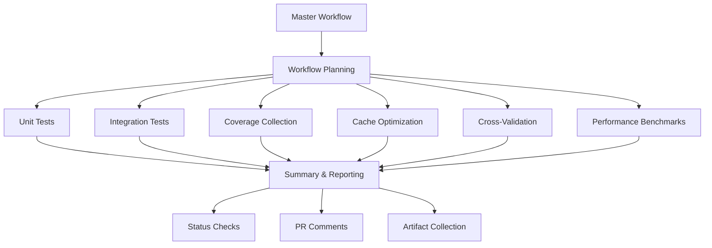

# CI Integration Guide

This document describes the comprehensive CI integration setup for the BitNet-rs testing framework.

## Overview

The BitNet-rs testing framework provides reliable automated testing through a coordinated set of GitHub Actions workflows that ensure code quality, performance, and compatibility across platforms.

## Architecture

### Master Workflow Coordination

The testing framework uses a master workflow (`testing-framework-master.yml`) that coordinates all testing activities:



### Workflow Components

#### 1. Core Workflows (Always Run)
- **Unit Tests** (`testing-framework-unit.yml`)
  - Comprehensive unit test coverage across all crates
  - Multi-platform testing (Ubuntu, Windows, macOS)
  - Coverage threshold enforcement (90% minimum)
  - Property-based testing for critical components

- **Integration Tests** (`testing-framework-integration.yml`)
  - End-to-end workflow validation
  - Component interaction testing
  - Configuration testing across scenarios
  - Resource management validation

- **Coverage Collection** (`testing-framework-coverage.yml`)
  - Line, function, and branch coverage analysis
  - Per-crate coverage reporting
  - HTML and LCOV report generation
  - Codecov integration

- **Cache Optimization** (`testing-framework-cache-optimization.yml`)
  - Intelligent test caching
  - Incremental testing based on changes
  - Performance optimization tracking

#### 2. Conditional Workflows
- **Cross-Validation** (`testing-framework-crossval.yml`)
  - Rust vs C++ implementation comparison
  - Accuracy validation within 1e-6 tolerance
  - Performance benchmarking
  - Triggered by: `crossval` label, main branch pushes, nightly schedule

- **Performance Benchmarks** (`testing-framework-performance.yml`)
  - Comprehensive performance testing
  - Regression detection (5% threshold)
  - Memory usage analysis
  - Triggered by: main branch pushes, performance-related changes

- **Receipt Verification** (`verify-receipts.yml`)
  - Validates inference receipts for honest compute evidence
  - Tests positive examples (valid receipts should pass)
  - Tests negative examples (invalid receipts should fail)
  - Verifies generated receipts from benchmarks
  - Enforces compute_path == "real" (no mock inference)
  - Validates kernel IDs and backend-kernel alignment
  - Triggered by: PR/push to main/develop affecting inference/benchmarks

#### 3. Reporting and Coordination
- **CI Reporting** (`ci-reporting.yml`)
  - Aggregates results from all workflows
  - Generates comprehensive reports
  - Updates PR comments with status
  - Creates GitHub status checks

## Workflow Triggers

### Automatic Triggers
- **Push to main/develop**: Runs full test suite including performance benchmarks
- **Pull Request**: Runs core tests (unit, integration, coverage, optimization)
- **Nightly Schedule**: Runs cross-validation and comprehensive analysis
- **File Changes**: Smart triggering based on changed files

### Manual Triggers
- **Workflow Dispatch**: Manual execution with configurable parameters
- **PR Labels**:
  - `crossval`: Triggers cross-validation tests
  - `testing-framework`: Forces full testing framework execution

## Status Reporting

### GitHub Status Checks
The CI integration creates detailed status checks for each component:

- `bitnet-rs/unit-tests`: Unit test results
- `bitnet-rs/integration-tests`: Integration test results
- `bitnet-rs/coverage`: Coverage analysis results
- `bitnet-rs/cross-validation`: Rust/C++ parity validation
- `bitnet-rs/performance`: Performance benchmark results
- `bitnet-rs/overall`: Overall testing framework status

### PR Comments
Automated PR comments provide:
- Comprehensive test result summary
- Coverage analysis with trends
- Performance impact assessment
- Cross-validation results (when applicable)
- Links to detailed reports and artifacts

### Artifact Collection
All workflows generate artifacts with 30-90 day retention:
- Test result files (JSON, JUnit XML)
- Coverage reports (HTML, LCOV)
- Performance data and visualizations
- Cross-validation comparison reports
- Debug logs and crash dumps

## Quality Gates

### Core Requirements (Must Pass)
1. **Unit Tests**: >90% coverage across all target crates
2. **Integration Tests**: All workflow scenarios pass
3. **Code Quality**: Clippy, formatting, and security checks pass

### Optional Requirements (Warning Only)
1. **Cross-Validation**: Rust/C++ parity within tolerance
2. **Performance**: No regressions >5% from baseline

### Failure Handling
- **Core Failures**: Block PR merging, create GitHub status failure
- **Optional Failures**: Warning status, detailed reporting for investigation
- **Timeout Protection**: 15-minute maximum execution time per workflow
- **Retry Logic**: Automatic retry for transient failures

## Configuration

### Environment Variables
```yaml
CARGO_TERM_COLOR: always
RUST_BACKTRACE: 1
BITNET_TEST_CACHE_ENABLED: true
BITNET_TEST_INCREMENTAL: true
BITNET_TEST_SMART_SELECTION: true
```

### Workflow Inputs
- `coverage_threshold`: Minimum coverage percentage (default: 90%)
- `run_crossval`: Force cross-validation execution
- `run_performance`: Force performance benchmark execution
- `test_timeout`: Test execution timeout in minutes

### Cache Strategy
- **Smart Caching**: Dependency-aware cache invalidation
- **Fixture Caching**: Shared test data across workflows
- **Incremental Testing**: Only run tests affected by changes
- **Cache Cleanup**: Automatic cleanup of old cache entries

## Platform Support

### Supported Platforms
- **Ubuntu Latest**: Primary platform with full feature support
- **Windows Latest**: Full compatibility testing
- **macOS Latest**: Apple Silicon and Intel support

### Feature Matrix
| Feature | Ubuntu | Windows | macOS |
|---------|--------|---------|-------|
| Unit Tests | ✅ | ✅ | ✅ |
| Integration Tests | ✅ | ✅ | ✅ |
| Coverage Collection | ✅ | ✅ | ✅ |
| Cross-Validation | ✅ | ❌ | ✅ |
| Performance Benchmarks | ✅ | ❌ | ❌ |
| Memory Leak Detection | ✅ | ❌ | ❌ |

## Monitoring and Alerting

### Failure Notifications
- **Slack Integration**: Automatic notifications for main branch failures
- **GitHub Issues**: Automatic issue creation for nightly test failures
- **Email Alerts**: Critical failure notifications (configured per repository)

### Trend Analysis
- **Performance Tracking**: Long-term performance trend analysis
- **Coverage Trends**: Coverage change tracking over time
- **Success Rate Monitoring**: Test reliability metrics
- **GitHub Pages**: Public dashboard with trend visualizations

## Troubleshooting

### Common Issues

#### 1. Test Timeouts
- **Cause**: Long-running tests or resource contention
- **Solution**: Increase timeout, optimize test performance, or split tests
- **Prevention**: Monitor test execution times, set reasonable timeouts

#### 2. Cache Misses
- **Cause**: Cache key changes or cache eviction
- **Solution**: Verify cache key generation, check cache size limits
- **Prevention**: Use stable cache keys, monitor cache hit rates

#### 3. Cross-Validation Failures
- **Cause**: C++ setup issues or accuracy drift
- **Solution**: Rebuild C++ implementation, adjust tolerance if needed
- **Prevention**: Regular C++ dependency updates, tolerance monitoring

#### 4. Coverage Drops
- **Cause**: New untested code or test removal
- **Solution**: Add tests for new code, verify test coverage
- **Prevention**: Enforce coverage requirements, review coverage reports

#### 5. Receipt Verification Failures
- **Cause**: Mock compute path, missing kernels, or backend-kernel mismatch
- **Solution**:
  - Ensure `compute_path == "real"` in generated receipts
  - Verify kernel IDs are populated from actual execution
  - Check backend-kernel alignment (GPU receipts need GPU kernels)
- **Prevention**:
  - Use `cargo run -p xtask -- benchmark` to generate valid receipts
  - Test with example receipts: `docs/tdd/receipts/cpu_positive_example.json`
  - Validate locally: `cargo run -p xtask -- verify-receipt --path ci/inference.json`

### Debug Information

#### Workflow Logs
All workflows provide detailed logging:
- Test execution progress
- Performance metrics
- Error messages with context
- System resource usage

#### Artifact Analysis
Debug artifacts include:
- Complete test logs
- System performance data
- Memory usage profiles
- Crash dumps (when applicable)

#### Status Integration
The `ci_status_integration` tool provides:
- Unified status reporting
- Cross-workflow coordination
- Detailed failure analysis
- Historical trend data

## Best Practices

### For Developers
1. **Run Tests Locally**: Use `cargo test` before pushing
2. **Check Coverage**: Use `cargo llvm-cov` to verify coverage
3. **Monitor Performance**: Watch for performance regressions
4. **Use Labels**: Apply appropriate PR labels for testing needs

### For Maintainers
1. **Review Failures**: Investigate all test failures promptly
2. **Update Baselines**: Adjust performance baselines when needed
3. **Monitor Trends**: Review weekly trend reports
4. **Maintain Dependencies**: Keep test dependencies updated

### For CI Configuration
1. **Stable Workflows**: Avoid frequent workflow changes
2. **Clear Naming**: Use descriptive workflow and job names
3. **Proper Timeouts**: Set appropriate timeouts for all jobs
4. **Resource Limits**: Monitor and optimize resource usage

## Integration with Development Workflow

### Pull Request Process
1. **Automatic Testing**: Core tests run on every PR
2. **Status Checks**: Required status checks prevent merging failures
3. **Review Integration**: Test results inform code review process
4. **Merge Requirements**: All core tests must pass before merge

### Release Process
1. **Pre-Release Testing**: Comprehensive test suite before release
2. **Performance Validation**: Benchmark against previous releases
3. **Cross-Platform Verification**: Test on all supported platforms
4. **Quality Gates**: Enforce quality requirements for releases

### Continuous Monitoring
1. **Nightly Tests**: Comprehensive testing during off-hours
2. **Trend Analysis**: Long-term quality and performance monitoring
3. **Proactive Alerts**: Early warning for potential issues
4. **Regular Reviews**: Weekly review of test results and trends

This CI integration provides a robust, scalable, and maintainable testing infrastructure that ensures the quality and reliability of BitNet-rs across all supported platforms and use cases.
