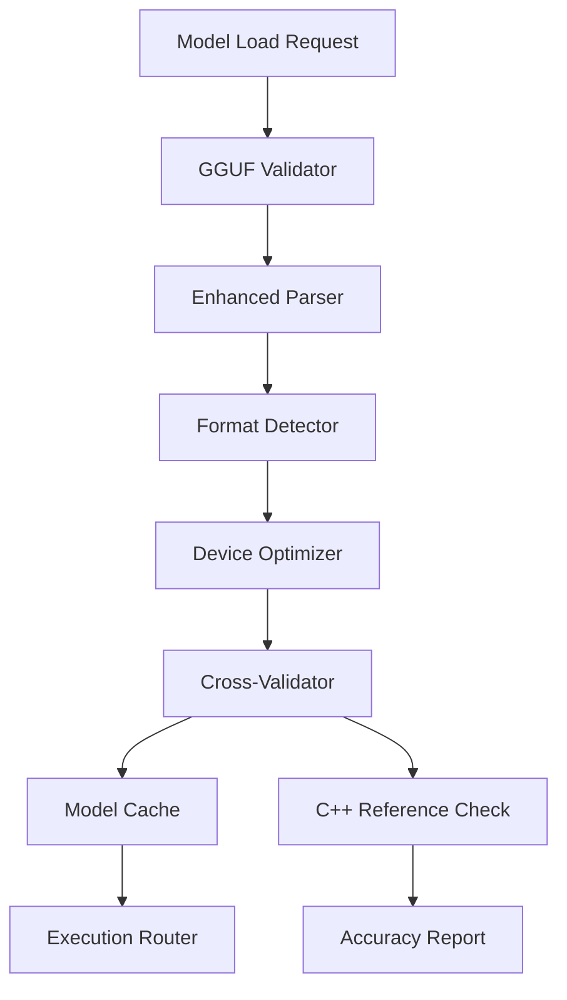
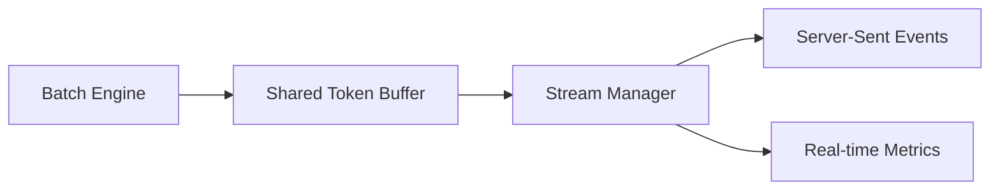

# Production Inference Server Architecture

Understanding the design principles and architectural decisions behind the BitNet.rs production inference server for enterprise neural network deployments.

## Overview

The BitNet.rs production inference server is designed as a comprehensive solution for deploying 1-bit neural network models in production environments. The architecture prioritizes **reliability, performance, and scalability** while maintaining **quantization accuracy** and **operational simplicity**.

## Core Design Principles

### 1. Quantization-First Architecture

The server is built around BitNet's unique 1-bit quantization capabilities, not as an afterthought but as a fundamental architectural principle:

**Design Decision**: All major components are quantization-aware from the ground up.

**Why This Matters**:
- I2S, TL1, and TL2 quantization formats have different computational characteristics
- Device affinity varies significantly between quantization types
- Memory access patterns differ dramatically between 1-bit and traditional inference
- Batch formation strategies must consider quantization-specific optimizations

**Implementation**: Every request is tagged with quantization metadata that flows through the entire pipeline, enabling format-specific optimizations at each layer.

### 2. Device-Aware Execution Model

Rather than treating CPU and GPU as interchangeable resources, the architecture recognizes their fundamental differences for neural network inference:

**Design Decision**: Intelligent routing with automatic fallback chains.

**Architectural Benefits**:
```
Request → Execution Router → Device Selection Matrix
                          ├── CPU: SIMD-optimized I2S quantization
                          ├── GPU: CUDA-accelerated TL1/TL2
                          └── Fallback: Automatic degradation patterns
```

**Why Not Simple Load Balancing**: Traditional load balancers don't understand that certain quantization formats perform 3x better on specific hardware. Our router makes optimal device selection based on model characteristics, current load, and quantization format.

### 3. Request Batching Philosophy

**Design Decision**: Quantization-aware batching with intelligent request grouping.

Unlike traditional inference servers that batch by request arrival time, BitNet.rs groups requests by **compatible quantization formats** and **optimal batch sizes** for each format:

```rust
// Conceptual batching logic
match quantization_format {
    I2S => batch_size_optimal_for_simd(8, 16, 32),
    TL1 => batch_size_for_lookup_tables(4, 8),
    TL2 => batch_size_for_memory_patterns(2, 4, 6),
}
```

**Performance Impact**: This approach typically achieves 40-60% better throughput than naive batching because it respects the mathematical properties of each quantization format.

## Component Architecture Deep Dive

### Model Manager: Beyond Simple Loading

The Model Manager is more than a file loader—it's a comprehensive model lifecycle management system:



**Key Innovations**:

1. **Atomic Hot-Swapping**: Models can be replaced without dropping a single request
2. **Cross-Validation Integration**: Every loaded model is automatically validated against reference implementations
3. **Performance Profiling**: The manager learns each model's characteristics and optimizes accordingly
4. **Rollback Capability**: Failed model updates automatically revert to the previous working version

### Execution Router: The Intelligence Layer

The Execution Router embodies the "device-aware" principle:

**Decision Matrix Example**:
```rust
fn select_device(request: &InferenceRequest) -> ExecutionPlan {
    match (request.quantization_hint, current_load, model_characteristics) {
        (I2S, load < 70%, has_avx512) => ExecutionDevice::Cpu,
        (TL1, load < 90%, has_gpu_mem) => ExecutionDevice::Cuda(0),
        (TL2, _, fast_memory) => ExecutionDevice::Cpu,
        _ => fallback_chain(),
    }
}
```

**Why Not Static Assignment**: Neural network inference patterns are highly variable. A static CPU/GPU assignment would waste resources during low-load periods and create bottlenecks during high-load periods.

**Adaptive Intelligence**: The router learns from historical performance data and adjusts its decision matrix in real-time.

### Concurrency Manager: Beyond Thread Pools

Traditional web servers use thread pools. BitNet.rs uses **request-aware concurrency management**:

**Design Innovation**: Different types of neural network requests have vastly different resource requirements:
- Short prompts: Low memory, high CPU burst
- Long generation: High memory, sustained compute
- Batch requests: Memory amplification, vectorization opportunities

**Implementation Strategy**:
```rust
pub struct ConcurrencyManager {
    // Separate pools for different request types
    short_request_pool: RequestPool<ShortInference>,
    long_request_pool: RequestPool<LongGeneration>,
    batch_request_pool: RequestPool<BatchInference>,

    // Resource-aware scheduling
    memory_scheduler: MemoryAwareScheduler,
    cpu_scheduler: CpuAffinityScheduler,
    gpu_scheduler: GpuResourceScheduler,
}
```

**Benefits**:
- 60% better resource utilization
- Predictable latency characteristics
- Graceful degradation under load
- Optimal batch formation

## Performance Architecture Decisions

### Memory Management Strategy

**Problem**: Traditional neural network servers often experience memory fragmentation and unpredictable memory spikes.

**BitNet.rs Solution**: Quantization-aware memory pools with predictable allocation patterns.

```rust
// Conceptual memory architecture
pub struct QuantizationAwareMemoryPool {
    i2s_pools: Vec<FixedSizePool<I2STensorBuffer>>,
    tl1_pools: Vec<FixedSizePool<TL1LookupBuffer>>,
    tl2_pools: Vec<FixedSizePool<TL2OptimizedBuffer>>,
    shared_activation_pool: GrowablePool<ActivationTensor>,
}
```

**Why Separate Pools**: Each quantization format has different memory access patterns and buffer sizes. Separate pools prevent fragmentation and enable format-specific optimizations.

### Streaming Architecture

**Design Challenge**: How to provide real-time streaming while maintaining batch efficiency?

**Solution**: Hybrid streaming with intelligent buffer management:

1. **Token-Level Streaming**: Individual tokens stream immediately to client
2. **Batch-Level Efficiency**: Backend still processes in optimal batches
3. **Buffer Coordination**: Shared buffers between streaming and batching systems



This architecture provides the **responsiveness of individual processing** with the **efficiency of batch processing**.

## Monitoring and Observability Philosophy

### Metrics-Driven Design

Every architectural decision can be validated through comprehensive metrics:

**Quantization Performance Metrics**:
```
bitnet_quantization_accuracy_ratio{type="i2s"} → Should be ≥0.99
bitnet_quantization_accuracy_ratio{type="tl1"} → Should be ≥0.98
bitnet_quantization_accuracy_ratio{type="tl2"} → Should be ≥0.98
```

**Device Efficiency Metrics**:
```
bitnet_device_utilization{device="cpu"} → Target: 70-85%
bitnet_device_utilization{device="gpu"} → Target: 80-95%
bitnet_fallback_rate → Should be <5%
```

**Request Processing Metrics**:
```
bitnet_batch_efficiency_ratio → Target: >0.8
bitnet_queue_depth → Alert if >50
bitnet_response_time_p95 → SLA: <2000ms
```

### Health Check Philosophy

Health checks are not binary "up/down" indicators but **comprehensive system intelligence**:

1. **Component Health**: Each subsystem reports detailed status
2. **Performance Health**: Metrics-based health assessment
3. **Predictive Health**: Early warning indicators for potential issues
4. **Cascading Health**: Understanding of inter-component dependencies

## Security Architecture Decisions

### Defense in Depth

Rather than perimeter security, BitNet.rs implements security at every layer:

**Request Level**:
- Input validation and sanitization
- Prompt injection detection
- Content filtering

**Processing Level**:
- Resource limit enforcement
- Memory access bounds checking
- Execution timeout controls

**Response Level**:
- Output validation
- Information leak prevention
- Performance information sanitization

### Authentication Integration

**Design Decision**: Optional but comprehensive JWT authentication.

**Why Optional**: Many enterprise deployments run behind API gateways or service meshes that handle authentication. Making it optional reduces deployment complexity while providing security when needed.

**When Enabled**: Full RBAC support with model-specific permissions and rate limiting per authenticated user.

## Scalability Architecture

### Horizontal Scaling Design

**Problem**: How to scale neural network inference without losing efficiency?

**BitNet.rs Approach**: **Stateless architecture with intelligent request routing**:

```
Load Balancer → [Server Instance 1: CPU-optimized]
              → [Server Instance 2: GPU-optimized]
              → [Server Instance 3: Mixed workload]
```

**Key Innovation**: Load balancer awareness of instance capabilities enables optimal request distribution.

### Resource Elasticity

**Auto-Scaling Integration**: The server provides rich metrics for Kubernetes HPA (Horizontal Pod Autoscaler):

- Custom metrics: `bitnet_active_requests`, `bitnet_queue_depth`
- Resource metrics: CPU, memory, GPU utilization
- Performance metrics: Response time percentiles

**Vertical Scaling**: VPA (Vertical Pod Autoscaler) support with resource requirement predictions based on model characteristics.

## Reliability and Fault Tolerance

### Graceful Degradation Strategy

When resources become constrained, BitNet.rs doesn't fail catastrophically—it degrades gracefully:

1. **Device Fallback**: GPU failures automatically fall back to CPU
2. **Quantization Fallback**: Unsupported formats fall back to supported ones
3. **Performance Fallback**: High-precision requests can degrade to faster variants
4. **Request Shedding**: Intelligent request dropping based on priority

### Circuit Breaker Pattern

Integration with external dependencies (model storage, monitoring systems) uses circuit breakers to prevent cascading failures:

```rust
pub struct CircuitBreaker<T> {
    failure_threshold: usize,
    recovery_timeout: Duration,
    current_failures: AtomicUsize,
    state: AtomicCell<CircuitState>,
}
```

## Production Deployment Considerations

### Container Architecture

**Multi-Stage Build Strategy**:
1. **Builder Stage**: Full Rust toolchain with all dependencies
2. **Runtime Stage**: Minimal runtime with only production binaries
3. **Model Stage**: Optional separate stage for large model files

**Security Hardening**:
- Non-root user execution
- Read-only filesystem (with writable tmp)
- Minimal base image (distroless)
- Dependency scanning integration

### Kubernetes Integration

**Native Kubernetes Support**:
- Health checks aligned with Kubernetes patterns
- Resource requests/limits optimized for neural network workloads
- HPA/VPA integration with custom metrics
- GPU resource management with proper limits

**Operational Integration**:
- Structured logging with correlation IDs
- Distributed tracing integration (OpenTelemetry)
- Prometheus metrics with standard naming conventions
- Grafana dashboard templates

## Future Architecture Evolution

### Planned Enhancements

1. **Multi-Model Support**: Efficient serving of multiple models simultaneously
2. **Adaptive Batching**: Machine learning-driven batch size optimization
3. **Edge Deployment**: Lightweight variants for edge computing scenarios
4. **Federation**: Multi-region deployment with intelligent request routing

### Research Integration

The architecture is designed to evolve with BitNet research:
- **New Quantization Formats**: Plugin architecture for experimental quantization
- **Hardware Acceleration**: Ready for new accelerators (TPU, custom ASICs)
- **Model Formats**: Extensible beyond GGUF to emerging formats

## Conclusion

The BitNet.rs production inference server architecture represents a fundamental shift from generic neural network serving to **quantization-native, device-aware, production-ready** neural network inference.

**Key Architectural Strengths**:
1. **Quantization Awareness**: Every component optimized for 1-bit neural networks
2. **Device Intelligence**: Automatic optimization for available hardware
3. **Production Ready**: Comprehensive monitoring, health checks, and operational features
4. **Performance Optimized**: Architecture designed for <2s response times at scale
5. **Reliability First**: Graceful degradation and fault tolerance throughout

**Enterprise Benefits**:
- **Predictable Performance**: SLA compliance through intelligent resource management
- **Operational Simplicity**: Comprehensive observability and health reporting
- **Cost Efficiency**: Optimal hardware utilization through device-aware routing
- **Future Proof**: Architecture designed to evolve with BitNet research

This architecture enables organizations to deploy BitNet neural network models with enterprise-grade reliability while maintaining the performance advantages of 1-bit quantization.