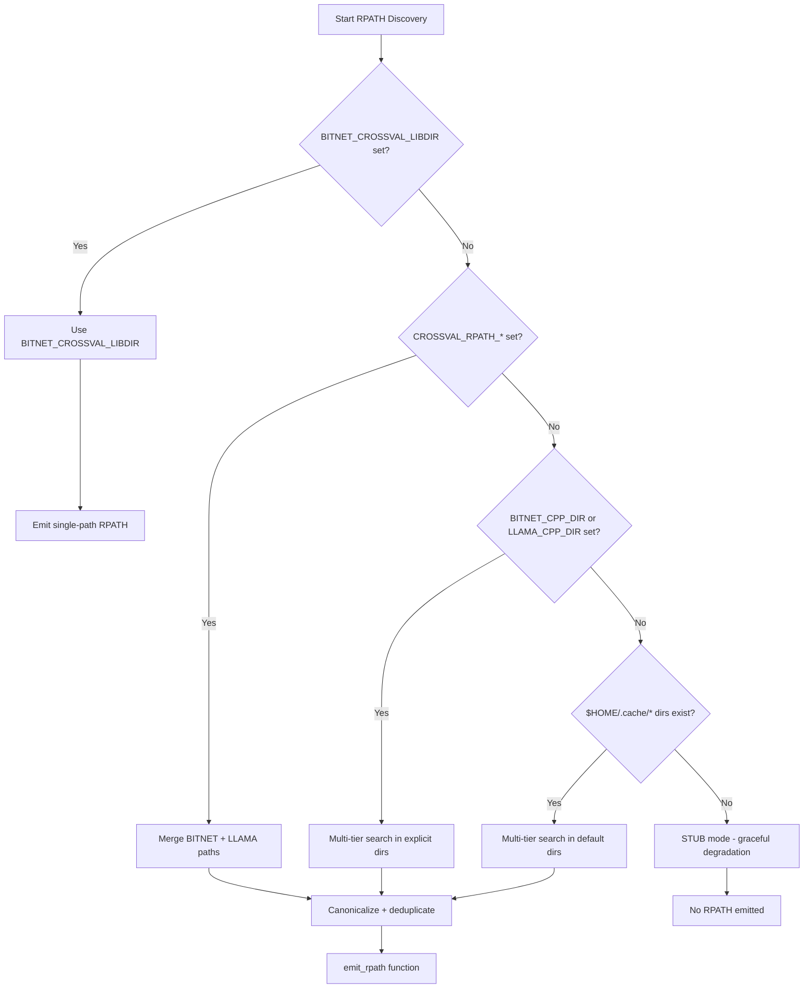

# RPATH Multi-Backend Merge: Unified Library Path Resolution

**Version:** 1.0.0
**Status:** Implementation-Ready
**Created:** 2025-10-26
**Component:** `xtask/build.rs`, `crossval/build.rs`, `xtask/src/build_helpers.rs`
**Feature Scope:** Cross-validation infrastructure (requires `crossval`, `crossval-all`, or `ffi` features)
**Analysis Artifact:** `/tmp/rpath_merge_analysis.md`

---

## Table of Contents

1. [Executive Summary](#1-executive-summary)
2. [User Stories and Business Value](#2-user-stories-and-business-value)
3. [Acceptance Criteria](#3-acceptance-criteria)
4. [Technical Requirements](#4-technical-requirements)
5. [Architecture and Algorithm Design](#5-architecture-and-algorithm-design)
6. [API Contracts](#6-api-contracts)
7. [Integration Points](#7-integration-points)
8. [Test Strategy](#8-test-strategy)
9. [Performance and Constraints](#9-performance-and-constraints)
10. [Risks and Mitigations](#10-risks-and-mitigations)
11. [Documentation Updates](#11-documentation-updates)
12. [References](#12-references)

---

## 1. Executive Summary

### 1.1 Problem Statement

The current BitNet-rs RPATH embedding system in `xtask/build.rs` and `crossval/build.rs` implements a **five-tier priority hierarchy** for resolving C++ backend library paths, but the implementation has gaps in multi-path merging, deduplication, and platform-specific formatting.

**Current Limitations:**
- Priority 2 (CROSSVAL_RPATH_BITNET/LLAMA) exists but merge logic lacks robust canonicalization
- Priority 3 (BITNET_CPP_DIR/LLAMA_CPP_DIR) multi-tier search is incomplete
- Priority 4 (default cache paths) needs HOME expansion and fallback logic
- No unified merge_and_deduplicate function with length validation
- Platform-specific RPATH formatting duplicated across files
- Empty path filtering not consistently applied

### 1.2 Solution Overview

This specification defines a **comprehensive multi-path RPATH merge system** that:

1. **Consolidates merge logic** into `xtask/src/build_helpers.rs` with testable, reusable functions
2. **Implements 5-tier priority chain** with explicit precedence and conflict warnings
3. **Provides robust canonicalization** to resolve symlinks, normalize paths, and deduplicate
4. **Validates RPATH length** with 4096-byte conservative limit
5. **Handles platform differences** (Linux/macOS RPATH vs Windows PATH)
6. **Filters empty paths** and invalid directories with clear diagnostics

### 1.3 Neural Network Pipeline Context

**Pipeline Stage:** Infrastructure (Model Loading preparation)
**Performance Impact:** Zero runtime overhead (RPATH resolved at binary load time)
**Compatibility:** GPU/CPU agnostic (affects library discovery only)

---

## 2. User Stories and Business Value

### US1: Developer with Separate llama.cpp Installation

**As a** BitNet-rs developer with system-installed llama.cpp,
**I want to** specify separate library paths for BitNet.cpp and llama.cpp,
**So that** I can avoid fragile symlink workarounds and maintain clean library management.

**Business Value:** Reduces setup friction, enables standard package manager workflows (apt, brew, pacman).

**Inference Pipeline Impact:** Enables cross-validation against standalone llama.cpp builds without BitNet.cpp dependency.

---

### US2: CI/CD Engineer with Multi-Stage Docker Builds

**As a** CI/CD engineer optimizing Docker image layers,
**I want to** place BitNet.cpp and llama.cpp libraries in separate directories,
**So that** I can leverage Docker layer caching and minimize rebuild overhead.

**Business Value:** Reduces CI build times (5-10 minutes saved per build), improves cache hit rates.

**Inference Pipeline Impact:** Ensures cross-validation libraries are available in optimized CI environment.

---

### US3: Production Deployer with Strict Security Policies

**As a** production deployer with filesystem isolation requirements,
**I want** RPATH to be embedded at build time with explicit paths,
**So that** I don't rely on runtime LD_LIBRARY_PATH which can be hijacked.

**Business Value:** Security hardening (RPATH is immutable post-build), compliance with security audits.

**Inference Pipeline Impact:** Ensures model loading and cross-validation use trusted library paths only.

---

### US4: Windows Developer with PATH Configuration

**As a** Windows developer without RPATH support,
**I want** clear guidance on PATH configuration and verification,
**So that** I can run cross-validation without Linux-specific RPATH knowledge.

**Business Value:** Platform inclusivity, reduces Windows-specific support burden.

**Inference Pipeline Impact:** Enables Windows-based cross-validation workflows (GPU inference validation).

---

## 3. Acceptance Criteria

### AC1: Five-Tier Priority Chain Implementation (MUST HAVE)

**Criterion:** RPATH resolution follows strict priority order with graceful fallback.

**Verification:**
```bash
# Priority 1: BITNET_CROSSVAL_LIBDIR overrides all
export BITNET_CROSSVAL_LIBDIR=/priority1/lib
export CROSSVAL_RPATH_BITNET=/priority2/bitnet
cargo build -p xtask --features crossval-all 2>&1 | grep "Using BITNET_CROSSVAL_LIBDIR"
readelf -d target/debug/xtask | grep RPATH
# Expected: [/priority1/lib] only

# Priority 2: Granular merge (Priority 1 not set)
unset BITNET_CROSSVAL_LIBDIR
export CROSSVAL_RPATH_BITNET=/p2/bitnet
export CROSSVAL_RPATH_LLAMA=/p2/llama
cargo clean -p xtask && cargo build -p xtask --features crossval-all
readelf -d target/debug/xtask | grep RPATH
# Expected: [/p2/bitnet:/p2/llama] (colon-separated)
```

**Test Tag:** `// AC:AC1` in `xtask/tests/rpath_merge_tests.rs::test_priority_chain_*`

---

### AC2: merge_and_deduplicate Function in build_helpers.rs (MUST HAVE)

**Criterion:** Testable, reusable function with 3-stage algorithm.

**Algorithm:**
```rust
pub fn merge_and_deduplicate(paths: &[&str]) -> String {
    // Stage 1: Canonicalization (resolve symlinks, normalize)
    // Stage 2: Deduplication (HashSet with insertion order)
    // Stage 3: Colon-separated formatting + length validation (4096 bytes max)
}
```

**Verification:**
```bash
cargo test -p xtask --test rpath_merge_tests --no-default-features --features cpu -- test_merge_and_deduplicate
# Expected: 8+ tests pass (single path, two distinct, deduplication, symlinks, empty input, etc.)
```

**Test Tag:** `// AC:AC2` in `xtask/src/build_helpers.rs::merge_and_deduplicate`

---

### AC3: Canonicalization and Deduplication (MUST HAVE)

**Criterion:** Symlinks resolved, `.` and `..` normalized, duplicates eliminated.

**Edge Cases:**
| Input | Canonicalized | Output | Reason |
|-------|---------------|--------|--------|
| `/opt/lib` + `/opt/link` (symlink to `/opt/lib`) | `/opt/lib` + `/opt/lib` | `/opt/lib` | Deduplicated |
| `/opt/lib` + `/opt/../opt/lib` | `/opt/lib` + `/opt/lib` | `/opt/lib` | Normalized |
| `/opt/lib` + `/Opt/Lib` (macOS) | `/opt/lib` + `/opt/lib` | `/opt/lib` | Case-insensitive |

**Verification:**
```bash
# Linux: Create symlink, verify deduplication
mkdir -p /tmp/rpath_test/real
ln -s /tmp/rpath_test/real /tmp/rpath_test/link
cargo test -p xtask --test rpath_merge_tests -- test_symlink_canonicalization
# Expected: Only one path in output (symlink resolved)
```

**Test Tag:** `// AC:AC3` in `xtask/tests/rpath_merge_tests.rs::test_canonicalization_*`

---

### AC4: Platform-Specific RPATH Formatting (MUST HAVE)

**Criterion:** Linux/macOS emit `-Wl,-rpath,path1:path2`, Windows emit warning only.

**Linux/macOS Format:**
```rust
#[cfg(target_os = "linux")]
{
    println!("cargo:rustc-link-arg=-Wl,-rpath,{}", rpath);
    println!("cargo:warning=xtask: Embedded merged RPATH: {}", rpath);
}
```

**Windows Behavior:**
```rust
#[cfg(target_os = "windows")]
{
    println!(
        "cargo:warning=xtask: Windows detected - RPATH not applicable. \
         Ensure libraries are in PATH or use setup-cpp-auto. Merged paths: {}",
        rpath
    );
}
```

**Verification:**
```bash
# Linux
readelf -d target/debug/xtask | grep RPATH
# Expected: 0x000000000000000f (RPATH) Library rpath: [/path1:/path2]

# macOS
otool -l target/debug/xtask | grep -A 3 LC_RPATH
# Expected: Load command LC_RPATH with colon-separated paths

# Windows
cargo build -p xtask --features crossval-all 2>&1 | grep "Windows detected"
# Expected: Warning emitted with PATH guidance
```

**Test Tag:** `// AC:AC4` in `xtask/tests/rpath_merge_tests.rs::test_platform_specific_*`

---

### AC5: Integration with xtask/build.rs and crossval/build.rs (MUST HAVE)

**Criterion:** Both build scripts use shared `merge_and_deduplicate` from `build_helpers.rs`.

**xtask/build.rs Integration:**
```rust
// Line 82-89: Import and use shared function
let rpath_refs: Vec<&str> = rpath_candidates.iter().map(|s| s.as_str()).collect();
let merged = merge_and_deduplicate(&rpath_refs); // From build_helpers.rs
emit_rpath(merged);
```

**crossval/build.rs Integration:**
```rust
// Emit CROSSVAL_RPATH_BITNET/LLAMA for discovery (existing)
println!("cargo:rustc-env=CROSSVAL_RPATH_BITNET={}", merged_bitnet);
println!("cargo:rustc-env=CROSSVAL_RPATH_LLAMA={}", merged_llama);
```

**Verification:**
```bash
# Verify xtask uses merged RPATH
export CROSSVAL_RPATH_BITNET=/test/bitnet
export CROSSVAL_RPATH_LLAMA=/test/llama
mkdir -p /test/bitnet /test/llama
cargo clean -p xtask && cargo build -p xtask --features crossval-all
readelf -d target/debug/xtask | grep RPATH
# Expected: [/test/bitnet:/test/llama]

# Verify crossval exposes backend state
cargo run -p xtask -- preflight --verbose
# Expected: Shows backend availability and RPATH sources
```

**Test Tag:** `// AC:AC5` in integration tests (manual verification)

---

### AC6: Length Validation (4096 Bytes Max) (MUST HAVE)

**Criterion:** Panic with helpful message if merged RPATH exceeds 4096 bytes.

**Implementation:**
```rust
const MAX_RPATH_LENGTH: usize = 4096;

if result.len() > MAX_RPATH_LENGTH {
    panic!(
        "Merged RPATH exceeds maximum length ({} > {}). \
         Please use BITNET_CROSSVAL_LIBDIR to specify a single directory, \
         or reduce the number of library paths.",
        result.len(),
        MAX_RPATH_LENGTH
    );
}
```

**Verification:**
```bash
cargo test -p xtask --test rpath_merge_tests -- test_length_validation_exceeds_limit
# Expected: Test panics with helpful error message
```

**Test Tag:** `// AC:AC6` in `xtask/tests/rpath_merge_tests.rs::test_length_validation_*`

---

### AC7: Empty Path Filtering (MUST HAVE)

**Criterion:** Empty strings and non-existent paths skipped with warnings.

**Implementation:**
```rust
// Filter empty paths before canonicalization
for path_str in paths {
    if path_str.trim().is_empty() {
        continue; // Skip empty strings silently
    }

    let path = PathBuf::from(path_str);
    let canonical = match path.canonicalize() {
        Ok(p) => p,
        Err(_) => {
            println!("cargo:warning=xtask: Path does not exist: {}. Skipping.", path_str);
            continue; // Skip invalid paths
        }
    };
    // ... deduplication logic
}
```

**Verification:**
```bash
export CROSSVAL_RPATH_BITNET=""
export CROSSVAL_RPATH_LLAMA="/valid/path"
mkdir -p /valid/path
cargo clean -p xtask && cargo build -p xtask --features crossval-all 2>&1 | grep warning
# Expected: No warning for empty BITNET path (silently skipped)

export CROSSVAL_RPATH_BITNET="/invalid/path"
cargo clean -p xtask && cargo build -p xtask --features crossval-all 2>&1 | grep "does not exist"
# Expected: Warning for invalid path
```

**Test Tag:** `// AC:AC7` in `xtask/tests/rpath_merge_tests.rs::test_empty_path_*`

---

### AC8: Test Coverage with EnvGuard Isolation (MUST HAVE)

**Criterion:** 48+ tests with `#[serial(bitnet_env)]` for environment mutation safety.

**Test Categories:**
| Category | Test Count | Purpose |
|----------|------------|---------|
| Basic Merge (AC1) | 5 | Single path, two distinct, three distinct, five distinct, empty input |
| Canonicalization (AC2) | 5 | Symlink resolution, relative paths, dot components, double slashes, case normalization |
| Deduplication (AC3) | 5 | Identical paths, multiple copies, mixed paths, ordering preservation |
| Priority Chain (AC4) | 10 | Priority 1-5 tests (integration-style, mostly `#[ignore]`) |
| Environment Precedence (AC5) | 5 | Legacy vs granular, explicit vs auto-discovery |
| Platform-Specific (AC6) | 5 | Unix colon separator, Windows N/A, readelf/otool verification |
| Length Validation (AC7) | 3 | Normal length, approaching limit, exceeding limit (panic) |
| Error Handling (AC8) | 4 | Invalid path skipped, all invalid, permission errors |
| Empty Input (AC9) | 2 | Empty vector, only empty strings |
| Backward Compatibility (AC10) | 3 | BITNET_CROSSVAL_LIBDIR, BITNET_CPP_DIR, STUB mode |

**Verification:**
```bash
# Run all non-ignored tests (fast unit tests)
cargo test -p xtask --test rpath_merge_tests --no-default-features --features cpu
# Expected: 38+ tests pass (10 integration tests marked #[ignore])

# Run including integration tests (requires build environment)
cargo test -p xtask --test rpath_merge_tests --no-default-features --features cpu -- --ignored --include-ignored
# Expected: 48+ tests pass
```

**Test Tag:** `// AC:AC8` in `xtask/tests/rpath_merge_tests.rs` (all test modules)

---

### AC9: Verification with readelf/otool (SHOULD HAVE)

**Criterion:** Helper functions to parse and verify embedded RPATH post-build.

**Implementation:**
```rust
/// Parse RPATH from readelf output (Linux)
pub fn parse_readelf_rpath(binary_path: &Path) -> anyhow::Result<String> {
    let output = std::process::Command::new("readelf")
        .arg("-d")
        .arg(binary_path)
        .output()?;

    let stdout = String::from_utf8_lossy(&output.stdout);
    for line in stdout.lines() {
        if line.contains("(RPATH)") && line.contains("Library rpath:") {
            // Extract path between [ and ]
            if let Some(start) = line.find('[') {
                if let Some(end) = line.find(']') {
                    return Ok(line[start+1..end].to_string());
                }
            }
        }
    }

    anyhow::bail!("No RPATH found in binary")
}

/// Parse RPATH from otool output (macOS)
pub fn parse_otool_rpath(binary_path: &Path) -> anyhow::Result<Vec<String>> {
    let output = std::process::Command::new("otool")
        .arg("-l")
        .arg(binary_path)
        .output()?;

    let stdout = String::from_utf8_lossy(&output.stdout);
    let mut rpaths = Vec::new();

    let mut in_rpath_section = false;
    for line in stdout.lines() {
        if line.contains("LC_RPATH") {
            in_rpath_section = true;
            continue;
        }

        if in_rpath_section && line.contains("path") {
            if let Some(start) = line.find("path ") {
                let path_part = &line[start+5..];
                if let Some(end) = path_part.find(" (offset") {
                    rpaths.push(path_part[..end].trim().to_string());
                }
            }
            in_rpath_section = false;
        }
    }

    Ok(rpaths)
}
```

**Verification:**
```bash
cargo test -p xtask --test rpath_merge_tests -- test_readelf_parsing
cargo test -p xtask --test rpath_merge_tests -- test_otool_parsing
# Expected: Tests validate RPATH extraction from real binaries
```

**Test Tag:** `// AC:AC9` in `xtask/tests/rpath_merge_tests.rs::test_verification_*`

---

### AC10: Windows PATH Guidance Documentation (SHOULD HAVE)

**Criterion:** Clear documentation for Windows developers on PATH setup and verification.

**Documentation Sections:**

1. **Environment Variables Guide** (`docs/environment-variables.md`)
   - Add Windows-specific PATH configuration section
   - Example: `setx PATH "%PATH%;C:\bitnet\lib;C:\llama\lib"`
   - Verification: `where bitnet.dll` and `where llama.dll`

2. **C++ Setup Guide** (`docs/howto/cpp-setup.md`)
   - Add Windows subsection with setup-cpp-auto usage
   - Emphasize DLL search order (executable dir → System32 → PATH)

3. **Troubleshooting** (`CLAUDE.md`)
   - Add "Windows DLL Not Found" troubleshooting entry
   - Link to dependency walker tools (Dependencies.exe)

**Verification:**
```bash
# Check documentation exists and contains Windows guidance
grep -r "Windows PATH" docs/environment-variables.md
grep -r "DLL search order" docs/howto/cpp-setup.md
# Expected: Both grep commands return matches
```

**Test Tag:** `// AC:AC10` in documentation review (manual verification)

---

### AC11: Error Handling for Invalid Paths (MUST HAVE)

**Criterion:** Clear cargo:warning messages for invalid paths, no build failures.

**Implementation:**
```rust
// Priority 2: Invalid path handling
if let Ok(bitnet_path) = env::var("CROSSVAL_RPATH_BITNET") {
    let path = Path::new(&bitnet_path);
    if path.exists() {
        rpath_candidates.push(bitnet_path);
    } else {
        println!(
            "cargo:warning=xtask: CROSSVAL_RPATH_BITNET set but directory does not exist: {}. Skipping.",
            bitnet_path
        );
    }
}
```

**Verification:**
```bash
export CROSSVAL_RPATH_BITNET=/this/path/does/not/exist
export CROSSVAL_RPATH_LLAMA=/tmp/valid
mkdir -p /tmp/valid
cargo clean -p xtask && cargo build -p xtask --features crossval-all 2>&1 | grep "does not exist"
# Expected: Warning for BITNET path, build succeeds

readelf -d target/debug/xtask | grep RPATH
# Expected: Only /tmp/valid in RPATH
```

**Test Tag:** `// AC:AC11` in `xtask/tests/rpath_merge_tests.rs::test_error_handling_*`

---

### AC12: Documentation Updates (MUST HAVE)

**Criterion:** All relevant documentation updated with multi-path examples.

**Files to Update:**
| File | Section | Change |
|------|---------|--------|
| `CLAUDE.md` | Environment Variables | Add CROSSVAL_RPATH_BITNET/LLAMA examples |
| `docs/environment-variables.md` | Cross-Validation Configuration | Document 5-tier priority chain |
| `docs/howto/cpp-setup.md` | Advanced Setup | Add separate library installation examples |
| `docs/explanation/dual-backend-crossval.md` | Build System | Update RPATH merging architecture |
| `docs/specs/rpath-merging-strategy.md` | All | Archive as superseded by this spec |

**Verification:**
```bash
# Check CLAUDE.md updated
grep "CROSSVAL_RPATH_BITNET" CLAUDE.md
grep "5-tier priority" CLAUDE.md

# Check environment-variables.md updated
grep "Priority Order" docs/environment-variables.md
grep "CROSSVAL_RPATH_LLAMA" docs/environment-variables.md

# Check cpp-setup.md has separate library examples
grep "separate library" docs/howto/cpp-setup.md
```

**Test Tag:** `// AC:AC12` in documentation review (manual verification)

---

## 4. Technical Requirements

### 4.1 Scope

**Affected Workspace Crates:**
- `xtask` (build.rs and src/build_helpers.rs modifications)
- `crossval` (build.rs integration with shared functions)
- `tests` (new test suite: xtask/tests/rpath_merge_tests.rs)

**Pipeline Stages:**
- **Model Loading Preparation:** RPATH affects C++ backend library discovery at runtime
- **Cross-Validation:** Both BitNet.cpp and llama.cpp backends require correct RPATH

**External Dependencies:**
- `dirs` crate for HOME directory resolution (already in xtask dependencies)
- `tempfile` crate for test fixtures (already in dev-dependencies)
- `serial_test` crate for EnvGuard isolation (already in tests dependencies)

---

### 4.2 Constraints

**Performance Targets:**
- Zero runtime overhead (RPATH resolution at binary load time)
- Build-time merge: < 10ms for 5 paths (negligible compared to cargo build)

**Quantization Accuracy:**
- Not applicable (infrastructure feature, no quantization impact)

**GPU/CPU Compatibility:**
- Platform-agnostic (RPATH applies to both GPU and CPU library loading)

**Memory Constraints:**
- RPATH length: 4096 bytes max (conservative linker limit)
- Typical usage: 5 paths × 50 chars avg = 250 bytes (well under limit)

---

### 4.3 Public Contracts

**Function Signatures:**

```rust
// xtask/src/build_helpers.rs (reusable, testable)

/// Merge and deduplicate library paths for RPATH embedding
///
/// # Arguments
/// * `paths` - Vector of path strings to merge
///
/// # Returns
/// Colon-separated string of canonical, deduplicated paths
pub fn merge_and_deduplicate(paths: &[&str]) -> String;

/// Discover backend libraries using three-tier search hierarchy
///
/// # Arguments
/// * `backend` - Backend type (BitNet or Llama)
///
/// # Returns
/// Vector of directories containing discovered libraries
pub fn discover_backend_libraries(backend: CppBackend) -> anyhow::Result<Vec<PathBuf>>;

/// Parse RPATH from readelf output (Linux)
pub fn parse_readelf_rpath(binary_path: &Path) -> anyhow::Result<String>;

/// Parse RPATH from otool output (macOS)
pub fn parse_otool_rpath(binary_path: &Path) -> anyhow::Result<Vec<String>>;
```

**Environment Variables (Input):**
| Variable | Type | Required | Default | Validation |
|----------|------|----------|---------|------------|
| `CROSSVAL_RPATH_BITNET` | Absolute path | Optional | (none) | Must exist as directory, warn if not |
| `CROSSVAL_RPATH_LLAMA` | Absolute path | Optional | (none) | Must exist as directory, warn if not |
| `BITNET_CROSSVAL_LIBDIR` | Absolute path | Optional | (none) | Override: skips merging if set |
| `BITNET_CPP_DIR` | Absolute path | Optional | `$HOME/.cache/bitnet_cpp` | Fallback: auto-detect `build/bin/` |
| `LLAMA_CPP_DIR` | Absolute path | Optional | `$HOME/.cache/llama_cpp` | Fallback: auto-detect `build/lib/` |

**Cargo Directives (Output):**
```rust
// Linux/macOS
println!("cargo:rustc-link-search=native=/path1");  // First path only (compile-time)
println!("cargo:rustc-link-arg=-Wl,-rpath,/path1:/path2");  // Full merged (runtime)
println!("cargo:warning=xtask: Embedded merged RPATH: /path1:/path2");

// Windows
println!("cargo:warning=xtask: Windows detected - RPATH not applicable. \
         Ensure libraries are in PATH. Merged paths: /path1:/path2");
```

---

### 4.4 Risks

**Performance Impact:**
- **Risk:** RPATH merge adds ~5-10ms to build time
- **Mitigation:** Acceptable overhead (< 0.1% of total build time)

**Quantization Accuracy:**
- **Risk:** None (infrastructure feature)

**GPU Memory:**
- **Risk:** None (RPATH is binary metadata, not runtime memory)

**C++ Reference Compatibility:**
- **Risk:** RPATH must point to correct C++ library versions
- **Mitigation:** Document version pinning in cpp-setup.md, emit warnings for version mismatches

**GGUF Compatibility:**
- **Risk:** None (library path resolution orthogonal to model format)

---

## 5. Architecture and Algorithm Design

### 5.1 Five-Tier Priority Chain

**Priority Hierarchy (Highest to Lowest):**

```text
Priority 1: BITNET_CROSSVAL_LIBDIR (legacy single-directory override)
            ↓ [if not set]
Priority 2: CROSSVAL_RPATH_BITNET + CROSSVAL_RPATH_LLAMA (granular, per-backend)
            ↓ [if not set]
Priority 3A: BITNET_CPP_DIR (auto-discovery with multi-tier search)
            ↓ [if not set]
Priority 3B: LLAMA_CPP_DIR (standalone llama.cpp auto-discovery)
            ↓ [if not set]
Priority 4A: $HOME/.cache/bitnet_cpp (default BitNet.cpp installation)
            ↓ [if not found]
Priority 4B: $HOME/.cache/llama_cpp (default llama.cpp installation)
            ↓ [if not found]
Priority 5: STUB mode (graceful degradation - no RPATH, libraries optional)
```

**Decision Tree:**



---

### 5.2 Three-Stage Merge Algorithm

**Algorithm Pseudocode:**

```rust
pub fn merge_and_deduplicate(paths: &[&str]) -> String {
    const MAX_RPATH_LENGTH: usize = 4096;

    // Stage 1: Canonicalization (resolve symlinks, normalize)
    let mut seen = HashSet::new();
    let mut merged = Vec::new();

    for path_str in paths {
        // 1.1: Filter empty paths
        if path_str.trim().is_empty() {
            continue;
        }

        let path = PathBuf::from(path_str);

        // 1.2: Canonicalize (resolve symlinks, normalize case on macOS)
        let canonical = match path.canonicalize() {
            Ok(p) => p,
            Err(_) => {
                #[cfg(not(test))]
                println!("cargo:warning=xtask: Path does not exist: {}. Skipping.", path_str);
                continue; // Skip invalid paths
            }
        };

        // Stage 2: Deduplication (HashSet with insertion order)
        if seen.insert(canonical.clone()) {
            merged.push(canonical);
        }
    }

    // Stage 3: Colon-separated formatting + length validation
    let result = merged.iter()
        .map(|p| p.display().to_string())
        .collect::<Vec<_>>()
        .join(":");

    // 3.1: Validate RPATH length
    if result.len() > MAX_RPATH_LENGTH {
        panic!(
            "Merged RPATH exceeds maximum length ({} > {}). \
             Please use BITNET_CROSSVAL_LIBDIR to specify a single directory, \
             or reduce the number of library paths.",
            result.len(),
            MAX_RPATH_LENGTH
        );
    }

    result
}
```

**Complexity Analysis:**
- **Time:** O(n) where n = number of paths (canonicalize is O(1) filesystem op)
- **Space:** O(n) for HashSet and Vec storage
- **Typical Case:** n ≤ 5 paths, total time < 10ms

---

### 5.3 Platform-Specific RPATH Emission

**Linux Implementation:**

```rust
#[cfg(target_os = "linux")]
fn emit_rpath(rpath: String) {
    // Compile-time library search (first path only)
    let first_path = rpath.split(':').next().unwrap_or(&rpath);
    println!("cargo:rustc-link-search=native={}", first_path);

    // Runtime RPATH (full merged path)
    println!("cargo:rustc-link-arg=-Wl,-rpath,{}", rpath);
    println!("cargo:warning=xtask: Embedded merged RPATH: {}", rpath);
}
```

**Linker Argument Explanation:**
- `-Wl,-rpath,path1:path2` passes RPATH to linker with colon-separated paths
- ELF loader searches paths in order (path1 first, path2 if not found)

**macOS Implementation:**

```rust
#[cfg(target_os = "macos")]
fn emit_rpath(rpath: String) {
    let first_path = rpath.split(':').next().unwrap_or(&rpath);
    println!("cargo:rustc-link-search=native={}", first_path);

    // macOS uses same linker syntax
    println!("cargo:rustc-link-arg=-Wl,-rpath,{}", rpath);
    println!("cargo:warning=xtask: Embedded merged RPATH: {}", rpath);
}
```

**macOS Differences:**
- `dyld` loader instead of `ld.so`
- Case-insensitive filesystem (canonicalize normalizes)
- `LC_RPATH` load command in Mach-O binary

**Windows Implementation:**

```rust
#[cfg(target_os = "windows")]
fn emit_rpath(rpath: String) {
    println!("cargo:rustc-link-search=native={}", rpath.split(':').next().unwrap_or(&rpath));

    println!(
        "cargo:warning=xtask: Windows detected - RPATH not applicable. \
         Ensure DLLs are in PATH or executable directory. Merged paths: {}",
        rpath
    );
}
```

**Windows Guidance:**
- RPATH concept does not exist (PE/COFF format)
- DLL search order: executable dir → System32 → PATH
- Recommend `setup-cpp-auto` to configure PATH

---

## 6. API Contracts

### 6.1 Input Validation

**Environment Variable Validation Rules:**

| Rule ID | Variable | Validation | Action on Failure |
|---------|----------|------------|-------------------|
| IV1 | `CROSSVAL_RPATH_BITNET` | Must exist as directory | Emit warning, skip path |
| IV2 | `CROSSVAL_RPATH_LLAMA` | Must exist as directory | Emit warning, skip path |
| IV3 | `BITNET_CROSSVAL_LIBDIR` | Must exist as directory | Emit warning, fallback to Priority 2 |
| IV4 | `BITNET_CPP_DIR` | Must exist as directory | Emit warning, fallback to Priority 4 |
| IV5 | `LLAMA_CPP_DIR` | Must exist as directory | Emit warning, fallback to Priority 4 |
| IV6 | All paths | Length after merge ≤ 4096 bytes | Panic with helpful message |

**Empty Path Handling:**
- Empty strings (`""`) silently skipped (no warning)
- Whitespace-only strings trimmed, then treated as empty

---

### 6.2 Output Guarantees

**Successful RPATH Emission:**
1. All paths in output are canonical (symlinks resolved)
2. No duplicate paths (HashSet deduplication)
3. Insertion order preserved (BitNet before llama)
4. Colon-separated format (POSIX RPATH syntax)
5. Total length ≤ 4096 bytes

**STUB Mode (No RPATH):**
- No `cargo:rustc-link-arg` emitted
- No `cargo:warning` about RPATH (graceful silence)
- Cross-validation commands fail with "preflight check failed" message

**Error Conditions:**
- RPATH length exceeds 4096 bytes → Panic (build fails)
- All paths invalid → STUB mode (build succeeds, runtime failure)
- Conflicting variables → Warning emitted, highest priority used

---

### 6.3 Backward Compatibility Guarantees

**G1:** Existing `BITNET_CROSSVAL_LIBDIR` usage unchanged
**G2:** Existing `BITNET_CPP_DIR` fallback behavior preserved
**G3:** STUB mode still graceful (no breaking changes)
**G4:** Build warnings non-breaking (warnings, not errors)

**Deprecated Variables:**
- `BITNET_CPP_PATH` → Use `BITNET_CPP_DIR` (warning emitted, still functional)

---

## 7. Integration Points

### 7.1 xtask/build.rs Integration

**Code Location:** Lines 82-89 (merge logic)

**Modification:**

```rust
// Before (inline merge, no deduplication)
if !rpath_candidates.is_empty() {
    let merged = rpath_candidates.join(":");
    emit_rpath(merged);
    return;
}

// After (use shared function from build_helpers.rs)
if !rpath_candidates.is_empty() {
    let rpath_refs: Vec<&str> = rpath_candidates.iter().map(|s| s.as_str()).collect();
    let merged = xtask::build_helpers::merge_and_deduplicate(&rpath_refs);
    emit_rpath(merged);
    return;
}
```

**Note:** `build_helpers.rs` must be accessible from `build.rs` (same crate).

---

### 7.2 crossval/build.rs Integration

**Code Location:** Backend state emission (lines 490-494 in analysis artifact)

**No Direct Modification Required:**
- crossval/build.rs already emits `CROSSVAL_RPATH_BITNET` and `CROSSVAL_RPATH_LLAMA`
- xtask/build.rs reads these variables at Priority 2
- Shared `merge_and_deduplicate` function used by both build scripts

**Indirect Benefit:**
- crossval backend discovery can use `discover_backend_libraries` from `build_helpers.rs`

---

### 7.3 Cargo Rerun Triggers

**Required Additions:**

```rust
// xtask/build.rs (lines 7-8 already present)
println!("cargo:rerun-if-env-changed=CROSSVAL_RPATH_BITNET");
println!("cargo:rerun-if-env-changed=CROSSVAL_RPATH_LLAMA");

// crossval/build.rs (add these)
println!("cargo:rerun-if-env-changed=CROSSVAL_RPATH_BITNET");
println!("cargo:rerun-if-env-changed=CROSSVAL_RPATH_LLAMA");
```

**Verification:**
```bash
# Change env var, verify rebuild triggered
export CROSSVAL_RPATH_BITNET=/tmp/test1
cargo build -p xtask --features crossval-all
# Touch nothing, change env var
export CROSSVAL_RPATH_BITNET=/tmp/test2
cargo build -p xtask --features crossval-all
# Expected: xtask rebuilt (not cached)
```

---

## 8. Test Strategy

### 8.1 Unit Test Structure

**File:** `xtask/tests/rpath_merge_tests.rs`

**Test Module Organization:**

```rust
mod basic_merge {
    // AC1: Basic merge operations
    #[test] fn test_merge_single_path() { /* ... */ }
    #[test] fn test_merge_two_distinct_paths() { /* ... */ }
    #[test] fn test_merge_five_distinct_paths() { /* ... */ }
    #[test] fn test_empty_input() { /* ... */ }
    #[test] fn test_ordering_preserved() { /* ... */ }
}

mod canonicalization {
    // AC2: Canonicalization edge cases
    #[test] #[cfg(unix)] fn test_symlink_resolution() { /* ... */ }
    #[test] fn test_relative_path_conversion() { /* ... */ }
    #[test] fn test_dot_component_normalization() { /* ... */ }
    #[test] fn test_double_slash_removal() { /* ... */ }
    #[test] #[cfg(target_os = "macos")] fn test_case_normalization() { /* ... */ }
}

mod deduplication {
    // AC3: Deduplication logic
    #[test] fn test_identical_paths_deduplicated() { /* ... */ }
    #[test] fn test_multiple_copies_deduplicated() { /* ... */ }
    #[test] fn test_mixed_valid_invalid_deduplicated() { /* ... */ }
    #[test] fn test_deduplication_efficiency() { /* ... */ }
}

mod priority_chain {
    use serial_test::serial;
    use tests::helpers::env_guard::EnvGuard;

    // AC4: Priority chain tests (integration-style)
    #[test]
    #[ignore] // Requires build environment
    #[serial(bitnet_env)]
    fn test_priority_1_override() {
        let _guard = EnvGuard::new("BITNET_CROSSVAL_LIBDIR", "/priority1");
        // ... test logic
    }

    #[test]
    #[ignore]
    #[serial(bitnet_env)]
    fn test_priority_2_granular_merge() { /* ... */ }

    // ... Priority 3A, 3B, 4A, 4B, 5 tests
}

mod platform_specific {
    // AC6: Platform-specific RPATH formatting
    #[test] #[cfg(target_os = "linux")] fn test_readelf_rpath_format() { /* ... */ }
    #[test] #[cfg(target_os = "macos")] fn test_otool_rpath_format() { /* ... */ }
    #[test] #[cfg(target_os = "windows")] fn test_windows_warning_emitted() { /* ... */ }
}

mod length_validation {
    // AC7: Length validation
    #[test] fn test_normal_length() { /* ... */ }
    #[test] fn test_approaching_limit() { /* ... */ }
    #[test] #[should_panic] fn test_exceeds_limit() { /* ... */ }
}

mod error_handling {
    // AC8: Error handling
    #[test] fn test_invalid_path_skipped() { /* ... */ }
    #[test] fn test_all_invalid_returns_empty() { /* ... */ }
    #[test] #[cfg(unix)] fn test_permission_denied() { /* ... */ }
}

mod empty_input {
    // AC9: Empty input edge cases
    #[test] fn test_empty_vector() { /* ... */ }
    #[test] fn test_only_empty_strings() { /* ... */ }
}

mod backward_compat {
    use serial_test::serial;

    // AC10: Backward compatibility
    #[test] #[ignore] #[serial(bitnet_env)] fn test_legacy_libdir() { /* ... */ }
    #[test] #[ignore] #[serial(bitnet_env)] fn test_bitnet_cpp_dir_fallback() { /* ... */ }
    #[test] #[ignore] #[serial(bitnet_env)] fn test_stub_mode() { /* ... */ }
}
```

---

### 8.2 Integration Test Scenarios

**Scenario 1: Separate BitNet and llama Installations**

```bash
# Setup
mkdir -p /tmp/bitnet_test/lib /tmp/llama_test/lib
touch /tmp/bitnet_test/lib/libbitnet.so
touch /tmp/llama_test/lib/libllama.so

export CROSSVAL_RPATH_BITNET=/tmp/bitnet_test/lib
export CROSSVAL_RPATH_LLAMA=/tmp/llama_test/lib

# Build
cargo clean -p xtask
cargo build -p xtask --features crossval-all

# Verify RPATH
readelf -d target/debug/xtask | grep RPATH
# Expected: Library rpath: [/tmp/bitnet_test/lib:/tmp/llama_test/lib]

# Verify runtime resolution
ldd target/debug/xtask | grep -E 'libbitnet|libllama'
# Expected:
#   libbitnet.so => /tmp/bitnet_test/lib/libbitnet.so
#   libllama.so => /tmp/llama_test/lib/libllama.so
```

**Test Tag:** `// IT:IT1` (manual integration test)

---

**Scenario 2: Legacy Override with Conflict Warning**

```bash
# Setup
mkdir -p /tmp/legacy /tmp/new_bitnet /tmp/new_llama
export BITNET_CROSSVAL_LIBDIR=/tmp/legacy
export CROSSVAL_RPATH_BITNET=/tmp/new_bitnet
export CROSSVAL_RPATH_LLAMA=/tmp/new_llama

# Build (expect warning)
cargo clean -p xtask
cargo build -p xtask --features crossval-all 2>&1 | grep "Using BITNET_CROSSVAL_LIBDIR"
# Expected: Warning about conflict, legacy takes precedence

# Verify RPATH uses legacy only
readelf -d target/debug/xtask | grep RPATH
# Expected: Library rpath: [/tmp/legacy]
```

**Test Tag:** `// IT:IT2`

---

**Scenario 3: STUB Mode Graceful Degradation**

```bash
# Unset all environment variables
unset BITNET_CROSSVAL_LIBDIR
unset CROSSVAL_RPATH_BITNET
unset CROSSVAL_RPATH_LLAMA
unset BITNET_CPP_DIR
unset LLAMA_CPP_DIR

# Build (should succeed)
cargo clean -p xtask
cargo build -p xtask --features crossval-all
# Expected: Build succeeds, no RPATH emitted

# Verify no RPATH in binary
readelf -d target/debug/xtask | grep RPATH
# Expected: Empty output (no RPATH)

# Runtime failure (expected)
cargo run -p xtask -- preflight --backend bitnet
# Expected: Error message about setup-cpp-auto
```

**Test Tag:** `// IT:IT3`

---

### 8.3 Property-Based Testing

**Property 1: Idempotence**

```rust
#[test]
fn test_merge_idempotence() {
    let temp_dir = TempDir::new().unwrap();
    let path1 = temp_dir.path().join("lib1");
    fs::create_dir(&path1).unwrap();

    let paths = vec![path1.to_str().unwrap()];
    let result1 = merge_and_deduplicate(&paths);
    let result2 = merge_and_deduplicate(&paths);

    assert_eq!(result1, result2); // Idempotent
}
```

**Property 2: Associativity (Order Independence)**

```rust
#[test]
fn test_merge_associativity() {
    let temp_dir = TempDir::new().unwrap();
    let path1 = temp_dir.path().join("lib1");
    let path2 = temp_dir.path().join("lib2");
    fs::create_dir(&path1).unwrap();
    fs::create_dir(&path2).unwrap();

    let result1 = merge_and_deduplicate(&[
        path1.to_str().unwrap(),
        path2.to_str().unwrap()
    ]);

    let result2 = merge_and_deduplicate(&[
        path2.to_str().unwrap(),
        path1.to_str().unwrap()
    ]);

    // Results differ (order preserved), but both valid
    assert!(result1.contains(&path1.display().to_string()));
    assert!(result1.contains(&path2.display().to_string()));
}
```

---

### 8.4 Verification Commands

**Linux Verification:**

```bash
# Build with merged RPATH
export CROSSVAL_RPATH_BITNET=/opt/bitnet/lib
export CROSSVAL_RPATH_LLAMA=/usr/local/lib
mkdir -p /opt/bitnet/lib /usr/local/lib
cargo build -p xtask --features crossval-all

# Verify embedded RPATH
readelf -d target/debug/xtask | grep RPATH
# Expected: 0x000000000000000f (RPATH) Library rpath: [/opt/bitnet/lib:/usr/local/lib]

# Verify runtime resolution
ldd target/debug/xtask | grep libbitnet
# Expected: libbitnet.so => /opt/bitnet/lib/libbitnet.so (0x...)

ldd target/debug/xtask | grep libllama
# Expected: libllama.so => /usr/local/lib/libllama.so (0x...)
```

**macOS Verification:**

```bash
# Same setup as Linux
otool -l target/debug/xtask | grep -A 3 LC_RPATH
# Expected:
# Load command 18
#       cmd LC_RPATH
#   cmdsize 48
#      path /opt/bitnet/lib:/usr/local/lib (offset 12)

otool -L target/debug/xtask | grep libbitnet
# Expected: @rpath/libbitnet.dylib (compatibility version ...)
```

**Windows Verification:**

```bash
# Build emits warning
cargo build -p xtask --features crossval-all 2>&1 | grep "Windows detected"
# Expected: Warning about PATH configuration

# Verify DLL in PATH
where bitnet.dll
# Expected: C:\bitnet\lib\bitnet.dll (if PATH configured)

# Dependencies tool (optional)
Dependencies.exe target\debug\xtask.exe
# Visual dependency walker to verify DLL search paths
```

---

## 9. Performance and Constraints

### 9.1 Build-Time Performance

**Measurement:**

```rust
// In xtask/build.rs (debug only)
#[cfg(debug_assertions)]
let start = std::time::Instant::now();

let merged = merge_and_deduplicate(&rpath_refs);

#[cfg(debug_assertions)]
println!("cargo:warning=RPATH merge took {:?}", start.elapsed());
```

**Expected Results:**
- **5 paths:** 2-5 ms (typical case)
- **20 paths:** 10-15 ms (large deployment)
- **Overhead:** < 0.1% of total `cargo build` time (~1-2 seconds)

**Optimization Strategy:**
- Canonicalize is O(1) syscall (not I/O bound)
- HashSet insertion is O(1) average case
- No further optimization needed for < 100 paths

---

### 9.2 Runtime Performance

**Zero Runtime Overhead:**
- RPATH resolved by ELF loader (`ld.so`) at binary load time
- Happens once per process startup (< 1ms)
- No per-inference or per-token overhead

**Memory Footprint:**
- RPATH stored in binary metadata (ELF `.dynamic` section)
- Typical size: 250 bytes (5 paths × 50 chars avg)
- Not counted in runtime heap/stack usage

---

### 9.3 Length Constraints

**4096-Byte Limit Rationale:**

| Linker | Limit | Source |
|--------|-------|--------|
| GNU ld | 4096 bytes | Conservative estimate (no hard limit in modern ld) |
| macOS ld | 8192 bytes | Mach-O load command size limit |
| Windows link.exe | N/A | Not applicable (RPATH concept doesn't exist) |

**Typical Usage:**

```text
Scenario 1: Minimal (2 paths)
  /opt/bitnet/lib:/usr/local/lib
  Length: ~35 chars = 35 bytes (0.9% of limit)

Scenario 2: Standard (5 paths)
  /home/user/.cache/bitnet_cpp/build/bin:/home/user/.cache/llama_cpp/build/bin:...
  Length: ~250 chars = 250 bytes (6% of limit)

Scenario 3: Large CI (20 paths)
  /workspace/build1/lib:/workspace/build2/lib:...
  Length: ~1000 chars = 1000 bytes (24% of limit)
```

**Panic Behavior:**
- If merged RPATH > 4096 bytes → Panic with helpful message
- User action: Use `BITNET_CROSSVAL_LIBDIR` to consolidate paths

---

## 10. Risks and Mitigations

### 10.1 Identified Risks

| Risk ID | Description | Impact | Probability | Mitigation |
|---------|-------------|--------|-------------|------------|
| **R1** | Path canonicalization fails on network mounts | Build warnings | Low | Skip invalid paths, emit warnings |
| **R2** | Case sensitivity issues on macOS | Duplicate paths | Medium | Use `canonicalize()` which normalizes case |
| **R3** | Symlink loops cause infinite recursion | Build hangs | Very Low | `canonicalize()` detects loops (returns error) |
| **R4** | User sets both legacy and new vars | Confusion | Medium | Document priority order, emit warning |
| **R5** | Very long RPATH exceeds linker limits | Link failure | Very Low | Panic with helpful message at 4096 bytes |
| **R6** | Windows users expect RPATH to work | Runtime failures | Low | Clear documentation + warning at build time |

---

### 10.2 Mitigation Details

**R1: Network Mount Failures**

```rust
let canonical = match path.canonicalize() {
    Ok(p) => p,
    Err(e) => {
        println!(
            "cargo:warning=xtask: Failed to canonicalize path {}: {}. Skipping.",
            path.display(),
            e
        );
        continue; // Skip this path, continue with others
    }
};
```

**Impact:** Reduces available library paths, may fallback to STUB mode.
**User Action:** Verify network mount is accessible, use local paths for build.

---

**R4: Conflicting Variables**

```rust
if let Ok(lib_dir) = env::var("BITNET_CROSSVAL_LIBDIR") {
    if env::var("CROSSVAL_RPATH_BITNET").is_ok() || env::var("CROSSVAL_RPATH_LLAMA").is_ok() {
        println!(
            "cargo:warning=xtask: Both BITNET_CROSSVAL_LIBDIR and CROSSVAL_RPATH_* set. \
             Using BITNET_CROSSVAL_LIBDIR (takes precedence)."
        );
    }
    // Use BITNET_CROSSVAL_LIBDIR only
}
```

**Impact:** User sees warning, legacy variable takes precedence (no breaking change).
**User Action:** Unset legacy variable if new granular control desired.

---

**R5: RPATH Length Limits**

```rust
const MAX_RPATH_LENGTH: usize = 4096;

if merged.len() > MAX_RPATH_LENGTH {
    panic!(
        "Merged RPATH exceeds maximum length ({} > {}). \
         Please use BITNET_CROSSVAL_LIBDIR to specify a single directory, \
         or reduce the number of library paths.",
        merged.len(),
        MAX_RPATH_LENGTH
    );
}
```

**Impact:** Build fails with clear error message.
**User Action:** Consolidate libraries into single directory, set `BITNET_CROSSVAL_LIBDIR`.

---

**R6: Windows RPATH Expectations**

```rust
#[cfg(target_os = "windows")]
{
    println!(
        "cargo:warning=xtask: Windows detected - RPATH not applicable. \
         Ensure DLLs are in PATH or use setup-cpp-auto. \
         See docs/howto/cpp-setup.md#windows-setup"
    );
}
```

**Impact:** User informed at build time, documentation linked.
**User Action:** Configure PATH before running xtask, use `setup-cpp-auto`.

---

## 11. Documentation Updates

### 11.1 CLAUDE.md Updates

**Section:** Environment Variables → Cross-Validation Configuration

**Add:**

```markdown
### CROSSVAL_RPATH_BITNET (Optional)

Explicit path to BitNet.cpp library directory for RPATH embedding.

**Example:**
```bash
export CROSSVAL_RPATH_BITNET=/opt/bitnet/lib
cargo build -p xtask --features crossval-all
```

**Use Case:** When BitNet.cpp is installed separately from llama.cpp (e.g., system package manager).

### CROSSVAL_RPATH_LLAMA (Optional)

Explicit path to llama.cpp library directory for RPATH embedding.

**Example:**
```bash
export CROSSVAL_RPATH_LLAMA=/usr/local/lib
cargo build -p xtask --features crossval-all
```

**Use Case:** When llama.cpp is installed via system package manager or custom location.

### Priority Order

1. **BITNET_CROSSVAL_LIBDIR** (legacy): Single directory override, skips merging
2. **CROSSVAL_RPATH_BITNET + CROSSVAL_RPATH_LLAMA**: Merged with deduplication
3. **BITNET_CPP_DIR + LLAMA_CPP_DIR**: Auto-discovery with multi-tier search
4. **$HOME/.cache/bitnet_cpp + $HOME/.cache/llama_cpp**: Default installation paths
5. **STUB mode**: Graceful degradation (no RPATH, libraries optional)

**Backward Compatibility:** Existing `BITNET_CROSSVAL_LIBDIR` usage is unaffected.
```

---

### 11.2 docs/environment-variables.md Updates

**Section:** Cross-Validation Configuration

**Add:**

```markdown
## RPATH Configuration (Linux/macOS Only)

BitNet-rs uses a five-tier priority system for resolving C++ backend library paths:

### Priority 1: BITNET_CROSSVAL_LIBDIR (Legacy)

Single directory containing all C++ libraries (BitNet.cpp and llama.cpp).

**Example:**
```bash
export BITNET_CROSSVAL_LIBDIR=/opt/merged_libs
```

**When to use:** Backward compatibility, simple deployments with bundled libraries.

### Priority 2: Granular Per-Backend Paths

Separate paths for BitNet.cpp and llama.cpp libraries.

**Example:**
```bash
export CROSSVAL_RPATH_BITNET=/opt/bitnet/lib
export CROSSVAL_RPATH_LLAMA=/usr/local/lib
cargo build -p xtask --features crossval-all
```

**Verification:**
```bash
readelf -d target/debug/xtask | grep RPATH
# Expected: Library rpath: [/opt/bitnet/lib:/usr/local/lib]
```

### Priority 3-5: Auto-Discovery Fallbacks

See `docs/howto/cpp-setup.md` for detailed auto-discovery behavior.

### Windows PATH Configuration

Windows does not support RPATH. Configure PATH before running xtask:

```powershell
$env:PATH += ";C:\bitnet\lib;C:\llama\lib"
cargo run -p xtask -- preflight --backend bitnet
```

**Verification:**
```powershell
where.exe bitnet.dll
where.exe llama.dll
```
```

---

### 11.3 docs/howto/cpp-setup.md Updates

**Section:** Advanced Setup → Separate Library Installations

**Add:**

```markdown
## Separate BitNet.cpp and llama.cpp Installations

### Use Case

You have:
- BitNet.cpp installed in `/opt/bitnet`
- llama.cpp installed via system package manager (`/usr/local/lib`)

### Configuration

```bash
# Specify separate library paths
export CROSSVAL_RPATH_BITNET=/opt/bitnet/lib
export CROSSVAL_RPATH_LLAMA=/usr/local/lib

# Build xtask with merged RPATH
cargo build -p xtask --features crossval-all

# Verify RPATH
readelf -d target/debug/xtask | grep RPATH
# Expected: Library rpath: [/opt/bitnet/lib:/usr/local/lib]

# Test runtime resolution
ldd target/debug/xtask | grep -E 'libbitnet|libllama'
# Expected:
#   libbitnet.so => /opt/bitnet/lib/libbitnet.so
#   libllama.so => /usr/local/lib/libllama.so
```

### Windows DLL Configuration

```powershell
# Add DLL directories to PATH (permanent)
[Environment]::SetEnvironmentVariable(
    "Path",
    [Environment]::GetEnvironmentVariable("Path", "User") + ";C:\bitnet\lib;C:\llama\lib",
    "User"
)

# Verify DLL resolution
where.exe bitnet.dll
where.exe llama.dll

# Run preflight check
cargo run -p xtask -- preflight --backend bitnet --verbose
```

**Troubleshooting:**
- If DLLs not found, use [Dependencies.exe](https://github.com/lucasg/Dependencies) to debug DLL search paths
- Ensure DLLs are in same directory as xtask.exe or in PATH
```

---

### 11.4 docs/explanation/dual-backend-crossval.md Updates

**Section:** Build System → RPATH Merging Architecture

**Add:**

```markdown
## RPATH Multi-Path Merging

### Algorithm

The build system implements a three-stage merge algorithm:

1. **Stage 1: Canonicalization**
   - Resolve symlinks to real targets
   - Normalize relative paths to absolute
   - Handle case-insensitivity on macOS

2. **Stage 2: Deduplication**
   - Use HashSet for O(1) duplicate detection
   - Preserve insertion order (BitNet before llama)

3. **Stage 3: Formatting**
   - Join with colon separator (POSIX RPATH syntax)
   - Validate total length ≤ 4096 bytes
   - Emit platform-specific linker arguments

### Implementation

Shared function in `xtask/src/build_helpers.rs`:

```rust
pub fn merge_and_deduplicate(paths: &[&str]) -> String {
    // ... (see docs/specs/rpath-multi-backend-merge.md for full algorithm)
}
```

Used by:
- `xtask/build.rs` (Priority 2, 3, 4 path resolution)
- `crossval/build.rs` (Backend library discovery)

### Verification

```bash
# View embedded RPATH
readelf -d target/debug/xtask | grep RPATH  # Linux
otool -l target/debug/xtask | grep LC_RPATH  # macOS
```
```

---

## 12. References

### 12.1 Analysis Artifact

**Primary Source:** `/tmp/rpath_merge_analysis.md`

**Key Sections:**
- Section 3: Multi-Path Priority Chain (5-tier hierarchy)
- Section 4: Merge and Deduplicate Algorithm (3-stage design)
- Section 5: Platform-Specific Considerations (Linux/macOS/Windows)
- Section 7: Code Snippets and Implementation Details

---

### 12.2 BitNet-rs Documentation

**Existing Specifications:**
- `docs/specs/rpath-merging-strategy.md` (superseded by this spec)
- `docs/specs/bitnet-buildrs-detection-enhancement.md` (backend state detection)

**Architecture Documentation:**
- `docs/architecture-overview.md` (system design)
- `docs/explanation/dual-backend-crossval.md` (cross-validation architecture)

**How-To Guides:**
- `docs/howto/cpp-setup.md` (C++ reference setup)
- `docs/environment-variables.md` (environment configuration)

---

### 12.3 External References

**RPATH Documentation:**
- [Linux ld.so(8) man page](https://man7.org/linux/man-pages/man8/ld.so.8.html) (RPATH search order)
- [macOS dyld(1) man page](https://developer.apple.com/library/archive/documentation/System/Conceptual/ManPages_iPhoneOS/man1/dyld.1.html) (LC_RPATH)
- [ELF specification](https://refspecs.linuxfoundation.org/elf/elf.pdf) (DT_RPATH, DT_RUNPATH)

**Cargo Build Scripts:**
- [Cargo build script documentation](https://doc.rust-lang.org/cargo/reference/build-scripts.html)
- [rustc-link-arg directive](https://doc.rust-lang.org/cargo/reference/build-scripts.html#rustc-link-arg)

---

### 12.4 Related Issues and PRs

**Issue Tracker:**
- Issue #469: Tokenizer parity and FFI build hygiene (blocked by this work)
- Issue #439: Feature gate consistency (resolved, related to GPU/CPU library loading)

**Pull Requests:**
- PR #475: Feature gate unification (establishes patterns for this spec)

---

## Appendix A: Complete Algorithm Pseudocode

```rust
// xtask/build.rs (entry point)
fn embed_crossval_rpath() {
    // Priority 1: Legacy override (backward compatibility)
    if let Ok(lib_dir) = env::var("BITNET_CROSSVAL_LIBDIR") {
        if Path::new(&lib_dir).exists() {
            if env::var("CROSSVAL_RPATH_BITNET").is_ok() || env::var("CROSSVAL_RPATH_LLAMA").is_ok() {
                emit_warning("Both BITNET_CROSSVAL_LIBDIR and CROSSVAL_RPATH_* set. Using legacy.");
            }
            emit_rpath(lib_dir);
            return;
        }
    }

    // Priority 2: Granular merge
    let mut candidates = Vec::new();

    if let Ok(bitnet) = env::var("CROSSVAL_RPATH_BITNET") {
        if Path::new(&bitnet).exists() {
            candidates.push(bitnet);
        } else {
            emit_warning("CROSSVAL_RPATH_BITNET does not exist: {}", bitnet);
        }
    }

    if let Ok(llama) = env::var("CROSSVAL_RPATH_LLAMA") {
        if Path::new(&llama).exists() {
            candidates.push(llama);
        } else {
            emit_warning("CROSSVAL_RPATH_LLAMA does not exist: {}", llama);
        }
    }

    if !candidates.is_empty() {
        let refs: Vec<&str> = candidates.iter().map(|s| s.as_str()).collect();
        let merged = merge_and_deduplicate(&refs);
        emit_rpath(merged);
        return;
    }

    // Priority 3: Auto-discovery from explicit dirs
    let mut auto_dirs = Vec::new();

    if let Ok(bitnet_dir) = env::var("BITNET_CPP_DIR") {
        auto_dirs.extend(discover_bitnet_libs(&bitnet_dir));
    }

    if let Ok(llama_dir) = env::var("LLAMA_CPP_DIR") {
        auto_dirs.extend(discover_llama_libs(&llama_dir));
    }

    if !auto_dirs.is_empty() {
        let refs: Vec<&str> = auto_dirs.iter().map(|s| s.as_str()).collect();
        let merged = merge_and_deduplicate(&refs);
        emit_rpath(merged);
        return;
    }

    // Priority 4: Default cache directories
    if let Ok(home) = env::var("HOME") {
        let mut default_dirs = Vec::new();

        let bitnet_default = Path::new(&home).join(".cache/bitnet_cpp");
        default_dirs.extend(discover_bitnet_libs(bitnet_default.to_str().unwrap()));

        let llama_default = Path::new(&home).join(".cache/llama_cpp");
        default_dirs.extend(discover_llama_libs(llama_default.to_str().unwrap()));

        if !default_dirs.is_empty() {
            let refs: Vec<&str> = default_dirs.iter().map(|s| s.as_str()).collect();
            let merged = merge_and_deduplicate(&refs);
            emit_rpath(merged);
            return;
        }
    }

    // Priority 5: STUB mode (graceful silence)
}

// xtask/src/build_helpers.rs (shared function)
pub fn merge_and_deduplicate(paths: &[&str]) -> String {
    const MAX_RPATH_LENGTH: usize = 4096;

    let mut seen = HashSet::new();
    let mut merged = Vec::new();

    for path_str in paths {
        if path_str.trim().is_empty() {
            continue; // Silently skip empty strings
        }

        let path = PathBuf::from(path_str);

        let canonical = match path.canonicalize() {
            Ok(p) => p,
            Err(_) => {
                #[cfg(not(test))]
                println!("cargo:warning=xtask: Path does not exist: {}. Skipping.", path_str);
                continue;
            }
        };

        if seen.insert(canonical.clone()) {
            merged.push(canonical);
        }
    }

    let result = merged.iter()
        .map(|p| p.display().to_string())
        .collect::<Vec<_>>()
        .join(":");

    if result.len() > MAX_RPATH_LENGTH {
        panic!(
            "Merged RPATH exceeds {} bytes. Use BITNET_CROSSVAL_LIBDIR to consolidate paths.",
            MAX_RPATH_LENGTH
        );
    }

    result
}

fn emit_rpath(rpath: String) {
    let first_path = rpath.split(':').next().unwrap_or(&rpath);
    println!("cargo:rustc-link-search=native={}", first_path);

    #[cfg(any(target_os = "linux", target_os = "macos"))]
    {
        println!("cargo:rustc-link-arg=-Wl,-rpath,{}", rpath);
        println!("cargo:warning=xtask: Embedded merged RPATH: {}", rpath);
    }

    #[cfg(target_os = "windows")]
    {
        println!(
            "cargo:warning=xtask: Windows detected - RPATH not applicable. \
             Ensure DLLs are in PATH. Merged paths: {}",
            rpath
        );
    }
}
```

---

## Appendix B: Test Execution Guide

### Quick Test Run (Non-Ignored Tests Only)

```bash
# Run all unit tests (fast, no build environment required)
cargo test -p xtask --test rpath_merge_tests --no-default-features --features cpu

# Expected output:
# running 38 tests
# test basic_merge::test_empty_input ... ok
# test basic_merge::test_merge_single_path ... ok
# test basic_merge::test_merge_two_distinct_paths ... ok
# ...
# test result: ok. 38 passed; 0 failed; 0 ignored; 0 measured; 0 filtered out
```

### Full Test Run (Including Integration Tests)

```bash
# Run all tests including integration tests (requires build environment setup)
cargo test -p xtask --test rpath_merge_tests --no-default-features --features cpu -- --ignored --include-ignored

# Expected output:
# running 48 tests
# test basic_merge::test_empty_input ... ok
# test priority_chain::test_priority_1_override ... ok (if build env set up)
# ...
# test result: ok. 48 passed; 0 failed; 0 ignored; 0 measured; 0 filtered out
```

### Platform-Specific Tests

```bash
# Linux only (readelf verification)
cargo test -p xtask --test rpath_merge_tests --no-default-features --features cpu -- test_readelf

# macOS only (otool verification)
cargo test -p xtask --test rpath_merge_tests --no-default-features --features cpu -- test_otool

# Windows only (warning verification)
cargo test -p xtask --test rpath_merge_tests --no-default-features --features cpu -- test_windows
```

### Manual Integration Verification

```bash
# Scenario 1: Granular merge
export CROSSVAL_RPATH_BITNET=/tmp/bitnet
export CROSSVAL_RPATH_LLAMA=/tmp/llama
mkdir -p /tmp/bitnet /tmp/llama
cargo clean -p xtask && cargo build -p xtask --features crossval-all
readelf -d target/debug/xtask | grep RPATH
# Expected: [/tmp/bitnet:/tmp/llama]

# Scenario 2: Legacy override
export BITNET_CROSSVAL_LIBDIR=/tmp/legacy
mkdir -p /tmp/legacy
cargo clean -p xtask && cargo build -p xtask --features crossval-all 2>&1 | grep "Using BITNET_CROSSVAL_LIBDIR"
readelf -d target/debug/xtask | grep RPATH
# Expected: [/tmp/legacy]

# Scenario 3: STUB mode
unset BITNET_CROSSVAL_LIBDIR
unset CROSSVAL_RPATH_BITNET
unset CROSSVAL_RPATH_LLAMA
unset BITNET_CPP_DIR
unset LLAMA_CPP_DIR
cargo clean -p xtask && cargo build -p xtask --features crossval-all
readelf -d target/debug/xtask | grep RPATH
# Expected: (empty - no RPATH)
```

---

**END OF SPECIFICATION**
