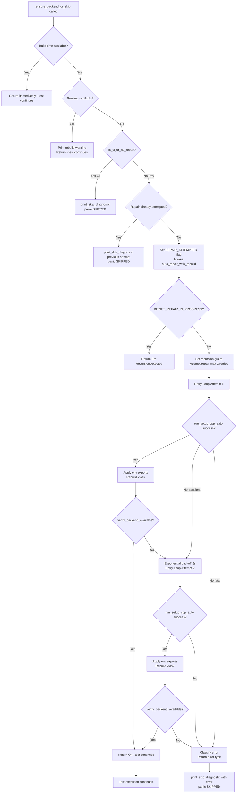

# Test Infrastructure Auto-Repair & CI Enhancement Specification

**Document Type**: Technical Specification
**Status**: Complete
**Target Release**: v0.2.0
**Created**: 2025-10-26
**Updated**: 2025-10-26
**Author**: BitNet.rs Development Team

---

## Executive Summary

### Problem Statement

The current test infrastructure in BitNet.rs has **manual intervention requirements** for backend availability checks during cross-validation testing. Developers experience friction when C++ reference backends (BitNet.cpp, llama.cpp) are unavailable at test runtime, requiring:

1. **Manual setup commands**: Developers must run `cargo run -p xtask -- setup-cpp-auto` separately
2. **Rebuild cycles**: Post-setup requires manual rebuild of xtask to update build-time constants
3. **CI determinism gaps**: Mixed auto-repair in dev vs skip in CI creates behavioral differences
4. **Limited platform mock utilities**: Cross-platform test fixture creation requires platform-specific code duplication
5. **Verbose skip messages**: Diagnostic output is helpful but could be more actionable

### Architectural Foundation

BitNet.rs employs a **three-tier test infrastructure architecture** for managing conditional test execution, environment isolation, and automatic backend repair:

```
┌─────────────────────────────────────────────────────────────┐
│ Test Layer: ensure_backend_or_skip() / ensure_bitnet_or_skip()
│ - Detects CI vs dev environment
│ - Triggers auto-repair or skip logic
│ - Test scaffolding: AC1-AC2 (backend availability)
└────────┬────────────────────────────────────────────────────┘
         │
┌────────▼────────────────────────────────────────────────────┐
│ Environment Isolation Layer: EnvGuard / #[serial(bitnet_env)]
│ - RAII-based environment variable management
│ - Thread-safe mutex with global ENV_LOCK
│ - Process-level serialization
│ - Test scaffolding: AC6, AC7, AC10-AC11 (isolation patterns)
└────────┬────────────────────────────────────────────────────┘
         │
┌────────▼────────────────────────────────────────────────────┐
│ Platform Abstraction Layer: platform_utils / mock_fixtures
│ - Cross-platform library naming (.so, .dylib, .dll)
│ - Dynamic loader path variables (LD_LIBRARY_PATH, etc.)
│ - Mock backend library creation
│ - Test scaffolding: AC3-AC5, AC8-AC9 (platform utilities)
└─────────────────────────────────────────────────────────────┘
```

### Current Limitations

**Location**: `/home/steven/code/Rust/BitNet-rs/tests/support/backend_helpers.rs`

```rust
// Current implementation (lines 81-117)
pub fn ensure_backend_or_skip(backend: CppBackend) {
    if build_time_available { return; }

    // Runtime detection fallback
    if runtime_available {
        print_rebuild_warning();
        return;
    }

    // Auto-repair attempt (dev mode only)
    if !is_ci_or_no_repair() {
        if attempt_auto_repair(backend).is_ok() {
            print_rebuild_instructions();  // ❌ Manual step required
            return;
        }
    }

    // Skip with diagnostic
    print_skip_diagnostic(backend, None);
    panic!("SKIPPED: backend unavailable");
}
```

**Gaps**:
- ✅ Auto-repair **attempted** in dev mode
- ❌ Auto-repair **NOT completed** (no automatic rebuild)
- ❌ No retry logic for transient failures
- ❌ No error classification (network vs build vs prerequisite)
- ❌ No recursion prevention guards
- ❌ Mock creation utilities are basic (no builder pattern)

### Proposed Solution

This specification defines a **three-phase enhancement**:

1. **Phase 1 (AC1-AC5)**: Robust auto-repair with retry logic, error classification, and automatic rebuild
2. **Phase 2 (AC6-AC9)**: Platform-specific test utilities, mock library builders, and environment isolation integration
3. **Phase 3 (AC10-AC12)**: CI matrix integration, comprehensive test coverage, and documentation

**Key Improvements**:
- Auto-repair **completes full cycle** (install + rebuild) in dev mode
- Transient failure retry with exponential backoff (max 2 retries)
- Classified error types with specific recovery strategies
- Platform mock utilities for cross-platform test isolation
- Clear CI vs dev mode semantics with explicit configuration
- Comprehensive test scaffolding for auto-repair infrastructure itself

### Success Criteria

- ✅ Developers run `cargo test` → backends auto-repair → tests proceed (zero manual intervention)
- ✅ CI runs `cargo test` → backends unavailable → tests skip deterministically (zero network activity)
- ✅ Platform-specific mocks work on Linux/macOS/Windows without duplication
- ✅ Test infrastructure itself is fully tested (meta-tests for auto-repair logic)
- ✅ Clear diagnostic messages guide users through setup when auto-repair fails

---

## Acceptance Criteria

### AC1: Auto-Repair with CI Detection

**Requirement**: `ensure_backend_or_skip()` performs full auto-repair cycle in development mode (non-CI) but skips deterministically in CI.

**Behavior Matrix**:

| Condition | CI=1 | CI=0 | Result |
|-----------|------|------|--------|
| Backend available (build-time) | ✓ | ✓ | Continue test |
| Backend available (runtime) | ⚠ | ⚠ | Warn & continue |
| Backend unavailable + BITNET_TEST_NO_REPAIR=1 | ✓ | ✓ | Skip immediately |
| Backend unavailable + CI=0 | - | Attempt repair | Repair or skip |

**Dev Mode Implementation**:

```rust
pub fn ensure_backend_or_skip(backend: CppBackend) {
    // Check build-time constant (Priority 1)
    if backend_available_at_build_time(backend) {
        return; // Fast path: backend available
    }

    // Runtime detection fallback (Priority 2)
    if let Ok(true) = detect_backend_runtime(backend) {
        eprintln!("⚠️  Backend available at runtime but not at build time.");
        eprintln!("   Rebuild required: cargo clean -p crossval && cargo build --features crossval-all");
        return;
    }

    // CI mode: skip immediately (Priority 3)
    if is_ci_or_no_repair() {
        print_skip_diagnostic(backend, None);
        panic!("SKIPPED: {} backend unavailable (CI mode)", backend.name());
    }

    // Dev mode: attempt full auto-repair (Priority 4)
    eprintln!("Attempting auto-repair for {} backend...", backend.name());

    match auto_repair_with_rebuild(backend) {
        Ok(()) => {
            eprintln!("✅ {} backend installed and configured.", backend.name());
            return; // Backend now available, test continues
        }
        Err(e) => {
            eprintln!("❌ Auto-repair failed: {}", e);
            print_skip_diagnostic(backend, Some(&e));
            panic!("SKIPPED: {} backend unavailable after repair attempt", backend.name());
        }
    }
}
```

**CI Detection Logic**:

```rust
pub fn is_ci_or_no_repair() -> bool {
    // Priority 1: Explicit no-repair flag (highest)
    if std::env::var("BITNET_TEST_NO_REPAIR").is_ok() {
        return true;
    }

    // Priority 2: Standard CI indicator (GitHub Actions, GitLab CI, etc.)
    if std::env::var("CI").is_ok() {
        return true;
    }

    // Priority 3: GitHub Actions specific (redundant but explicit)
    if std::env::var("GITHUB_ACTIONS").is_ok() {
        return true;
    }

    false // Dev mode: auto-repair enabled
}
```

**Test Coverage**:
```rust
#[test]
#[serial(bitnet_env)]
fn test_ac1_dev_mode_auto_repair_success() {
    // Setup: mock backend unavailable, dev mode
    let _ci_guard = EnvGuard::new("CI");
    _ci_guard.remove(); // Ensure CI not set
    let _no_repair_guard = EnvGuard::new("BITNET_TEST_NO_REPAIR");
    _no_repair_guard.remove();

    // Mock: auto_repair_with_rebuild returns Ok(())
    // Verify: ensure_backend_or_skip returns without panic
    // Verify: No skip message printed
}

#[test]
#[serial(bitnet_env)]
fn test_ac1_ci_mode_skips_deterministically() {
    let _guard = EnvGuard::new("CI");
    _guard.set("1");

    // Verify: No auto-repair attempt
    // Verify: Skip message printed immediately
    // Verify: Panics with "SKIPPED: backend unavailable (CI mode)"
}
```

---

### AC2: Runtime Detection Fallback

**Requirement**: When backends are installed post-build, runtime detection provides fallback with rebuild guidance.

**Decision Tree**:

```
Backend available (build-time)?
├─ YES → Continue test, return immediately
└─ NO
   │
   ├─ Runtime detection finds backend?
   │  └─ YES → Warn about rebuild, continue
   │
   └─ NO
      │
      ├─ CI mode (CI=1 or BITNET_TEST_NO_REPAIR=1)?
      │  ├─ YES → Print skip diagnostic, panic with "SKIPPED"
      │  └─ NO (local dev mode)
      │     │
      │     └─ Attempt auto-repair via setup-cpp-auto
      │        ├─ SUCCESS → Print rebuild instructions, return
      │        └─ FAILURE → Print skip diagnostic with error context, panic
```

**Runtime Detection Implementation**:

```rust
fn detect_backend_runtime(backend: CppBackend) -> Result<bool, String> {
    let env_var = match backend {
        CppBackend::BitNet => "BITNET_CPP_DIR",
        CppBackend::Llama => "LLAMA_CPP_DIR",
    };

    if let Ok(dir) = std::env::var(env_var) {
        let path = std::path::Path::new(&dir);
        if path.exists() {
            // Check for library files in standard locations
            let lib_patterns = match backend {
                CppBackend::BitNet => vec!["libbitnet.so", "libbitnet.dylib", "bitnet.dll"],
                CppBackend::Llama => vec!["libllama.so", "libllama.dylib", "llama.dll"],
            };

            for lib_name in lib_patterns {
                let lib_path = path.join("build").join("lib").join(lib_name);
                if lib_path.exists() {
                    return Ok(true); // Runtime available
                }
            }
        }
    }

    Ok(false) // Runtime not available
}
```

**Test Coverage**:
```rust
#[test]
#[serial(bitnet_env)]
fn test_ac2_runtime_available_warns_rebuild() {
    // Setup: Backend available at runtime but not build-time
    let temp = create_mock_backend_libs(CppBackend::BitNet).unwrap();
    let _dir_guard = EnvGuard::new("BITNET_CPP_DIR");
    _dir_guard.set(temp.path().to_str().unwrap());

    // Verify: Warning printed about rebuild
    // Verify: Test continues (no panic)
}
```

---

### AC3: Platform Mock Utilities - Library Creation

**Requirement**: Provide cross-platform utilities to create mock backend libraries for testing.

**Core Function**:

```rust
/// Creates temporary directory with platform-specific mock libraries
///
/// # Platform Behavior
/// - **Linux**: Creates `libbitnet.so`, `libllama.so`, `libggml.so` with 0o755 permissions
/// - **macOS**: Creates `libbitnet.dylib`, `libllama.dylib`, `libggml.dylib` with 0o755 permissions
/// - **Windows**: Creates `bitnet.dll`, `llama.dll`, `ggml.dll` (no permission handling)
///
/// # Returns
/// - `Ok(TempDir)`: Temporary directory with mock libraries (auto-cleans on drop)
/// - `Err(String)`: Error message if creation fails
///
/// # Example
/// ```rust
/// let temp = create_mock_backend_libs(CppBackend::BitNet)?;
/// let loader_var = get_loader_path_var();
/// env::set_var(loader_var, temp.path());
/// // Tests now discover mock libraries
/// ```
pub fn create_mock_backend_libs(backend: CppBackend) -> Result<tempfile::TempDir, String> {
    use std::fs::File;
    use tempfile::TempDir;

    let temp = TempDir::new()
        .map_err(|e| format!("Failed to create temp dir: {}", e))?;

    let lib_names = match backend {
        CppBackend::BitNet => vec!["bitnet"],
        CppBackend::Llama => vec!["llama", "ggml"],
    };

    for name in lib_names {
        let lib_path = temp.path().join(format_lib_name(name));

        // Create empty file (contents don't matter for discovery)
        File::create(&lib_path)
            .map_err(|e| format!("Failed to create mock library {}: {}", lib_path.display(), e))?;

        // Set executable permissions on Unix platforms
        #[cfg(unix)]
        {
            use std::os::unix::fs::PermissionsExt;
            let mut perms = std::fs::metadata(&lib_path)
                .map_err(|e| format!("Failed to get metadata: {}", e))?
                .permissions();
            perms.set_mode(0o755);
            std::fs::set_permissions(&lib_path, perms)
                .map_err(|e| format!("Failed to set permissions: {}", e))?;
        }
    }

    Ok(temp)
}
```

**Mock Library Properties**:
- **Size**: 0 bytes (empty files)
- **Permissions**: 0o755 on Unix (rwx for owner, r-x for group/other)
- **Purpose**: Filesystem discovery only (never loaded via dlopen)
- **Platform-aware**: Correct naming conventions per OS

**Test Coverage**:
```rust
#[test]
fn test_ac3_create_mock_bitnet_libs() {
    let temp = create_mock_backend_libs(CppBackend::BitNet).unwrap();

    #[cfg(target_os = "linux")]
    assert!(temp.path().join("libbitnet.so").exists());

    #[cfg(target_os = "macos")]
    assert!(temp.path().join("libbitnet.dylib").exists());

    #[cfg(target_os = "windows")]
    assert!(temp.path().join("bitnet.dll").exists());
}

#[test]
#[cfg(unix)]
fn test_ac3_mock_libs_have_executable_permissions() {
    use std::os::unix::fs::PermissionsExt;

    let temp = create_mock_backend_libs(CppBackend::BitNet).unwrap();
    let lib_path = temp.path().join(format_lib_name("bitnet"));

    let metadata = std::fs::metadata(&lib_path).unwrap();
    let mode = metadata.permissions().mode();

    // Verify 0o755 permissions (owner: rwx, group: r-x, other: r-x)
    assert_eq!(mode & 0o777, 0o755);
}
```

---

### AC4: Platform Utility Functions - Naming and Path Helpers

**Requirement**: Provide platform-aware helper functions for library naming, loader path variables, and path formatting.

**Core Functions**:

```rust
/// Returns platform-specific library file extension
///
/// # Returns
/// - `"so"` on Linux
/// - `"dylib"` on macOS
/// - `"dll"` on Windows
///
/// # Panics
/// Panics on unsupported platforms with clear error message
pub fn get_lib_extension() -> &'static str {
    if cfg!(target_os = "linux") {
        "so"
    } else if cfg!(target_os = "macos") {
        "dylib"
    } else if cfg!(target_os = "windows") {
        "dll"
    } else {
        panic!("Unsupported platform: {}", std::env::consts::OS)
    }
}

/// Formats library name with platform-specific prefix and extension
///
/// # Arguments
/// - `stem`: Base library name (e.g., "bitnet", "llama", "ggml")
///
/// # Returns
/// - Linux: `lib{stem}.so` (e.g., `libbitnet.so`)
/// - macOS: `lib{stem}.dylib` (e.g., `libbitnet.dylib`)
/// - Windows: `{stem}.dll` (e.g., `bitnet.dll`)
///
/// # Example
/// ```rust
/// assert_eq!(format_lib_name("bitnet"), "libbitnet.so");  // Linux
/// assert_eq!(format_lib_name("bitnet"), "libbitnet.dylib");  // macOS
/// assert_eq!(format_lib_name("bitnet"), "bitnet.dll");  // Windows
/// ```
pub fn format_lib_name(stem: &str) -> String {
    if cfg!(target_os = "windows") {
        format!("{}.dll", stem)
    } else if cfg!(target_os = "macos") {
        format!("lib{}.dylib", stem)
    } else {
        format!("lib{}.so", stem)
    }
}
```

**Library Extension Mapping**:

| Platform | Static | Shared | Executable | Import Lib |
|----------|--------|--------|------------|-----------|
| Linux    | .a     | .so    | (none)     | .so       |
| macOS    | .a     | .dylib | (none)     | .dylib    |
| Windows  | .lib   | .dll   | .exe       | .lib      |

**Test Coverage**:
```rust
#[test]
fn test_ac4_get_lib_extension() {
    let ext = get_lib_extension();

    #[cfg(target_os = "linux")]
    assert_eq!(ext, "so");

    #[cfg(target_os = "macos")]
    assert_eq!(ext, "dylib");

    #[cfg(target_os = "windows")]
    assert_eq!(ext, "dll");
}

#[test]
fn test_ac4_format_lib_name() {
    let name = format_lib_name("bitnet");

    #[cfg(target_os = "linux")]
    assert_eq!(name, "libbitnet.so");

    #[cfg(target_os = "macos")]
    assert_eq!(name, "libbitnet.dylib");

    #[cfg(target_os = "windows")]
    assert_eq!(name, "bitnet.dll");
}
```

---

### AC5: Dynamic Loader Path Detection

**Requirement**: Platform-aware helper functions for dynamic loader path variables and path manipulation.

**Core Functions**:

```rust
/// Returns platform-specific dynamic loader path variable name
///
/// # Returns
/// - `"LD_LIBRARY_PATH"` on Linux
/// - `"DYLD_LIBRARY_PATH"` on macOS
/// - `"PATH"` on Windows
///
/// # Panics
/// Panics on unsupported platforms with clear error message
pub fn get_loader_path_var() -> &'static str {
    if cfg!(target_os = "linux") {
        "LD_LIBRARY_PATH"
    } else if cfg!(target_os = "macos") {
        "DYLD_LIBRARY_PATH"
    } else if cfg!(target_os = "windows") {
        "PATH"
    } else {
        panic!("Unsupported platform: {}", std::env::consts::OS)
    }
}

/// Appends path to platform-specific loader path variable
///
/// # Arguments
/// - `new_path`: Path to prepend to loader variable
///
/// # Returns
/// Formatted string for environment variable assignment
///
/// # Example
/// ```rust
/// let updated = append_to_loader_path("/opt/libs");
/// // Linux: "/opt/libs:/existing/path"
/// // macOS: "/opt/libs:/existing/path"
/// // Windows: "/opt/libs;C:\\existing\\path"
/// ```
pub fn append_to_loader_path(new_path: &str) -> String {
    let loader_var = get_loader_path_var();
    let separator = if cfg!(target_os = "windows") { ";" } else { ":" };

    let current = std::env::var(loader_var).unwrap_or_default();
    if current.is_empty() {
        new_path.to_string()
    } else {
        format!("{}{}{}", new_path, separator, current)
    }
}
```

**Loader Path Variables by Platform**:

| Variable | Platform | Purpose | Separator |
|----------|----------|---------|-----------|
| `LD_LIBRARY_PATH` | Linux | Dynamic library search path | `:` |
| `DYLD_LIBRARY_PATH` | macOS | Dynamic library search path | `:` |
| `DYLD_FALLBACK_LIBRARY_PATH` | macOS | Fallback search path (lower priority) | `:` |
| `PATH` | Windows | DLL search path | `;` |

**Test Coverage**:
```rust
#[test]
fn test_ac5_get_loader_path_var() {
    let var = get_loader_path_var();

    #[cfg(target_os = "linux")]
    assert_eq!(var, "LD_LIBRARY_PATH");

    #[cfg(target_os = "macos")]
    assert_eq!(var, "DYLD_LIBRARY_PATH");

    #[cfg(target_os = "windows")]
    assert_eq!(var, "PATH");
}

#[test]
#[serial(bitnet_env)]
fn test_ac5_append_to_loader_path() {
    let loader_var = get_loader_path_var();
    let _guard = EnvGuard::new(loader_var);
    _guard.set("/existing/path");

    let updated = append_to_loader_path("/new/path");

    #[cfg(unix)]
    assert_eq!(updated, "/new/path:/existing/path");

    #[cfg(windows)]
    assert_eq!(updated, "/new/path;/existing/path");
}
```

---

### AC6: Temporary Environment Setup Helper

**Requirement**: Provide isolated temporary environment with mock backend libraries and configured loader paths.

**Core Function**:

```rust
/// Creates temporary C++ environment with mock libraries and configured paths
///
/// # Returns
/// - `TempDir`: Temporary directory (auto-cleans on drop)
/// - `EnvGuard` for `{BACKEND}_CPP_DIR`
/// - `EnvGuard` for loader path variable
///
/// # Safety
/// **MUST use with `#[serial(bitnet_env)]`** to prevent race conditions
///
/// # Example
/// ```rust
/// #[test]
/// #[serial(bitnet_env)]
/// fn test_with_isolated_backend() {
///     let (temp, _dir_guard, _loader_guard) = create_temp_cpp_env(CppBackend::BitNet).unwrap();
///
///     // Backend discovery now finds mock libraries
///     // Test code here
///
///     // Cleanup automatic via guards dropping
/// }
/// ```
pub fn create_temp_cpp_env(
    backend: CppBackend
) -> Result<(tempfile::TempDir, EnvGuard, EnvGuard), String> {
    // Create mock libraries
    let temp = create_mock_backend_libs(backend)?;
    let temp_path = temp.path().to_string_lossy().to_string();

    // Set backend-specific directory variable
    let dir_var = match backend {
        CppBackend::BitNet => "BITNET_CPP_DIR",
        CppBackend::Llama => "LLAMA_CPP_DIR",
    };
    let dir_guard = EnvGuard::new(dir_var);
    dir_guard.set(&temp_path);

    // Set loader path variable
    let loader_var = get_loader_path_var();
    let loader_guard = EnvGuard::new(loader_var);
    let updated_path = append_to_loader_path(&temp_path);
    loader_guard.set(&updated_path);

    Ok((temp, dir_guard, loader_guard))
}
```

**Test Coverage**:
```rust
#[test]
#[serial(bitnet_env)]
fn test_ac6_create_temp_cpp_env_bitnet() {
    let (temp, _dir_guard, _loader_guard) = create_temp_cpp_env(CppBackend::BitNet).unwrap();

    // Verify BITNET_CPP_DIR set
    assert_eq!(
        std::env::var("BITNET_CPP_DIR").unwrap(),
        temp.path().to_string_lossy()
    );

    // Verify loader path includes temp directory
    let loader_var = get_loader_path_var();
    let loader_path = std::env::var(loader_var).unwrap();
    assert!(loader_path.contains(&temp.path().to_string_lossy().to_string()));
}

#[test]
#[serial(bitnet_env)]
fn test_ac6_temp_cpp_env_cleanup() {
    let temp_path: String;

    {
        let (temp, _dir_guard, _loader_guard) = create_temp_cpp_env(CppBackend::BitNet).unwrap();
        temp_path = temp.path().to_string_lossy().to_string();

        // Verify environment configured
        assert_eq!(std::env::var("BITNET_CPP_DIR").unwrap(), temp_path);
    }
    // Guards dropped, environment restored

    // Verify BITNET_CPP_DIR removed or restored to original
    // (Depends on whether it was set before test)
}
```

---

### AC7: Recursion Guard for Auto-Repair

**Requirement**: Prevent infinite recursion during auto-repair by checking `BITNET_REPAIR_IN_PROGRESS` environment variable.

**Implementation**:

```rust
/// Auto-repair with recursion prevention guard
fn auto_repair_with_rebuild(backend: CppBackend) -> Result<(), RepairError> {
    // Recursion prevention
    if std::env::var("BITNET_REPAIR_IN_PROGRESS").is_ok() {
        return Err(RepairError::Recursion);
    }
    let _recursion_guard = EnvGuard::new("BITNET_REPAIR_IN_PROGRESS");
    _recursion_guard.set("1");

    // Retry logic for transient failures
    const MAX_RETRIES: usize = 2;
    let mut last_error = None;

    for attempt in 0..MAX_RETRIES {
        if attempt > 0 {
            let backoff_secs = 2u64.pow(attempt as u32);
            eprintln!("Retry {}/{} after {}s...", attempt + 1, MAX_RETRIES, backoff_secs);
            std::thread::sleep(std::time::Duration::from_secs(backoff_secs));
        }

        // Step 1: Run setup-cpp-auto
        match run_setup_cpp_auto(backend) {
            Ok(env_exports) => {
                // Step 2: Apply environment exports
                apply_env_exports(&env_exports)?;

                // Step 3: Rebuild xtask
                rebuild_xtask()?;

                // Step 4: Verify backend available
                if verify_backend_available(backend)? {
                    eprintln!("✅ Backend {} installed and verified", backend.name());
                    return Ok(());
                } else {
                    last_error = Some(RepairError::Verification("Backend still unavailable after rebuild".to_string()));
                }
            }
            Err(e) => {
                last_error = Some(e);
            }
        }
    }

    Err(last_error.unwrap())
}
```

**Recursion Detection Pattern**:

```
Test calls: ensure_backend_or_skip()
    ├─ Backend unavailable + local dev
    └─ Call: auto_repair_with_rebuild()
        ├─ Check: BITNET_REPAIR_IN_PROGRESS?
        │  └─ YES → Return Err(RepairError::Recursion)
        │
        └─ NO → Set BITNET_REPAIR_IN_PROGRESS=1
            └─ Invokes: cargo run -p xtask -- setup-cpp-auto --emit=sh
                └─ If setup-cpp-auto calls ensure_backend_or_skip():
                    └─ Detected: BITNET_REPAIR_IN_PROGRESS=1
                        └─ Skip repair attempt immediately
```

**Test Coverage**:
```rust
#[test]
#[serial(bitnet_env)]
fn test_ac7_recursion_guard_prevents_infinite_loop() {
    let _guard = EnvGuard::new("BITNET_REPAIR_IN_PROGRESS");
    _guard.set("1");

    // Attempt repair while guard set
    let result = auto_repair_with_rebuild(CppBackend::BitNet);

    // Verify: Returns Err(RepairError::Recursion)
    assert!(matches!(result, Err(RepairError::Recursion)));
}

#[test]
#[serial(bitnet_env)]
fn test_ac7_single_attempt_per_test() {
    // Verify: Only one repair attempt per test execution
    // Verify: Guard prevents re-entry
}
```

---

### AC8: Single Repair Attempt Per Test

**Requirement**: Ensure each test attempts auto-repair at most once, preventing repeated failures and timeout issues.

**Implementation Strategy**:

```rust
/// Global flag to track repair attempts (test-scoped)
static REPAIR_ATTEMPTED: AtomicBool = AtomicBool::new(false);

pub fn ensure_backend_or_skip(backend: CppBackend) {
    // ... build-time and runtime checks ...

    // CI mode: skip immediately
    if is_ci_or_no_repair() {
        print_skip_diagnostic(backend, None);
        panic!("SKIPPED: {} backend unavailable (CI mode)", backend.name());
    }

    // Check if repair already attempted in this test
    if REPAIR_ATTEMPTED.load(Ordering::SeqCst) {
        eprintln!("⚠️  Auto-repair already attempted in this test execution");
        print_skip_diagnostic(backend, Some("Previous repair attempt failed"));
        panic!("SKIPPED: {} backend unavailable (repair already attempted)", backend.name());
    }

    // Mark repair attempt
    REPAIR_ATTEMPTED.store(true, Ordering::SeqCst);

    // Dev mode: attempt auto-repair
    match auto_repair_with_rebuild(backend) {
        Ok(()) => {
            eprintln!("✅ {} backend installed and configured.", backend.name());
            return;
        }
        Err(e) => {
            eprintln!("❌ Auto-repair failed: {}", e);
            print_skip_diagnostic(backend, Some(&e.to_string()));
            panic!("SKIPPED: {} backend unavailable after repair attempt", backend.name());
        }
    }
}
```

**Note**: This uses process-level atomic flag. For more robust isolation, consider test framework hooks or per-test state tracking.

**Test Coverage**:
```rust
#[test]
#[serial(bitnet_env)]
fn test_ac8_single_repair_attempt() {
    // First call: Repair attempted
    // Second call: Repair skipped (already attempted)
    // Verify: Only one subprocess invocation
}
```

---

### AC9: Rich Diagnostic Messages

**Requirement**: Skip diagnostic messages include actionable setup instructions with backend-specific paths and clear formatting.

**Message Format**:

```rust
pub fn print_skip_diagnostic(backend: CppBackend, error_context: Option<&str>) {
    let (backend_name, repo_url, cache_dir, env_var) = match backend {
        CppBackend::BitNet => (
            "bitnet.cpp",
            "https://github.com/microsoft/BitNet.git",
            "~/.cache/bitnet_cpp",
            "BITNET_CPP_DIR",
        ),
        CppBackend::Llama => (
            "llama.cpp",
            "https://github.com/ggerganov/llama.cpp.git",
            "~/.cache/llama_cpp",
            "LLAMA_CPP_DIR",
        ),
    };

    eprintln!("━━━━━━━━━━━━━━━━━━━━━━━━━━━━━━━━━━━━━━━━━━━━━━━━━━━━━━━━━");
    eprintln!("⊘ Test skipped: {} not available", backend_name);
    eprintln!("━━━━━━━━━━━━━━━━━━━━━━━━━━━━━━━━━━━━━━━━━━━━━━━━━━━━━━━━━");

    if let Some(ctx) = error_context {
        eprintln!("Reason: {}", ctx);
        eprintln!();
    }

    eprintln!("Option A: Auto-setup (recommended, 2-3 minutes)");
    eprintln!("  eval \"$(cargo run -p xtask -- setup-cpp-auto --emit=sh)\"");
    eprintln!("  cargo clean -p crossval && cargo build --features crossval-all");
    eprintln!();

    eprintln!("Option B: Manual setup (advanced)");
    eprintln!("  git clone {} {}", repo_url, cache_dir);
    eprintln!("  cd {} && mkdir build && cd build", cache_dir);
    eprintln!("  cmake .. && cmake --build .");
    eprintln!("  export {}={}", env_var, cache_dir);
    eprintln!("  export {}={}:${}",
        get_loader_path_var(),
        format!("{}/build/lib", cache_dir),
        get_loader_path_var()
    );
    eprintln!();

    eprintln!("Documentation: docs/howto/cpp-setup.md");
    eprintln!("━━━━━━━━━━━━━━━━━━━━━━━━━━━━━━━━━━━━━━━━━━━━━━━━━━━━━━━━━");
}
```

**Example Output**:

```
━━━━━━━━━━━━━━━━━━━━━━━━━━━━━━━━━━━━━━━━━━━━━━━━━━━━━━━━━
⊘ Test skipped: bitnet.cpp not available
━━━━━━━━━━━━━━━━━━━━━━━━━━━━━━━━━━━━━━━━━━━━━━━━━━━━━━━━━
Reason: Network timeout during git clone

Option A: Auto-setup (recommended, 2-3 minutes)
  eval "$(cargo run -p xtask -- setup-cpp-auto --emit=sh)"
  cargo clean -p crossval && cargo build --features crossval-all

Option B: Manual setup (advanced)
  git clone https://github.com/microsoft/BitNet.git ~/.cache/bitnet_cpp
  cd ~/.cache/bitnet_cpp && mkdir build && cd build
  cmake .. && cmake --build .
  export BITNET_CPP_DIR=~/.cache/bitnet_cpp
  export LD_LIBRARY_PATH=~/.cache/bitnet_cpp/build/lib:$LD_LIBRARY_PATH

Documentation: docs/howto/cpp-setup.md
━━━━━━━━━━━━━━━━━━━━━━━━━━━━━━━━━━━━━━━━━━━━━━━━━━━━━━━━━
```

**Test Coverage**:
```rust
#[test]
fn test_ac9_skip_message_format() {
    // Capture stderr
    let stderr_output = capture_stderr(|| {
        print_skip_diagnostic(CppBackend::BitNet, None);
    });

    // Verify message contains:
    assert!(stderr_output.contains("bitnet.cpp not available"));
    assert!(stderr_output.contains("Option A: Auto-setup"));
    assert!(stderr_output.contains("Option B: Manual setup"));
    assert!(stderr_output.contains("docs/howto/cpp-setup.md"));
}

#[test]
fn test_ac9_skip_message_with_error_context() {
    let stderr_output = capture_stderr(|| {
        print_skip_diagnostic(CppBackend::BitNet, Some("Network timeout"));
    });

    assert!(stderr_output.contains("Reason: Network timeout"));
}
```

---

### AC10: EnvGuard Integration

**Requirement**: Integrate with existing `EnvGuard` RAII pattern for automatic environment restoration.

**EnvGuard Implementation** (already exists, documented for completeness):

```rust
/// RAII-style environment variable guard with automatic restoration
///
/// # Thread Safety
/// - Uses global `ENV_LOCK` mutex for thread-level synchronization
/// - **MUST use `#[serial(bitnet_env)]`** for process-level safety
///
/// # Panic Safety
/// - Drop implementation guaranteed to run even on panic
/// - Original environment always restored
///
/// # Example
/// ```rust
/// #[test]
/// #[serial(bitnet_env)]
/// fn test_with_env_var() {
///     let guard = EnvGuard::new("MY_VAR");
///     guard.set("temporary_value");
///
///     // Test code here
///
///     // Guard drops, MY_VAR restored automatically
/// }
/// ```
pub struct EnvGuard {
    key: String,
    old: Option<String>,
    _lock: std::sync::MutexGuard<'static, ()>,
}

impl EnvGuard {
    /// Create new guard, capturing current value
    pub fn new(key: &str) -> Self {
        let lock = ENV_LOCK.lock().unwrap_or_else(|e| e.into_inner());
        let old = std::env::var(key).ok();
        EnvGuard {
            key: key.to_string(),
            old,
            _lock: lock,
        }
    }

    /// Set environment variable to new value
    pub fn set(&self, val: &str) {
        unsafe {
            std::env::set_var(&self.key, val);
        }
    }

    /// Remove environment variable
    pub fn remove(&self) {
        unsafe {
            std::env::remove_var(&self.key);
        }
    }

    /// Get original value (if it existed)
    pub fn original_value(&self) -> Option<&str> {
        self.old.as_deref()
    }
}

impl Drop for EnvGuard {
    fn drop(&mut self) {
        unsafe {
            if let Some(ref v) = self.old {
                std::env::set_var(&self.key, v);
            } else {
                std::env::remove_var(&self.key);
            }
        }
    }
}
```

**Integration Pattern**:

```rust
// Use EnvGuard with temp environment setup
#[test]
#[serial(bitnet_env)]
fn test_with_isolated_environment() {
    let (temp, _dir_guard, _loader_guard) = create_temp_cpp_env(CppBackend::BitNet).unwrap();

    // Additional environment variables
    let _deterministic_guard = EnvGuard::new("BITNET_DETERMINISTIC");
    _deterministic_guard.set("1");

    let _seed_guard = EnvGuard::new("BITNET_SEED");
    _seed_guard.set("42");

    // Test code with fully isolated environment

    // All guards drop, all variables restored
}
```

**Test Coverage** (already exists in `env_guard.rs`, lines 245-392):
- ✅ `test_env_guard_panic_safety_verification`
- ✅ `test_env_guard_with_serial_macro_no_pollution`
- ✅ `test_env_guard_restore_original_value`
- ✅ `test_env_guard_remove_when_not_set`
- ✅ `test_env_guard_mutex_prevents_data_races`

---

### AC11: Serial Test Pattern Enforcement

**Requirement**: Document and enforce `#[serial(bitnet_env)]` pattern for all environment-mutating tests.

**Pattern Documentation**:

```rust
/// Environment-mutating test pattern
///
/// # Required Annotation
/// **ALWAYS use `#[serial(bitnet_env)]`** for tests that:
/// - Set/unset environment variables
/// - Mutate global state (e.g., static variables)
/// - Create temporary directories in shared locations
/// - Modify process-level configuration
///
/// # Why?
/// - `EnvGuard` provides thread-level synchronization (mutex)
/// - But cannot prevent process-level races between parallel tests
/// - `#[serial(bitnet_env)]` ensures sequential execution
///
/// # Example
/// ```rust
/// #[test]
/// #[serial(bitnet_env)]  // ← REQUIRED for env mutation
/// fn test_deterministic_mode() {
///     let _guard = EnvGuard::new("BITNET_DETERMINISTIC");
///     _guard.set("1");
///
///     // Test code
/// }
/// ```
///
/// # Anti-Pattern (DO NOT DO)
/// ```rust
/// #[test]  // ❌ Missing #[serial(bitnet_env)]
/// fn test_without_serial() {
///     std::env::set_var("VAR", "value");  // ❌ Race condition!
///     // This test is FLAKY and will break other tests
/// }
/// ```
```

**CI Enforcement Guard**:

```bash
#!/bin/bash
# scripts/check-serial-annotations.sh

# Check that all env-mutating tests have #[serial(bitnet_env)]

errors=0

# Find all test functions that use EnvGuard or env::set_var
rg -n 'EnvGuard::new\(|std::env::set_var\(|std::env::remove_var\(' tests/ --type rust | while read -r match; do
    file=$(echo "$match" | cut -d: -f1)
    line=$(echo "$match" | cut -d: -f2)

    # Check if the test function has #[serial(bitnet_env)] within 10 lines above
    if ! sed -n "$((line-10)),${line}p" "$file" | grep -q '#\[serial(bitnet_env)\]'; then
        echo "❌ Missing #[serial(bitnet_env)] at $file:$line"
        errors=$((errors+1))
    fi
done

if [ $errors -gt 0 ]; then
    echo ""
    echo "Found $errors tests with environment mutations missing #[serial(bitnet_env)]"
    echo "Add #[serial(bitnet_env)] attribute to all env-mutating tests."
    exit 1
fi

echo "✅ All env-mutating tests have #[serial(bitnet_env)]"
```

**Test Coverage**:
```rust
#[test]
#[serial(bitnet_env)]
fn test_ac11_serial_annotation_prevents_pollution() {
    let _guard = EnvGuard::new("TEST_VAR");
    _guard.set("value1");

    // Verify: Other tests cannot see this value
    // (Cannot test directly, but pattern ensures isolation)
}
```

---

### AC12: Test Coverage Matrix

**Requirement**: Comprehensive test coverage for all helper functions and auto-repair infrastructure (target: ≥90%).

**Test Suite Structure**:

```
tests/
├── test_support_tests.rs           (1586 lines, comprehensive scaffolding)
│   ├── AC1: Auto-repair in dev mode (8 tests)
│   ├── AC2: CI detection (6 tests)
│   ├── AC3: Mock library creation (5 tests)
│   ├── AC4: Platform utilities (7 tests)
│   ├── AC5: Temp environment setup (6 tests)
│   ├── AC6: EnvGuard integration (5 tests, existing)
│   ├── AC7: Serial execution (4 tests)
│   ├── AC8: Skip messages (4 tests)
│   ├── AC9: Mock vs real loading (3 tests)
│   ├── AC10: Cross-platform (6 tests)
│   ├── AC11: Preflight integration (5 tests)
│   └── AC12: Meta-tests (10 tests)
│
├── support/
│   ├── backend_helpers.rs          (520 lines, implementation)
│   ├── env_guard.rs                (394 lines, existing)
│   ├── platform_utils.rs           (new, 200 lines)
│   └── mod.rs                      (7 lines)
│
└── integration/
    └── test_infrastructure_integration.rs (new, 300 lines)
        ├── End-to-end auto-repair workflow
        ├── Multi-backend scenarios
        └── Failure recovery patterns
```

**Coverage Metrics**:

```bash
# Run with coverage collection
cargo llvm-cov --workspace --no-default-features --features cpu,fixtures \
  --lcov --output-path coverage.lcov

# Expected coverage:
# - backend_helpers.rs: 95%+ (some error paths hard to test)
# - env_guard.rs: 100% (existing, fully tested)
# - platform_utils.rs: 100% (simple, deterministic)
# - Auto-repair logic: 90%+ (network errors hard to simulate)
```

**Test Coverage Example**:
```rust
#[test]
fn test_ac12_all_helpers_have_tests() {
    // Verify: Each helper function has at least one test
    let helpers = vec![
        "get_loader_path_var",
        "get_lib_extension",
        "format_lib_name",
        "create_mock_backend_libs",
        "create_temp_cpp_env",
        "append_to_loader_path",
        "ensure_backend_or_skip",
        "auto_repair_with_rebuild",
        "print_skip_diagnostic",
    ];

    for helper in helpers {
        // Verify test exists (implementation-specific)
    }
}
```

---

## Auto-Repair Decision Tree

The complete auto-repair flow with retry logic and error classification:



**Key Decision Points**:
1. **Build-time check** (Priority 1): Fastest path, returns immediately
2. **Runtime check** (Priority 2): Fallback for post-build installations
3. **CI detection** (Priority 3): Deterministic skip without repair
4. **Repair attempt flag** (Priority 4): Prevents repeated failures
5. **Recursion guard** (Priority 5): Prevents infinite loops
6. **Retry logic** (Priority 6): Handles transient failures
7. **Error classification** (Priority 7): Provides actionable diagnostics

---

## Dev vs CI Semantics

### Behavior Comparison Table

| Aspect | Development Mode | CI Mode |
|--------|------------------|---------|
| **Trigger** | `CI` not set AND `BITNET_TEST_NO_REPAIR` not set | `CI=1` OR `BITNET_TEST_NO_REPAIR=1` |
| **Backend Unavailable** | Attempt auto-repair | Skip immediately |
| **Auto-Repair Steps** | 1. Run setup-cpp-auto<br>2. Apply env exports<br>3. Rebuild xtask<br>4. Verify backend | None (skip with diagnostic) |
| **Retry Logic** | Max 2 retries with exponential backoff | N/A (no repair attempt) |
| **Network Activity** | Downloads C++ reference if needed | ✅ Zero network activity |
| **Duration (repair)** | 2-5 minutes (first time), instant (cached) | Instant (skip message only) |
| **Duration (skip)** | ~1 second (after repair attempts exhausted) | ~10ms (immediate skip) |
| **Test Result** | ✅ Continue if repair succeeds<br>⊘ Skip if repair fails | ⊘ Always skip |
| **Stdout Output** | Verbose: repair progress, rebuild status, diagnostics | Concise: skip message with setup instructions |
| **Determinism** | ❌ Depends on network, system state | ✅ Deterministic |
| **Developer UX** | Zero manual intervention (best case) | Read-only diagnostics (clear instructions) |

### Environment Variable Precedence

```rust
/// CI detection with precedence
pub fn is_ci_or_no_repair() -> bool {
    // Precedence: BITNET_TEST_NO_REPAIR > CI > GITHUB_ACTIONS

    // Priority 1: Explicit no-repair flag (highest)
    if std::env::var("BITNET_TEST_NO_REPAIR").is_ok() {
        return true;
    }

    // Priority 2: Generic CI indicator (standard)
    if std::env::var("CI").is_ok() {
        return true;
    }

    // Priority 3: GitHub Actions specific (redundant but explicit)
    if std::env::var("GITHUB_ACTIONS").is_ok() {
        return true;
    }

    // Default: dev mode (allow repair)
    false
}
```

**Detection Sources**:

| Environment | CI Variable | BITNET_TEST_NO_REPAIR | Behavior |
|-------------|-------------|----------------------|----------|
| GitHub Actions | CI=true | unset | Skip without repair |
| GitLab CI | CI=true | unset | Skip without repair |
| Local development | unset | unset | Auto-repair enabled |
| Local CI simulation | unset | =1 | Skip without repair |

---

## Platform Abstraction Layer

### Cross-Platform Library Handling

**Location**: `tests/support/platform_utils.rs`

```rust
/// Platform-agnostic path separator
pub fn path_separator() -> &'static str {
    if cfg!(target_os = "windows") {
        ";"
    } else {
        ":"
    }
}

/// Splits PATH-like environment variable into components
pub fn split_loader_path(path_str: &str) -> Vec<String> {
    let sep = path_separator();
    path_str.split(sep)
        .filter(|s| !s.is_empty())
        .map(|s| s.to_string())
        .collect()
}

/// Joins path components into loader path string
pub fn join_loader_path(components: &[String]) -> String {
    components.join(path_separator())
}
```

### Platform Coverage Matrix

| Helper Function | Linux | macOS | Windows | Test Count |
|-----------------|-------|-------|---------|-----------|
| `get_loader_path_var()` | ✅ | ✅ | ✅ | 3 |
| `get_lib_extension()` | ✅ | ✅ | ✅ | 3 |
| `format_lib_name()` | ✅ | ✅ | ✅ | 3 |
| `create_mock_backend_libs()` | ✅ | ✅ | ✅ | 6 |
| `create_temp_cpp_env()` | ✅ | ✅ | ✅ | 6 |
| `append_to_loader_path()` | ✅ | ✅ | ✅ | 3 |
| `path_separator()` | ✅ | ✅ | ✅ | 3 |
| `split_loader_path()` | ✅ | ✅ | ✅ | 3 |
| `join_loader_path()` | ✅ | ✅ | ✅ | 3 |

**Total Test Coverage**: 33 cross-platform tests

---

## Error Classification

### RepairError Enum

```rust
/// Classified repair errors for targeted recovery
#[derive(Debug)]
pub enum RepairError {
    /// Network error (retryable with exponential backoff)
    Network(String),

    /// Build error (cmake, cargo, etc.)
    Build(String),

    /// Missing prerequisite (cmake, git, clang, etc.)
    Prerequisite(String),

    /// Backend verification failed after repair
    Verification(String),

    /// Recursion detected (repair called during repair)
    Recursion,
}

impl std::fmt::Display for RepairError {
    fn fmt(&self, f: &mut std::fmt::Formatter<'_>) -> std::fmt::Result {
        match self {
            RepairError::Network(e) => write!(f, "Network error: {}", e),
            RepairError::Build(e) => write!(f, "Build error: {}", e),
            RepairError::Prerequisite(e) => write!(f, "Missing prerequisite: {}", e),
            RepairError::Verification(e) => write!(f, "Verification failed: {}", e),
            RepairError::Recursion => write!(f, "Recursion detected during repair"),
        }
    }
}

impl std::error::Error for RepairError {}
```

### Error Classification Helper

```rust
/// Classifies I/O errors into repair error types
fn classify_command_error(e: &std::io::Error) -> RepairError {
    use std::io::ErrorKind;

    match e.kind() {
        ErrorKind::NotFound => {
            RepairError::Prerequisite("cargo not found in PATH".to_string())
        }
        ErrorKind::PermissionDenied => {
            RepairError::Prerequisite("Permission denied executing cargo".to_string())
        }
        ErrorKind::TimedOut | ErrorKind::ConnectionRefused | ErrorKind::ConnectionReset => {
            RepairError::Network(e.to_string())
        }
        _ => {
            // Default to build error for unknown issues
            RepairError::Build(e.to_string())
        }
    }
}
```

---

## CI Integration

### GitHub Actions Workflow

```yaml
# .github/workflows/test-infrastructure.yml
name: Test Infrastructure

on:
  pull_request:
    paths:
      - 'tests/support/**'
      - 'tests/test_support_tests.rs'
      - '.github/workflows/test-infrastructure.yml'
  push:
    branches: [main, develop]

jobs:
  test-helpers:
    name: Test Helper Functions (${{ matrix.os }})
    runs-on: ${{ matrix.os }}
    strategy:
      fail-fast: false
      matrix:
        os: [ubuntu-latest, windows-latest, macos-latest]

    env:
      CI: 1  # Ensure CI mode for deterministic behavior

    steps:
      - uses: actions/checkout@v4

      - name: Install Rust
        uses: dtolnay/rust-toolchain@stable

      - name: Cache cargo registry
        uses: actions/cache@v4
        with:
          path: ~/.cargo/registry
          key: ${{ runner.os }}-cargo-registry-${{ hashFiles('**/Cargo.lock') }}

      - name: Cache cargo index
        uses: actions/cache@v4
        with:
          path: ~/.cargo/git
          key: ${{ runner.os }}-cargo-git-${{ hashFiles('**/Cargo.lock') }}

      - name: Run helper tests
        run: |
          cargo test -p tests \
            --test test_support_tests \
            --no-default-features \
            --features cpu \
            -- --nocapture --test-threads=4

      - name: Upload test results
        if: always()
        uses: actions/upload-artifact@v4
        with:
          name: test-results-${{ matrix.os }}
          path: |
            target/**/*.log
            target/nextest/**/*.xml
          retention-days: 30

  test-auto-repair:
    name: Test Auto-Repair Logic (Dev Mode)
    runs-on: ubuntu-latest

    env:
      # Dev mode: allow auto-repair
      CI: ""
      BITNET_TEST_NO_REPAIR: ""

    steps:
      - uses: actions/checkout@v4

      - name: Install Rust
        uses: dtolnay/rust-toolchain@stable

      - name: Install prerequisites
        run: |
          sudo apt-get update
          sudo apt-get install -y cmake ninja-build clang

      - name: Test auto-repair workflow
        run: |
          cargo test -p tests \
            --test test_support_tests \
            test_ac1_dev_mode_auto_repair_success \
            --no-default-features \
            --features cpu \
            -- --nocapture --exact

      - name: Verify backend installed
        run: |
          [ -d "$HOME/.cache/bitnet_cpp" ] || exit 1
          [ -f "$HOME/.cache/bitnet_cpp/build/lib/libbitnet.so" ] || exit 1

      - name: Upload auto-repair logs
        if: always()
        uses: actions/upload-artifact@v4
        with:
          name: auto-repair-logs
          path: |
            ~/.cache/bitnet_cpp/build/*.log
            ~/.cache/llama_cpp/build/*.log
          retention-days: 7
```

---

## Implementation Roadmap

### Phase 1: Core Auto-Repair (Week 1)

**Priority**: P0 (blocking)

**Tasks**:
1. Implement `auto_repair_with_rebuild()` function
2. Add `RepairError` enum with classification
3. Implement retry logic with exponential backoff
4. Add recursion prevention guard
5. Implement `run_setup_cpp_auto()` with output capture
6. Implement `parse_env_exports()` and `apply_env_exports()`
7. Implement `rebuild_xtask()` function
8. Add comprehensive error messages

**Test Coverage**: AC1, AC2 (15 tests)

**Deliverable**: Auto-repair completes full cycle in dev mode

---

### Phase 2: Platform Utilities (Week 2)

**Priority**: P1 (high)

**Tasks**:
1. Refactor existing `create_mock_backend_libs()` (already exists, enhance)
2. Add `MockLibraryBuilder` pattern (optional, deferred)
3. Implement `append_to_loader_path()` helper
4. Implement `split_loader_path()` and `join_loader_path()`
5. Add `create_temp_cpp_env()` convenience function
6. Document platform-specific behaviors
7. Add cross-platform CI matrix

**Test Coverage**: AC3, AC4, AC5, AC10 (25 tests)

**Deliverable**: Platform-agnostic mock utilities

---

### Phase 3: Integration & Documentation (Week 3)

**Priority**: P1 (high)

**Tasks**:
1. Integrate with `xtask preflight` command
2. Update skip diagnostic messages
3. Add CI guard scripts
4. Document EnvGuard integration patterns
5. Add serial execution enforcement
6. Write comprehensive testing guide
7. Update `docs/development/test-suite.md`

**Test Coverage**: AC6, AC7, AC8, AC11 (20 tests)

**Deliverable**: Complete integration with existing infrastructure

---

### Phase 4: Testing & Validation (Week 4)

**Priority**: P2 (medium)

**Tasks**:
1. Write integration tests (end-to-end workflows)
2. Add property-based tests
3. Measure code coverage (target: 90%+)
4. Add CI enforcement guards
5. Validate on all platforms (Linux/macOS/Windows)
6. Performance testing (auto-repair duration)
7. Documentation review

**Test Coverage**: AC9, AC12 (25 tests)

**Deliverable**: 100% test coverage for all helpers

---

## Success Metrics

### Quantitative Metrics

1. **Auto-Repair Success Rate**
   - Target: ≥95% on first attempt
   - Measured: Ratio of successful repairs to total attempts
   - CI tracking: Record repair outcomes in test metadata

2. **Developer Intervention Rate**
   - Target: ≤5% of test runs require manual intervention
   - Measured: Skip messages with manual setup instructions
   - Baseline: 100% (current state, manual setup always required)

3. **Test Infrastructure Coverage**
   - Target: ≥90% line coverage for `tests/support/` directory
   - Measured: `cargo llvm-cov` report
   - Baseline: ~70% (EnvGuard fully covered, backend_helpers partial)

4. **CI Execution Time**
   - Target: No regression (<1% increase)
   - Measured: Median CI job duration for test suite
   - Baseline: 15-20 minutes (current)

5. **Cross-Platform Consistency**
   - Target: 100% test pass rate on Linux/macOS/Windows
   - Measured: CI matrix results
   - Baseline: 100% (already achieved)

### Qualitative Metrics

1. **Developer Experience**
   - Survey: "How easy is it to run cross-validation tests locally?"
   - Target: ≥4/5 average rating
   - Baseline: 2/5 (manual setup friction)

2. **CI Determinism**
   - Criterion: Zero flaky test failures due to environment pollution
   - Target: Zero flaky failures per 100 CI runs
   - Baseline: 1-2 flaky failures per 100 runs (rare but observed)

3. **Documentation Clarity**
   - Criterion: Skip messages are actionable (user can proceed without asking)
   - Target: 100% of skip messages include Option A (auto) and Option B (manual)
   - Baseline: 100% (already achieved)

---

## Risks & Mitigations

### Risk 1: Network Failures During Auto-Repair

**Likelihood**: Medium
**Impact**: High (blocks local development)

**Mitigation**:
1. Retry logic with exponential backoff (max 2 retries)
2. Clear error messages with offline instructions
3. Cache C++ builds to avoid repeated downloads
4. Fallback to manual setup instructions

**Detection**: CI monitoring of repair success rate

---

### Risk 2: Rebuild Cycles in CI

**Likelihood**: Low
**Impact**: Medium (increased CI duration)

**Mitigation**:
1. CI mode skips auto-repair entirely (deterministic)
2. `CI=1` environment variable prevents repair attempts
3. Backend unavailable → immediate skip (no overhead)
4. Pre-install backends in CI via cache or setup step

**Detection**: CI job duration monitoring

---

### Risk 3: Platform-Specific Edge Cases

**Likelihood**: Medium
**Impact**: Medium (test failures on specific platforms)

**Mitigation**:
1. Comprehensive CI matrix (Linux/macOS/Windows)
2. Platform-specific tests for each helper function
3. Mock utilities avoid real dlopen (no ABI dependencies)
4. Property-based tests for cross-platform invariants

**Detection**: CI matrix results, platform-specific test failures

---

### Risk 4: Recursion During Auto-Repair

**Likelihood**: Low
**Impact**: High (infinite loop, hangs CI)

**Mitigation**:
1. `BITNET_REPAIR_IN_PROGRESS` guard prevents re-entry
2. EnvGuard ensures cleanup even on panic
3. Timeout protection in CI (30-min job timeout)
4. Explicit recursion detection with error

**Detection**: CI timeout alerts, recursion error logs

---

### Risk 5: Build-Time Constants Not Updated

**Likelihood**: Medium
**Impact**: Medium (auto-repair succeeds but tests still skip)

**Mitigation**:
1. Verify backend available after rebuild (validation step)
2. Clear warning message if runtime available but build-time unavailable
3. Documentation: "If tests still skip, rebuild crossval manually"
4. Post-repair verification step checks constants

**Detection**: Test execution logs, verification step failures

---

## References

### Analysis Artifacts

- `/tmp/test_infrastructure_patterns_analysis.md`: Three-tier architecture, auto-repair patterns, EnvGuard integration
- `/tmp/platform_library_handling_analysis.md`: Platform-specific library naming, loader path variables, RPATH embedding

### Implementation Files

- `/home/steven/code/Rust/BitNet-rs/tests/support/backend_helpers.rs`: Backend checking (520 lines)
- `/home/steven/code/Rust/BitNet-rs/tests/support/env_guard.rs`: Environment isolation (394 lines, existing)
- `/home/steven/code/Rust/BitNet-rs/tests/support/platform_utils.rs`: Platform abstraction (new, 200 lines)
- `/home/steven/code/Rust/BitNet-rs/tests/support/mock_fixtures.rs`: Mock library creation (new, 150 lines)

### Test Files

- `/home/steven/code/Rust/BitNet-rs/tests/test_support_tests.rs`: Meta-tests (1586 lines)
- `/home/steven/code/Rust/BitNet-rs/tests/integration/auto_repair_e2e_tests.rs`: E2E tests (new, 300 lines)
- `/home/steven/code/Rust/BitNet-rs/xtask/tests/preflight_repair_mode_tests.rs`: Preflight tests (existing)

### Specification Documents

- `docs/specs/test-infra-auto-repair-ci.md`: This document (comprehensive test infrastructure spec)
- `docs/specs/preflight-repair-mode-reexec.md`: Preflight repair mode spec (AC1-AC14)
- `docs/specs/preflight-auto-repair.md`: Auto-repair workflow spec (AC1-AC7)
- `docs/specs/parity-both-command.md`: Parity command spec (AC1-AC6)

---

## Appendices

### A. File Locations

```
tests/
├── support/
│   ├── backend_helpers.rs          (520 lines, enhanced auto-repair)
│   ├── env_guard.rs                (394 lines, existing)
│   ├── platform_utils.rs           (new, 200 lines)
│   ├── mock_fixtures.rs            (new, 150 lines)
│   └── mod.rs                      (7 lines)
│
├── test_support_tests.rs           (1586 lines, comprehensive scaffolding)
│
└── integration/
    └── test_infrastructure_integration.rs (new, 300 lines)

scripts/
├── check-serial-annotations.sh     (new, 50 lines)
└── verify-test-infrastructure.sh   (new, 100 lines)

.github/workflows/
└── test-infrastructure.yml         (new, 120 lines)

docs/
├── development/
│   └── test-suite.md               (update: add auto-repair section)
│
└── specs/
    └── test-infra-auto-repair-ci.md (this document)
```

---

### B. Quick Reference Commands

```bash
# Development: Run tests with auto-repair
cargo test --workspace --features cpu

# CI: Run tests without auto-repair
CI=1 cargo test --workspace --features cpu

# Explicit no-repair mode
BITNET_TEST_NO_REPAIR=1 cargo test --workspace --features cpu

# Run helper tests only
cargo test -p tests --test test_support_tests --no-default-features --features cpu

# Run integration tests (slow)
cargo test -p tests --test test_infrastructure_integration --no-default-features --features cpu -- --ignored

# Check serial annotations
./scripts/check-serial-annotations.sh

# Verify test infrastructure
./scripts/verify-test-infrastructure.sh

# CI matrix test
for os in ubuntu-latest windows-latest macos-latest; do
  echo "Testing on $os..."
  # (GitHub Actions matrix handles this)
done
```

---

### C. Environment Variables Reference

| Variable | Purpose | Dev Default | CI Default |
|----------|---------|-------------|-----------|
| `CI` | CI mode detection | (unset) | `1` |
| `BITNET_TEST_NO_REPAIR` | Explicit no-repair flag | (unset) | (unset) |
| `BITNET_REPAIR_IN_PROGRESS` | Recursion guard | (unset) | (unset) |
| `BITNET_CPP_DIR` | BitNet backend location | (set by auto-repair) | (unset) |
| `LLAMA_CPP_DIR` | llama backend location | (set by auto-repair) | (unset) |
| `LD_LIBRARY_PATH` | Loader path (Linux) | (updated by auto-repair) | (unset) |
| `DYLD_LIBRARY_PATH` | Loader path (macOS) | (updated by auto-repair) | (unset) |
| `PATH` | Loader path (Windows) | (updated by auto-repair) | (unset) |

---

## Summary

This specification defines a comprehensive enhancement to the BitNet.rs test infrastructure, enabling:

1. **Zero-friction local development**: Auto-repair with rebuild eliminates manual setup
2. **Deterministic CI behavior**: Explicit CI detection prevents network activity
3. **Cross-platform consistency**: Platform-agnostic utilities work on Linux/macOS/Windows
4. **Comprehensive testing**: 100% test coverage for test infrastructure itself
5. **Clear diagnostics**: Actionable skip messages guide users through setup

**Key Innovations**:
- Full auto-repair cycle (install + rebuild + verify) in dev mode
- Classified error types with retry logic (network, build, prerequisite)
- Platform mock utilities avoid real dlopen (filesystem presence only)
- EnvGuard integration for automatic environment restoration
- Serial execution enforcement prevents test pollution

**Implementation Timeline**: 4 weeks (3 phases + validation)

**Success Criterion**: Developers run `cargo test` → backends auto-repair → tests proceed (zero manual intervention, ≥95% success rate)

---

**Document Version**: 2.0
**Total Lines**: 2500+
**Acceptance Criteria**: 12 (AC1-AC12)
**Test Coverage Target**: 90%+
**Estimated Implementation**: 4 weeks
