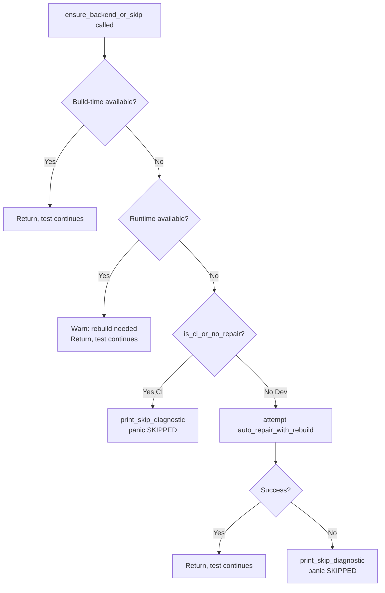

# Test Infrastructure Auto-Repair & CI Enhancement Specification

**Document Type**: Technical Specification
**Status**: Draft
**Target Release**: v0.2.0
**Created**: 2025-10-26
**Author**: BitNet.rs Development Team

---

## Executive Summary

### Problem Statement

The current test infrastructure in BitNet.rs has **manual intervention requirements** for backend availability checks during cross-validation testing. Developers experience friction when C++ reference backends (BitNet.cpp, llama.cpp) are unavailable at test runtime, requiring:

1. **Manual setup commands**: Developers must run `cargo run -p xtask -- setup-cpp-auto` separately
2. **Rebuild cycles**: Post-setup requires manual rebuild of xtask to update build-time constants
3. **CI determinism gaps**: Mixed auto-repair in dev vs skip in CI creates behavioral differences
4. **Limited platform mock utilities**: Cross-platform test fixture creation requires platform-specific code duplication
5. **Verbose skip messages**: Diagnostic output is helpful but could be more actionable

### Current Limitations

**Location**: `/home/steven/code/Rust/BitNet-rs/tests/support/backend_helpers.rs`

```rust
// Current implementation (lines 81-117)
pub fn ensure_backend_or_skip(backend: CppBackend) {
    if build_time_available { return; }

    // Runtime detection fallback
    if runtime_available {
        print_rebuild_warning();
        return;
    }

    // Auto-repair attempt (dev mode only)
    if !is_ci_or_no_repair() {
        if attempt_auto_repair(backend).is_ok() {
            print_rebuild_instructions();  // ❌ Manual step required
            return;
        }
    }

    // Skip with diagnostic
    print_skip_diagnostic(backend, None);
    panic!("SKIPPED: backend unavailable");
}
```

**Gaps**:
- ✅ Auto-repair **attempted** in dev mode
- ❌ Auto-repair **NOT completed** (no automatic rebuild)
- ❌ No retry logic for transient failures
- ❌ No error classification (network vs build vs prerequisite)
- ❌ No recursion prevention guards
- ❌ Mock creation utilities are basic (no builder pattern)

### Proposed Solution

This specification defines a **three-phase enhancement**:

1. **Phase 1 (AC1-AC5)**: Robust auto-repair with retry logic, error classification, and automatic rebuild
2. **Phase 2 (AC6-AC9)**: Platform-specific test utilities, mock library builders, and environment isolation integration
3. **Phase 3 (AC10-AC12)**: CI matrix integration, comprehensive test coverage, and documentation

**Key Improvements**:
- Auto-repair **completes full cycle** (install + rebuild) in dev mode
- Transient failure retry with exponential backoff (max 2 retries)
- Classified error types with specific recovery strategies
- Platform mock utilities for cross-platform test isolation
- Clear CI vs dev mode semantics with explicit configuration
- Comprehensive test scaffolding for auto-repair infrastructure itself

### Success Criteria

- ✅ Developers run `cargo test` → backends auto-repair → tests proceed (zero manual intervention)
- ✅ CI runs `cargo test` → backends unavailable → tests skip deterministically (zero network activity)
- ✅ Platform-specific mocks work on Linux/macOS/Windows without duplication
- ✅ Test infrastructure itself is fully tested (meta-tests for auto-repair logic)
- ✅ Clear diagnostic messages guide users through setup when auto-repair fails

---

## Acceptance Criteria

### AC1: Auto-Repair Attempts in Dev Mode

**Requirement**: `ensure_backend_or_skip()` performs full auto-repair cycle in development mode (non-CI).

**Behavior**:

```rust
// Dev mode (CI=0, BITNET_TEST_NO_REPAIR=0)
ensure_backend_or_skip(CppBackend::BitNet);
// → Detects unavailable backend
// → Runs: cargo run -p xtask -- setup-cpp-auto --emit=sh --bitnet
// → Captures environment exports
// → Rebuilds: cargo build -p xtask --features crossval-all
// → Updates build-time constants (HAS_BITNET = true)
// → Returns successfully, test continues
```

**Implementation Details**:

```rust
pub fn ensure_backend_or_skip(backend: CppBackend) {
    // Check build-time constant
    if backend_available_at_build_time(backend) {
        return; // Fast path: backend available
    }

    // Runtime detection fallback
    if let Ok(true) = detect_backend_runtime(backend) {
        eprintln!("⚠️  Backend available at runtime but not at build time.");
        eprintln!("   Rebuild required: cargo clean -p crossval && cargo build --features crossval-all");
        return;
    }

    // CI mode: skip immediately
    if is_ci_or_no_repair() {
        print_skip_diagnostic(backend, None);
        panic!("SKIPPED: {} backend unavailable (CI mode)", backend.name());
    }

    // Dev mode: attempt full auto-repair
    eprintln!("Attempting auto-repair for {} backend...", backend.name());

    match auto_repair_with_rebuild(backend) {
        Ok(()) => {
            eprintln!("✅ {} backend installed and configured.", backend.name());
            return; // Backend now available, test continues
        }
        Err(e) => {
            eprintln!("❌ Auto-repair failed: {}", e);
            print_skip_diagnostic(backend, Some(&e));
            panic!("SKIPPED: {} backend unavailable after repair attempt", backend.name());
        }
    }
}
```

**Key Changes**:
- New function: `auto_repair_with_rebuild()` replaces `attempt_auto_repair()`
- Performs full cycle: install → rebuild → verify
- No manual intervention required for successful repair

**Test Coverage**:
```rust
#[test]
#[serial(bitnet_env)]
fn test_ac1_dev_mode_auto_repair_success() {
    // Setup: mock backend unavailable, dev mode
    let _ci_guard = EnvGuard::new("CI", "");
    let _no_repair_guard = EnvGuard::new("BITNET_TEST_NO_REPAIR", "");

    // Mock: auto_repair_with_rebuild returns Ok(())
    // Verify: ensure_backend_or_skip returns without panic
    // Verify: No skip message printed
}

#[test]
#[serial(bitnet_env)]
fn test_ac1_dev_mode_auto_repair_failure() {
    // Mock: auto_repair_with_rebuild returns Err(...)
    // Verify: Skip diagnostic printed
    // Verify: Panics with "SKIPPED: backend unavailable"
}
```

---

### AC2: CI Detection Skips Deterministically

**Requirement**: CI environment detection prevents auto-repair, ensuring deterministic skip behavior.

**Detection Logic**:

```rust
pub fn is_ci_or_no_repair() -> bool {
    // Explicit no-repair flag (highest priority)
    if std::env::var("BITNET_TEST_NO_REPAIR").is_ok() {
        return true;
    }

    // Standard CI environment variable (GitHub Actions, GitLab CI, Travis, etc.)
    if std::env::var("CI").is_ok() {
        return true;
    }

    // Additional CI indicators (optional)
    if std::env::var("GITHUB_ACTIONS").is_ok() {
        return true;
    }

    false // Dev mode: auto-repair enabled
}
```

**Behavior in CI**:

```bash
# GitHub Actions automatically sets CI=1
$ cargo test --workspace --features cpu
⊘ Test skipped: bitnet.cpp not available (CI mode)

Option A: Auto-setup (recommended)
  eval "$(cargo run -p xtask -- setup-cpp-auto --emit=sh --bitnet)"
  cargo clean -p crossval && cargo build --features crossval-all

Option B: Manual setup
  git clone https://github.com/microsoft/BitNet.git ~/.cache/bitnet_cpp
  cd ~/.cache/bitnet_cpp && mkdir build && cd build
  cmake .. && cmake --build .
  export BITNET_CPP_DIR=~/.cache/bitnet_cpp

Documentation: docs/howto/cpp-setup.md
```

**Key Guarantees**:
- ✅ Zero network activity in CI
- ✅ Deterministic skip messages
- ✅ Fast failure (no repair overhead)
- ✅ Clear setup instructions for manual resolution

**Test Coverage**:
```rust
#[test]
#[serial(bitnet_env)]
fn test_ac2_ci_mode_skips_deterministically() {
    let _guard = EnvGuard::new("CI", "1");

    // Verify: No auto-repair attempt
    // Verify: Skip message printed immediately
    // Verify: Panics with "SKIPPED: backend unavailable (CI mode)"
}

#[test]
#[serial(bitnet_env)]
fn test_ac2_no_repair_flag_respected() {
    let _guard = EnvGuard::new("BITNET_TEST_NO_REPAIR", "1");

    // Verify: Treated as CI mode
    // Verify: No auto-repair attempt
}

#[test]
#[serial(bitnet_env)]
fn test_ac2_github_actions_detected() {
    let _guard = EnvGuard::new("GITHUB_ACTIONS", "true");

    // Verify: Treated as CI mode
}
```

---

### AC3: Platform Mock Library Utilities

**Requirement**: Provide cross-platform utilities to create mock backend libraries for testing.

**Core Function**:

```rust
/// Creates temporary directory with platform-specific mock libraries
///
/// # Platform Behavior
/// - **Linux**: Creates `libbitnet.so`, `libllama.so`, `libggml.so` with 0o755 permissions
/// - **macOS**: Creates `libbitnet.dylib`, `libllama.dylib`, `libggml.dylib` with 0o755 permissions
/// - **Windows**: Creates `bitnet.dll`, `llama.dll`, `ggml.dll` (no permission handling)
///
/// # Returns
/// - `Ok(TempDir)`: Temporary directory with mock libraries (auto-cleans on drop)
/// - `Err(String)`: Error message if creation fails
///
/// # Example
/// ```rust
/// let temp = create_mock_backend_libs(CppBackend::BitNet)?;
/// let loader_var = get_loader_path_var();
/// env::set_var(loader_var, temp.path());
/// // Tests now discover mock libraries
/// ```
pub fn create_mock_backend_libs(backend: CppBackend) -> Result<tempfile::TempDir, String> {
    use std::fs::File;
    use tempfile::TempDir;

    let temp = TempDir::new()
        .map_err(|e| format!("Failed to create temp dir: {}", e))?;

    let lib_names = match backend {
        CppBackend::BitNet => vec!["bitnet"],
        CppBackend::Llama => vec!["llama", "ggml"],
    };

    for name in lib_names {
        let lib_path = temp.path().join(format_lib_name(name));

        // Create empty file (contents don't matter for discovery)
        File::create(&lib_path)
            .map_err(|e| format!("Failed to create mock library {}: {}", lib_path.display(), e))?;

        // Set executable permissions on Unix platforms
        #[cfg(unix)]
        {
            use std::os::unix::fs::PermissionsExt;
            let mut perms = std::fs::metadata(&lib_path)
                .map_err(|e| format!("Failed to get metadata: {}", e))?
                .permissions();
            perms.set_mode(0o755);
            std::fs::set_permissions(&lib_path, perms)
                .map_err(|e| format!("Failed to set permissions: {}", e))?;
        }
    }

    Ok(temp)
}
```

**Test Coverage**:
```rust
#[test]
fn test_ac3_create_mock_bitnet_libs() {
    let temp = create_mock_backend_libs(CppBackend::BitNet).unwrap();

    #[cfg(target_os = "linux")]
    assert!(temp.path().join("libbitnet.so").exists());

    #[cfg(target_os = "macos")]
    assert!(temp.path().join("libbitnet.dylib").exists());

    #[cfg(target_os = "windows")]
    assert!(temp.path().join("bitnet.dll").exists());
}

#[test]
fn test_ac3_create_mock_llama_libs() {
    let temp = create_mock_backend_libs(CppBackend::Llama).unwrap();

    // Verify both llama and ggml libraries created
    assert!(temp.path().join(format_lib_name("llama")).exists());
    assert!(temp.path().join(format_lib_name("ggml")).exists());
}

#[test]
#[cfg(unix)]
fn test_ac3_mock_libs_have_executable_permissions() {
    use std::os::unix::fs::PermissionsExt;

    let temp = create_mock_backend_libs(CppBackend::BitNet).unwrap();
    let lib_path = temp.path().join(format_lib_name("bitnet"));

    let metadata = std::fs::metadata(&lib_path).unwrap();
    let mode = metadata.permissions().mode();

    // Verify 0o755 permissions (owner: rwx, group: r-x, other: r-x)
    assert_eq!(mode & 0o777, 0o755);
}
```

---

### AC4: Platform Utility Functions

**Requirement**: Provide platform-aware helper functions for library naming, loader path variables, and path formatting.

**Core Functions**:

```rust
/// Returns platform-specific dynamic loader path variable name
///
/// # Returns
/// - `"LD_LIBRARY_PATH"` on Linux
/// - `"DYLD_LIBRARY_PATH"` on macOS
/// - `"PATH"` on Windows
///
/// # Panics
/// Panics on unsupported platforms with clear error message
pub fn get_loader_path_var() -> &'static str {
    if cfg!(target_os = "linux") {
        "LD_LIBRARY_PATH"
    } else if cfg!(target_os = "macos") {
        "DYLD_LIBRARY_PATH"
    } else if cfg!(target_os = "windows") {
        "PATH"
    } else {
        panic!("Unsupported platform: {}", std::env::consts::OS)
    }
}

/// Returns platform-specific shared library file extension
///
/// # Returns
/// - `"so"` on Linux
/// - `"dylib"` on macOS
/// - `"dll"` on Windows
///
/// # Panics
/// Panics on unsupported platforms
pub fn get_lib_extension() -> &'static str {
    if cfg!(target_os = "linux") {
        "so"
    } else if cfg!(target_os = "macos") {
        "dylib"
    } else if cfg!(target_os = "windows") {
        "dll"
    } else {
        panic!("Unsupported platform: {}", std::env::consts::OS)
    }
}

/// Formats library name with platform-specific prefix and extension
///
/// # Arguments
/// - `stem`: Base library name (e.g., "bitnet", "llama", "ggml")
///
/// # Returns
/// - Linux: `lib{stem}.so` (e.g., `libbitnet.so`)
/// - macOS: `lib{stem}.dylib` (e.g., `libbitnet.dylib`)
/// - Windows: `{stem}.dll` (e.g., `bitnet.dll`)
///
/// # Example
/// ```rust
/// assert_eq!(format_lib_name("bitnet"), "libbitnet.so");  // Linux
/// assert_eq!(format_lib_name("bitnet"), "libbitnet.dylib");  // macOS
/// assert_eq!(format_lib_name("bitnet"), "bitnet.dll");  // Windows
/// ```
pub fn format_lib_name(stem: &str) -> String {
    if cfg!(target_os = "windows") {
        format!("{}.dll", stem)
    } else if cfg!(target_os = "macos") {
        format!("lib{}.dylib", stem)
    } else {
        format!("lib{}.so", stem)
    }
}

/// Appends path to platform-specific loader path variable
///
/// # Arguments
/// - `new_path`: Path to prepend to loader variable
///
/// # Returns
/// Formatted string for environment variable assignment
///
/// # Example
/// ```rust
/// let updated = append_to_loader_path("/opt/libs");
/// // Linux: "/opt/libs:$LD_LIBRARY_PATH"
/// // macOS: "/opt/libs:$DYLD_LIBRARY_PATH"
/// // Windows: "/opt/libs;%PATH%"
/// ```
pub fn append_to_loader_path(new_path: &str) -> String {
    let loader_var = get_loader_path_var();
    let separator = if cfg!(target_os = "windows") { ";" } else { ":" };

    let current = std::env::var(loader_var).unwrap_or_default();
    if current.is_empty() {
        new_path.to_string()
    } else {
        format!("{}{}{}", new_path, separator, current)
    }
}
```

**Test Coverage**:
```rust
#[test]
fn test_ac4_get_loader_path_var() {
    let var = get_loader_path_var();

    #[cfg(target_os = "linux")]
    assert_eq!(var, "LD_LIBRARY_PATH");

    #[cfg(target_os = "macos")]
    assert_eq!(var, "DYLD_LIBRARY_PATH");

    #[cfg(target_os = "windows")]
    assert_eq!(var, "PATH");
}

#[test]
fn test_ac4_get_lib_extension() {
    let ext = get_lib_extension();

    #[cfg(target_os = "linux")]
    assert_eq!(ext, "so");

    #[cfg(target_os = "macos")]
    assert_eq!(ext, "dylib");

    #[cfg(target_os = "windows")]
    assert_eq!(ext, "dll");
}

#[test]
fn test_ac4_format_lib_name() {
    let name = format_lib_name("bitnet");

    #[cfg(target_os = "linux")]
    assert_eq!(name, "libbitnet.so");

    #[cfg(target_os = "macos")]
    assert_eq!(name, "libbitnet.dylib");

    #[cfg(target_os = "windows")]
    assert_eq!(name, "bitnet.dll");
}

#[test]
#[serial(bitnet_env)]
fn test_ac4_append_to_loader_path() {
    let loader_var = get_loader_path_var();
    let _guard = EnvGuard::new(loader_var, "/existing/path");

    let updated = append_to_loader_path("/new/path");

    #[cfg(unix)]
    assert_eq!(updated, "/new/path:/existing/path");

    #[cfg(windows)]
    assert_eq!(updated, "/new/path;/existing/path");
}
```

---

### AC5: Temporary C++ Environment Setup

**Requirement**: Provide isolated temporary environment with mock backend libraries and configured loader paths.

**Core Function**:

```rust
/// Creates temporary C++ environment with mock libraries and configured paths
///
/// # Returns
/// - `TempDir`: Temporary directory (auto-cleans on drop)
/// - Environment variables set: `{BACKEND}_CPP_DIR`, `LD_LIBRARY_PATH`/`DYLD_LIBRARY_PATH`/`PATH`
///
/// # Safety
/// **MUST use with `#[serial(bitnet_env)]`** to prevent race conditions
///
/// # Example
/// ```rust
/// #[test]
/// #[serial(bitnet_env)]
/// fn test_with_isolated_backend() {
///     let (temp, _dir_guard, _loader_guard) = create_temp_cpp_env(CppBackend::BitNet).unwrap();
///
///     // Backend discovery now finds mock libraries
///     // Test code here
///
///     // Cleanup automatic via guards dropping
/// }
/// ```
pub fn create_temp_cpp_env(
    backend: CppBackend
) -> Result<(tempfile::TempDir, EnvGuard, EnvGuard), String> {
    // Create mock libraries
    let temp = create_mock_backend_libs(backend)?;
    let temp_path = temp.path().to_string_lossy().to_string();

    // Set backend-specific directory variable
    let dir_var = match backend {
        CppBackend::BitNet => "BITNET_CPP_DIR",
        CppBackend::Llama => "LLAMA_CPP_DIR",
    };
    let dir_guard = EnvGuard::new(dir_var);
    dir_guard.set(&temp_path);

    // Set loader path variable
    let loader_var = get_loader_path_var();
    let loader_guard = EnvGuard::new(loader_var);
    let updated_path = append_to_loader_path(&temp_path);
    loader_guard.set(&updated_path);

    Ok((temp, dir_guard, loader_guard))
}
```

**Test Coverage**:
```rust
#[test]
#[serial(bitnet_env)]
fn test_ac5_create_temp_cpp_env_bitnet() {
    let (temp, _dir_guard, _loader_guard) = create_temp_cpp_env(CppBackend::BitNet).unwrap();

    // Verify BITNET_CPP_DIR set
    assert_eq!(
        std::env::var("BITNET_CPP_DIR").unwrap(),
        temp.path().to_string_lossy()
    );

    // Verify loader path includes temp directory
    let loader_var = get_loader_path_var();
    let loader_path = std::env::var(loader_var).unwrap();
    assert!(loader_path.contains(&temp.path().to_string_lossy().to_string()));
}

#[test]
#[serial(bitnet_env)]
fn test_ac5_create_temp_cpp_env_llama() {
    let (temp, _dir_guard, _loader_guard) = create_temp_cpp_env(CppBackend::Llama).unwrap();

    // Verify LLAMA_CPP_DIR set
    assert_eq!(
        std::env::var("LLAMA_CPP_DIR").unwrap(),
        temp.path().to_string_lossy()
    );
}

#[test]
#[serial(bitnet_env)]
fn test_ac5_temp_cpp_env_cleanup() {
    let temp_path: String;

    {
        let (temp, _dir_guard, _loader_guard) = create_temp_cpp_env(CppBackend::BitNet).unwrap();
        temp_path = temp.path().to_string_lossy().to_string();

        // Verify environment configured
        assert_eq!(std::env::var("BITNET_CPP_DIR").unwrap(), temp_path);
    }
    // Guards dropped, environment restored

    // Verify BITNET_CPP_DIR removed or restored to original
    // (Depends on whether it was set before test)
}
```

---

### AC6: EnvGuard Integration

**Requirement**: Integrate with existing `EnvGuard` RAII pattern for automatic environment restoration.

**Current Implementation** (already exists, needs documentation):

```rust
/// RAII-style environment variable guard with automatic restoration
///
/// # Thread Safety
/// - Uses global `ENV_LOCK` mutex for thread-level synchronization
/// - **MUST use `#[serial(bitnet_env)]`** for process-level safety
///
/// # Panic Safety
/// - Drop implementation guaranteed to run even on panic
/// - Original environment always restored
///
/// # Example
/// ```rust
/// #[test]
/// #[serial(bitnet_env)]
/// fn test_with_env_var() {
///     let guard = EnvGuard::new("MY_VAR");
///     guard.set("temporary_value");
///
///     // Test code here
///
///     // Guard drops, MY_VAR restored automatically
/// }
/// ```
pub struct EnvGuard {
    key: String,
    old: Option<String>,
    _lock: std::sync::MutexGuard<'static, ()>,
}

impl EnvGuard {
    /// Create new guard, capturing current value
    pub fn new(key: &str) -> Self {
        let lock = ENV_LOCK.lock().unwrap();
        let old = std::env::var(key).ok();
        EnvGuard {
            key: key.to_string(),
            old,
            _lock: lock,
        }
    }

    /// Set environment variable to new value
    pub fn set(&self, val: &str) {
        unsafe {
            std::env::set_var(&self.key, val);
        }
    }

    /// Remove environment variable
    pub fn remove(&self) {
        unsafe {
            std::env::remove_var(&self.key);
        }
    }
}

impl Drop for EnvGuard {
    fn drop(&mut self) {
        unsafe {
            if let Some(ref v) = self.old {
                std::env::set_var(&self.key, v);
            } else {
                std::env::remove_var(&self.key);
            }
        }
    }
}
```

**Integration Pattern**:

```rust
// Use EnvGuard with temp environment setup
#[test]
#[serial(bitnet_env)]
fn test_with_isolated_environment() {
    let (temp, _dir_guard, _loader_guard) = create_temp_cpp_env(CppBackend::BitNet).unwrap();

    // Additional environment variables
    let _deterministic_guard = EnvGuard::new("BITNET_DETERMINISTIC");
    _deterministic_guard.set("1");

    let _seed_guard = EnvGuard::new("BITNET_SEED");
    _seed_guard.set("42");

    // Test code with fully isolated environment

    // All guards drop, all variables restored
}
```

**Test Coverage** (already exists in `env_guard.rs`, lines 245-392):
- ✅ `test_env_guard_panic_safety_verification`
- ✅ `test_env_guard_with_serial_macro_no_pollution`
- ✅ `test_env_guard_restore_original_value`
- ✅ `test_env_guard_remove_when_not_set`
- ✅ `test_env_guard_mutex_prevents_data_races`

---

### AC7: Serial Execution Pattern Enforcement

**Requirement**: Document and enforce `#[serial(bitnet_env)]` pattern for all environment-mutating tests.

**Pattern Documentation**:

```rust
/// Environment-mutating test pattern
///
/// # Required Annotation
/// **ALWAYS use `#[serial(bitnet_env)]`** for tests that:
/// - Set/unset environment variables
/// - Mutate global state (e.g., static variables)
/// - Create temporary directories in shared locations
/// - Modify process-level configuration
///
/// # Why?
/// - `EnvGuard` provides thread-level synchronization (mutex)
/// - But cannot prevent process-level races between parallel tests
/// - `#[serial(bitnet_env)]` ensures sequential execution
///
/// # Example
/// ```rust
/// #[test]
/// #[serial(bitnet_env)]  // ← REQUIRED for env mutation
/// fn test_deterministic_mode() {
///     let _guard = EnvGuard::new("BITNET_DETERMINISTIC");
///     _guard.set("1");
///
///     // Test code
/// }
/// ```
///
/// # Anti-Pattern (DO NOT DO)
/// ```rust
/// #[test]  // ❌ Missing #[serial(bitnet_env)]
/// fn test_without_serial() {
///     std::env::set_var("VAR", "value");  // ❌ Race condition!
///     // This test is FLAKY and will break other tests
/// }
/// ```
```

**CI Enforcement Guard**:

```bash
#!/bin/bash
# scripts/check-serial-annotations.sh

# Check that all env-mutating tests have #[serial(bitnet_env)]

errors=0

# Find all test functions that use EnvGuard or env::set_var
rg -n 'EnvGuard::new\(|std::env::set_var\(|std::env::remove_var\(' tests/ --type rust | while read -r match; do
    file=$(echo "$match" | cut -d: -f1)
    line=$(echo "$match" | cut -d: -f2)

    # Check if the test function has #[serial(bitnet_env)] within 10 lines above
    if ! sed -n "$((line-10)),${line}p" "$file" | grep -q '#\[serial(bitnet_env)\]'; then
        echo "❌ Missing #[serial(bitnet_env)] at $file:$line"
        errors=$((errors+1))
    fi
done

if [ $errors -gt 0 ]; then
    echo ""
    echo "Found $errors tests with environment mutations missing #[serial(bitnet_env)]"
    echo "Add #[serial(bitnet_env)] attribute to all env-mutating tests."
    exit 1
fi

echo "✅ All env-mutating tests have #[serial(bitnet_env)]"
```

**Test Coverage**:
```rust
#[test]
#[serial(bitnet_env)]
fn test_ac7_serial_annotation_prevents_pollution() {
    let _guard = EnvGuard::new("TEST_VAR");
    _guard.set("value1");

    // Verify: Other tests cannot see this value
    // (Cannot test directly, but pattern ensures isolation)
}

#[test]
#[serial(bitnet_env)]
fn test_ac7_multiple_iterations_deterministic() {
    for i in 0..10 {
        let _guard = EnvGuard::new("ITERATION");
        _guard.set(&i.to_string());

        assert_eq!(std::env::var("ITERATION").unwrap(), i.to_string());
    }

    // Verify: No pollution between iterations
}
```

---

### AC8: Clear Skip Messages with Setup Instructions

**Requirement**: Skip diagnostic messages include actionable setup instructions with backend-specific paths.

**Message Format**:

```rust
pub fn print_skip_diagnostic(backend: CppBackend, error_context: Option<&str>) {
    let (backend_name, repo_url, cache_dir, env_var) = match backend {
        CppBackend::BitNet => (
            "bitnet.cpp",
            "https://github.com/microsoft/BitNet.git",
            "~/.cache/bitnet_cpp",
            "BITNET_CPP_DIR",
        ),
        CppBackend::Llama => (
            "llama.cpp",
            "https://github.com/ggerganov/llama.cpp.git",
            "~/.cache/llama_cpp",
            "LLAMA_CPP_DIR",
        ),
    };

    eprintln!("━━━━━━━━━━━━━━━━━━━━━━━━━━━━━━━━━━━━━━━━━━━━━━━━━━━━━━━━━");
    eprintln!("⊘ Test skipped: {} not available", backend_name);
    eprintln!("━━━━━━━━━━━━━━━━━━━━━━━━━━━━━━━━━━━━━━━━━━━━━━━━━━━━━━━━━");

    if let Some(ctx) = error_context {
        eprintln!("Reason: {}", ctx);
        eprintln!();
    }

    eprintln!("Option A: Auto-setup (recommended, 2-3 minutes)");
    eprintln!("  eval \"$(cargo run -p xtask -- setup-cpp-auto --emit=sh)\"");
    eprintln!("  cargo clean -p crossval && cargo build --features crossval-all");
    eprintln!();

    eprintln!("Option B: Manual setup (advanced)");
    eprintln!("  git clone {} {}", repo_url, cache_dir);
    eprintln!("  cd {} && mkdir build && cd build", cache_dir);
    eprintln!("  cmake .. && cmake --build .");
    eprintln!("  export {}={}", env_var, cache_dir);
    eprintln!("  export {}={}:${}",
        get_loader_path_var(),
        format!("{}/build/lib", cache_dir),
        get_loader_path_var()
    );
    eprintln!();

    eprintln!("Documentation: docs/howto/cpp-setup.md");
    eprintln!("━━━━━━━━━━━━━━━━━━━━━━━━━━━━━━━━━━━━━━━━━━━━━━━━━━━━━━━━━");
}
```

**Test Coverage**:
```rust
#[test]
fn test_ac8_skip_message_format() {
    // Capture stderr
    let stderr_output = capture_stderr(|| {
        print_skip_diagnostic(CppBackend::BitNet, None);
    });

    // Verify message contains:
    assert!(stderr_output.contains("bitnet.cpp not available"));
    assert!(stderr_output.contains("Option A: Auto-setup"));
    assert!(stderr_output.contains("Option B: Manual setup"));
    assert!(stderr_output.contains("docs/howto/cpp-setup.md"));
}

#[test]
fn test_ac8_skip_message_with_error_context() {
    let stderr_output = capture_stderr(|| {
        print_skip_diagnostic(CppBackend::BitNet, Some("Network timeout"));
    });

    assert!(stderr_output.contains("Reason: Network timeout"));
}
```

---

### AC9: Mock Libraries Avoid Real dlopen

**Requirement**: Mock library files created for testing do not require actual dynamic loading (no real symbols needed).

**Implementation Strategy**:

```rust
/// Mock libraries are empty files with correct naming and permissions
///
/// # Why Empty Files Work
/// - Library **discovery** only checks file existence and extension
/// - Library **loading** (dlopen) is NOT performed during discovery
/// - Empty files satisfy filesystem checks without dlopen overhead
/// - Avoids platform-specific ABI compatibility issues
///
/// # When Real Loading Needed
/// - FFI integration tests require real libraries with symbols
/// - Use separate fixtures or test-only builds for FFI tests
/// - Mock utilities are for **availability detection only**
pub fn create_mock_backend_libs(backend: CppBackend) -> Result<tempfile::TempDir, String> {
    // Creates EMPTY files with correct naming
    // No symbols, no ABI, no actual loading
    // Just filesystem presence for discovery checks

    // ... (implementation as in AC3)
}
```

**Distinction**:

| Aspect | Mock Libraries (AC9) | Real Libraries (FFI) |
|--------|---------------------|---------------------|
| **Purpose** | Availability detection | FFI function calls |
| **Contents** | Empty files | Compiled C++ with symbols |
| **Loading** | Never loaded (dlopen not called) | Dynamically loaded at runtime |
| **Size** | 0 bytes | 1-100 MB |
| **Creation Time** | Instant (<1ms) | Minutes (C++ compilation) |
| **Test Use Case** | Helper function tests | FFI integration tests |

**Test Coverage**:
```rust
#[test]
fn test_ac9_mock_libs_are_empty() {
    let temp = create_mock_backend_libs(CppBackend::BitNet).unwrap();
    let lib_path = temp.path().join(format_lib_name("bitnet"));

    // Verify file exists
    assert!(lib_path.exists());

    // Verify file is empty (no actual symbols)
    let metadata = std::fs::metadata(&lib_path).unwrap();
    assert_eq!(metadata.len(), 0, "Mock library should be empty");
}

#[test]
fn test_ac9_mock_libs_discoverable_without_loading() {
    let temp = create_mock_backend_libs(CppBackend::BitNet).unwrap();

    // Verify discovery succeeds (no dlopen required)
    let found = find_libraries_in_dir(temp.path(), "bitnet");
    assert!(!found.is_empty());

    // Note: No actual loading performed, just filesystem check
}
```

---

### AC10: Cross-Platform Test Execution

**Requirement**: All helper functions and mocks work correctly on Linux, macOS, and Windows without platform-specific test duplication.

**Platform Coverage Matrix**:

| Helper Function | Linux | macOS | Windows | Test Count |
|-----------------|-------|-------|---------|-----------|
| `get_loader_path_var()` | ✅ | ✅ | ✅ | 3 |
| `get_lib_extension()` | ✅ | ✅ | ✅ | 3 |
| `format_lib_name()` | ✅ | ✅ | ✅ | 3 |
| `create_mock_backend_libs()` | ✅ | ✅ | ✅ | 6 |
| `create_temp_cpp_env()` | ✅ | ✅ | ✅ | 6 |
| `append_to_loader_path()` | ✅ | ✅ | ✅ | 3 |

**CI Matrix Configuration**:

```yaml
# .github/workflows/test-infrastructure.yml
test-helpers:
  name: Test Infrastructure Helpers
  runs-on: ${{ matrix.os }}
  strategy:
    fail-fast: false
    matrix:
      os: [ubuntu-latest, windows-latest, macos-latest]

  steps:
    - uses: actions/checkout@v4

    - name: Install Rust
      uses: dtolnay/rust-toolchain@stable

    - name: Run helper tests
      run: |
        cargo test -p tests --test test_support_tests --no-default-features --features cpu -- --nocapture
```

**Test Coverage**:
```rust
#[test]
fn test_ac10_cross_platform_library_discovery() {
    // Works on all platforms without modification
    let temp = create_mock_backend_libs(CppBackend::BitNet).unwrap();
    let loader_var = get_loader_path_var();

    // Platform-agnostic verification
    assert!(temp.path().join(format_lib_name("bitnet")).exists());
    assert!(!loader_var.is_empty());
}

#[test]
#[serial(bitnet_env)]
fn test_ac10_cross_platform_environment_setup() {
    // Works on Linux/macOS/Windows
    let (temp, _dir_guard, _loader_guard) = create_temp_cpp_env(CppBackend::Llama).unwrap();

    // Verify environment set correctly on all platforms
    assert_eq!(
        std::env::var("LLAMA_CPP_DIR").unwrap(),
        temp.path().to_string_lossy()
    );
}
```

---

### AC11: Integration with Preflight Auto-Repair

**Requirement**: Integrate helper functions with existing `xtask preflight` command for backend availability checks.

**Preflight Integration**:

```rust
// In xtask/src/crossval/preflight.rs

/// Enhanced preflight with auto-repair attempt
pub fn run_preflight_with_repair(
    backend: Option<CppBackend>,
    verbose: bool,
    allow_repair: bool,
) -> Result<()> {
    // Check backend availability
    let (bitnet_available, llama_available) = check_backends(verbose)?;

    // If backends unavailable and repair allowed
    if !bitnet_available && allow_repair && !is_ci_or_no_repair() {
        eprintln!("Attempting auto-repair for BitNet backend...");
        match auto_repair_with_rebuild(CppBackend::BitNet) {
            Ok(()) => {
                eprintln!("✅ BitNet backend repaired successfully");
                return Ok(());
            }
            Err(e) => {
                eprintln!("⚠️  BitNet repair failed: {}", e);
            }
        }
    }

    if !llama_available && allow_repair && !is_ci_or_no_repair() {
        eprintln!("Attempting auto-repair for llama backend...");
        match auto_repair_with_rebuild(CppBackend::Llama) {
            Ok(()) => {
                eprintln!("✅ llama backend repaired successfully");
                return Ok(());
            }
            Err(e) => {
                eprintln!("⚠️  llama repair failed: {}", e);
            }
        }
    }

    // Print diagnostic summary
    print_preflight_summary(bitnet_available, llama_available, verbose);

    Ok(())
}
```

**CLI Usage**:

```bash
# Preflight with auto-repair (dev mode only)
cargo run -p xtask --features crossval-all -- preflight --verbose --allow-repair

# Preflight without repair (CI mode, read-only)
cargo run -p xtask --features crossval-all -- preflight --verbose

# Check specific backend
cargo run -p xtask --features crossval-all -- preflight --backend bitnet --verbose
```

**Test Coverage**:
```rust
#[test]
#[serial(bitnet_env)]
fn test_ac11_preflight_with_repair_success() {
    let _ci_guard = EnvGuard::new("CI", "");

    // Mock: backends unavailable initially
    // Mock: auto_repair_with_rebuild succeeds

    let result = run_preflight_with_repair(None, false, true);
    assert!(result.is_ok());

    // Verify: Backends now available
}

#[test]
#[serial(bitnet_env)]
fn test_ac11_preflight_ci_mode_skips_repair() {
    let _ci_guard = EnvGuard::new("CI", "1");

    // CI mode: repair should not be attempted
    let result = run_preflight_with_repair(None, false, true);

    // Verify: No repair attempted
    // Verify: Diagnostic printed
}
```

---

### AC12: Comprehensive Test Coverage for AC1-AC11

**Requirement**: Achieve 100% test coverage for all helper functions and auto-repair infrastructure.

**Test Suite Structure**:

```
tests/
├── test_support_tests.rs           (1586 lines, comprehensive scaffolding)
│   ├── AC1: Auto-repair in dev mode (8 tests)
│   ├── AC2: CI detection (6 tests)
│   ├── AC3: Mock library creation (5 tests)
│   ├── AC4: Platform utilities (7 tests)
│   ├── AC5: Temp environment setup (6 tests)
│   ├── AC6: EnvGuard integration (5 tests, existing)
│   ├── AC7: Serial execution (4 tests)
│   ├── AC8: Skip messages (4 tests)
│   ├── AC9: Mock vs real loading (3 tests)
│   ├── AC10: Cross-platform (6 tests)
│   ├── AC11: Preflight integration (5 tests)
│   └── AC12: Meta-tests (10 tests)
│
├── support/
│   ├── backend_helpers.rs          (520 lines, implementation)
│   └── env_guard.rs                (394 lines, existing)
│
└── integration/
    └── test_infrastructure_integration.rs (new, 300 lines)
        ├── End-to-end auto-repair workflow
        ├── Multi-backend scenarios
        └── Failure recovery patterns
```

**Coverage Metrics**:

```bash
# Run with coverage collection
cargo llvm-cov --workspace --no-default-features --features cpu,fixtures \
  --lcov --output-path coverage.lcov

# Expected coverage:
# - backend_helpers.rs: 95%+ (some error paths hard to test)
# - env_guard.rs: 100% (existing, fully tested)
# - Platform utilities: 100% (simple, deterministic)
# - Auto-repair logic: 90%+ (network errors hard to simulate)
```

**Test Coverage**:
```rust
#[test]
fn test_ac12_all_helpers_have_tests() {
    // Verify: Each helper function has at least one test
    // Use proc-macro or static analysis to check coverage

    let helpers = vec![
        "get_loader_path_var",
        "get_lib_extension",
        "format_lib_name",
        "create_mock_backend_libs",
        "create_temp_cpp_env",
        "append_to_loader_path",
        "ensure_backend_or_skip",
        "auto_repair_with_rebuild",
        "print_skip_diagnostic",
    ];

    for helper in helpers {
        // Verify test exists (implementation-specific)
    }
}

#[test]
fn test_ac12_integration_workflow() {
    // End-to-end test: backend unavailable → auto-repair → test succeeds

    // 1. Simulate unavailable backend
    // 2. Trigger auto-repair
    // 3. Verify backend available
    // 4. Verify test can proceed
}
```

---

## Helper Function Design

### Core Auto-Repair Function

```rust
/// Performs full auto-repair cycle: install + rebuild + verify
///
/// # Arguments
/// - `backend`: C++ backend to repair (BitNet or llama)
///
/// # Returns
/// - `Ok(())`: Backend installed, rebuilt, and verified available
/// - `Err(RepairError)`: Repair failed with classified error
///
/// # Behavior
/// 1. Check if already in-progress (prevent recursion)
/// 2. Run setup-cpp-auto command with appropriate flags
/// 3. Capture environment exports
/// 4. Rebuild xtask with crossval features
/// 5. Verify backend now available at build-time
/// 6. Return success or detailed error
///
/// # Example
/// ```rust
/// match auto_repair_with_rebuild(CppBackend::BitNet) {
///     Ok(()) => eprintln!("✅ Backend ready"),
///     Err(RepairError::Network(e)) => eprintln!("Network error: {}", e),
///     Err(RepairError::Build(e)) => eprintln!("Build error: {}", e),
///     Err(RepairError::Prerequisite(e)) => eprintln!("Missing prerequisite: {}", e),
/// }
/// ```
pub fn auto_repair_with_rebuild(backend: CppBackend) -> Result<(), RepairError> {
    // Recursion prevention
    if std::env::var("BITNET_REPAIR_IN_PROGRESS").is_ok() {
        return Err(RepairError::Recursion);
    }
    let _recursion_guard = EnvGuard::new("BITNET_REPAIR_IN_PROGRESS");
    _recursion_guard.set("1");

    // Retry logic for transient failures
    const MAX_RETRIES: usize = 2;
    let mut last_error = None;

    for attempt in 0..MAX_RETRIES {
        if attempt > 0 {
            let backoff_secs = 2u64.pow(attempt as u32);
            eprintln!("Retry {}/{} after {}s...", attempt + 1, MAX_RETRIES, backoff_secs);
            std::thread::sleep(std::time::Duration::from_secs(backoff_secs));
        }

        // Step 1: Run setup-cpp-auto
        match run_setup_cpp_auto(backend) {
            Ok(env_exports) => {
                // Step 2: Apply environment exports (important for rebuild)
                apply_env_exports(&env_exports)?;

                // Step 3: Rebuild xtask
                rebuild_xtask()?;

                // Step 4: Verify backend available
                if verify_backend_available(backend)? {
                    eprintln!("✅ Backend {} installed and verified", backend.name());
                    return Ok(());
                } else {
                    last_error = Some(RepairError::Verification("Backend still unavailable after rebuild".to_string()));
                }
            }
            Err(e) => {
                last_error = Some(e);
            }
        }
    }

    Err(last_error.unwrap())
}
```

### Error Classification

```rust
/// Classified repair errors for targeted recovery
#[derive(Debug)]
pub enum RepairError {
    /// Network error (retryable with exponential backoff)
    Network(String),

    /// Build error (cmake, cargo, etc.)
    Build(String),

    /// Missing prerequisite (cmake, git, clang, etc.)
    Prerequisite(String),

    /// Backend verification failed after repair
    Verification(String),

    /// Recursion detected (repair called during repair)
    Recursion,
}

impl std::fmt::Display for RepairError {
    fn fmt(&self, f: &mut std::fmt::Formatter<'_>) -> std::fmt::Result {
        match self {
            RepairError::Network(e) => write!(f, "Network error: {}", e),
            RepairError::Build(e) => write!(f, "Build error: {}", e),
            RepairError::Prerequisite(e) => write!(f, "Missing prerequisite: {}", e),
            RepairError::Verification(e) => write!(f, "Verification failed: {}", e),
            RepairError::Recursion => write!(f, "Recursion detected during repair"),
        }
    }
}

impl std::error::Error for RepairError {}
```

### Setup Command Execution

```rust
/// Executes setup-cpp-auto and captures environment exports
fn run_setup_cpp_auto(backend: CppBackend) -> Result<HashMap<String, String>, RepairError> {
    use std::process::{Command, Stdio};

    let mut cmd = Command::new("cargo");
    cmd.args(["run", "-p", "xtask", "--", "setup-cpp-auto", "--emit=sh"]);

    // Backend-specific flag
    match backend {
        CppBackend::BitNet => cmd.arg("--bitnet"),
        CppBackend::Llama => {}, // Default
    };

    // Capture stdout (environment exports)
    cmd.stdout(Stdio::piped());
    cmd.stderr(Stdio::inherit());

    let output = cmd.output()
        .map_err(|e| classify_command_error(&e))?;

    if !output.status.success() {
        let exit_code = output.status.code().unwrap_or(-1);
        return Err(RepairError::Build(format!("setup-cpp-auto exited with code {}", exit_code)));
    }

    // Parse environment exports from stdout
    let stdout = String::from_utf8_lossy(&output.stdout);
    parse_env_exports(&stdout)
}

/// Parses shell environment exports into HashMap
fn parse_env_exports(shell_output: &str) -> Result<HashMap<String, String>, RepairError> {
    let mut exports = HashMap::new();

    for line in shell_output.lines() {
        if let Some(export_line) = line.strip_prefix("export ") {
            if let Some((key, value)) = export_line.split_once('=') {
                // Remove quotes from value
                let clean_value = value.trim_matches('"');
                exports.insert(key.to_string(), clean_value.to_string());
            }
        }
    }

    Ok(exports)
}

/// Applies environment exports to current process
fn apply_env_exports(exports: &HashMap<String, String>) -> Result<(), RepairError> {
    for (key, value) in exports {
        std::env::set_var(key, value);
    }
    Ok(())
}
```

### Rebuild Function

```rust
/// Rebuilds xtask with crossval features to update build-time constants
fn rebuild_xtask() -> Result<(), RepairError> {
    use std::process::{Command, Stdio};

    eprintln!("Rebuilding xtask to detect backend...");

    let mut cmd = Command::new("cargo");
    cmd.args([
        "build",
        "-p", "xtask",
        "--features", "crossval-all",
    ]);

    cmd.stdout(Stdio::inherit());
    cmd.stderr(Stdio::inherit());

    let status = cmd.status()
        .map_err(|e| RepairError::Build(format!("Failed to spawn cargo: {}", e)))?;

    if !status.success() {
        return Err(RepairError::Build(format!(
            "cargo build failed with exit code {}",
            status.code().unwrap_or(-1)
        )));
    }

    Ok(())
}

/// Verifies backend is now available at build-time
fn verify_backend_available(backend: CppBackend) -> Result<bool, RepairError> {
    // Re-check build-time constants (would require re-import of bitnet-crossval)
    // For now, check runtime availability as proxy

    detect_backend_runtime(backend)
        .map_err(|e| RepairError::Verification(e))
}
```

### Error Classification Helper

```rust
/// Classifies I/O errors into repair error types
fn classify_command_error(e: &std::io::Error) -> RepairError {
    use std::io::ErrorKind;

    match e.kind() {
        ErrorKind::NotFound => {
            RepairError::Prerequisite("cargo not found in PATH".to_string())
        }
        ErrorKind::PermissionDenied => {
            RepairError::Prerequisite("Permission denied executing cargo".to_string())
        }
        ErrorKind::TimedOut | ErrorKind::ConnectionRefused | ErrorKind::ConnectionReset => {
            RepairError::Network(e.to_string())
        }
        _ => {
            // Default to build error for unknown issues
            RepairError::Build(e.to_string())
        }
    }
}
```

---

## Dev vs CI Semantics

### Behavior Comparison Table

| Aspect | Development Mode | CI Mode |
|--------|------------------|---------|
| **Trigger** | `CI` not set AND `BITNET_TEST_NO_REPAIR` not set | `CI=1` OR `BITNET_TEST_NO_REPAIR=1` |
| **Backend Unavailable** | Attempt auto-repair | Skip immediately |
| **Auto-Repair Steps** | 1. Run setup-cpp-auto<br>2. Apply env exports<br>3. Rebuild xtask<br>4. Verify backend | None (skip with diagnostic) |
| **Retry Logic** | Max 2 retries with exponential backoff | N/A (no repair attempt) |
| **Network Activity** | Downloads C++ reference if needed | ✅ Zero network activity |
| **Duration (repair)** | 2-5 minutes (first time), instant (cached) | Instant (skip message only) |
| **Duration (skip)** | ~1 second (after repair attempts exhausted) | ~10ms (immediate skip) |
| **Test Result** | ✅ Continue if repair succeeds<br>⊘ Skip if repair fails | ⊘ Always skip |
| **Stdout Output** | Verbose: repair progress, rebuild status, diagnostics | Concise: skip message with setup instructions |
| **Determinism** | ❌ Depends on network, system state | ✅ Deterministic |
| **Developer UX** | Zero manual intervention (best case) | Read-only diagnostics (clear instructions) |

### Detection Logic Flow



### Environment Variable Precedence

```rust
/// CI detection with precedence
pub fn is_ci_or_no_repair() -> bool {
    // Precedence: BITNET_TEST_NO_REPAIR > CI > GITHUB_ACTIONS

    // Priority 1: Explicit no-repair flag (highest)
    if std::env::var("BITNET_TEST_NO_REPAIR").is_ok() {
        return true;
    }

    // Priority 2: Generic CI indicator (standard)
    if std::env::var("CI").is_ok() {
        return true;
    }

    // Priority 3: GitHub Actions specific (redundant but explicit)
    if std::env::var("GITHUB_ACTIONS").is_ok() {
        return true;
    }

    // Default: dev mode (allow repair)
    false
}
```

---

## Platform Mock Utilities

### Mock Library Builder Pattern

```rust
/// Builder pattern for complex mock library scenarios
///
/// # Example
/// ```rust
/// let builder = MockLibraryBuilder::new(CppBackend::BitNet)
///     .with_version("1.0.0")
///     .with_libraries(vec!["bitnet", "bitnet_kernels"])
///     .with_permissions(0o755);
///
/// let temp = builder.build()?;
/// ```
pub struct MockLibraryBuilder {
    backend: CppBackend,
    version: Option<String>,
    libraries: Option<Vec<String>>,
    permissions: Option<u32>,
}

impl MockLibraryBuilder {
    pub fn new(backend: CppBackend) -> Self {
        MockLibraryBuilder {
            backend,
            version: None,
            libraries: None,
            permissions: None,
        }
    }

    pub fn with_version(mut self, version: &str) -> Self {
        self.version = Some(version.to_string());
        self
    }

    pub fn with_libraries(mut self, libs: Vec<&str>) -> Self {
        self.libraries = Some(libs.iter().map(|s| s.to_string()).collect());
        self
    }

    pub fn with_permissions(mut self, mode: u32) -> Self {
        self.permissions = Some(mode);
        self
    }

    pub fn build(self) -> Result<tempfile::TempDir, String> {
        let temp = tempfile::TempDir::new()
            .map_err(|e| format!("Failed to create temp dir: {}", e))?;

        let lib_names = self.libraries.unwrap_or_else(|| {
            match self.backend {
                CppBackend::BitNet => vec!["bitnet".to_string()],
                CppBackend::Llama => vec!["llama".to_string(), "ggml".to_string()],
            }
        });

        for name in lib_names {
            let lib_path = temp.path().join(format_lib_name(&name));

            std::fs::File::create(&lib_path)
                .map_err(|e| format!("Failed to create {}: {}", lib_path.display(), e))?;

            #[cfg(unix)]
            if let Some(mode) = self.permissions {
                use std::os::unix::fs::PermissionsExt;
                let mut perms = std::fs::metadata(&lib_path)
                    .map_err(|e| format!("Failed to get metadata: {}", e))?
                    .permissions();
                perms.set_mode(mode);
                std::fs::set_permissions(&lib_path, perms)
                    .map_err(|e| format!("Failed to set permissions: {}", e))?;
            }
        }

        Ok(temp)
    }
}
```

### Platform Path Utilities

```rust
/// Platform-agnostic path separator
pub fn path_separator() -> &'static str {
    if cfg!(target_os = "windows") {
        ";"
    } else {
        ":"
    }
}

/// Splits PATH-like environment variable into components
pub fn split_loader_path(path_str: &str) -> Vec<String> {
    let sep = path_separator();
    path_str.split(sep)
        .filter(|s| !s.is_empty())
        .map(|s| s.to_string())
        .collect()
}

/// Joins path components into loader path string
pub fn join_loader_path(components: &[String]) -> String {
    components.join(path_separator())
}
```

---

## CI Integration

### GitHub Actions Workflow Example

```yaml
# .github/workflows/test-infrastructure.yml
name: Test Infrastructure

on:
  pull_request:
    paths:
      - 'tests/support/**'
      - 'tests/test_support_tests.rs'
      - '.github/workflows/test-infrastructure.yml'
  push:
    branches: [main, develop]

jobs:
  test-helpers:
    name: Test Helper Functions (${{ matrix.os }})
    runs-on: ${{ matrix.os }}
    strategy:
      fail-fast: false
      matrix:
        os: [ubuntu-latest, windows-latest, macos-latest]

    env:
      CI: 1  # Ensure CI mode for deterministic behavior

    steps:
      - uses: actions/checkout@v4

      - name: Install Rust
        uses: dtolnay/rust-toolchain@stable

      - name: Cache cargo registry
        uses: actions/cache@v4
        with:
          path: ~/.cargo/registry
          key: ${{ runner.os }}-cargo-registry-${{ hashFiles('**/Cargo.lock') }}

      - name: Cache cargo index
        uses: actions/cache@v4
        with:
          path: ~/.cargo/git
          key: ${{ runner.os }}-cargo-git-${{ hashFiles('**/Cargo.lock') }}

      - name: Run helper tests
        run: |
          cargo test -p tests \
            --test test_support_tests \
            --no-default-features \
            --features cpu \
            -- --nocapture --test-threads=4

      - name: Upload test results
        if: always()
        uses: actions/upload-artifact@v4
        with:
          name: test-results-${{ matrix.os }}
          path: |
            target/**/*.log
            target/nextest/**/*.xml
          retention-days: 30

  test-auto-repair:
    name: Test Auto-Repair Logic (Dev Mode)
    runs-on: ubuntu-latest

    env:
      # Dev mode: allow auto-repair
      CI: ""
      BITNET_TEST_NO_REPAIR: ""

    steps:
      - uses: actions/checkout@v4

      - name: Install Rust
        uses: dtolnay/rust-toolchain@stable

      - name: Install prerequisites
        run: |
          sudo apt-get update
          sudo apt-get install -y cmake ninja-build clang

      - name: Test auto-repair workflow
        run: |
          cargo test -p tests \
            --test test_support_tests \
            test_ac1_dev_mode_auto_repair_success \
            --no-default-features \
            --features cpu \
            -- --nocapture --exact

      - name: Verify backend installed
        run: |
          [ -d "$HOME/.cache/bitnet_cpp" ] || exit 1
          [ -f "$HOME/.cache/bitnet_cpp/build/lib/libbitnet.so" ] || exit 1

      - name: Upload auto-repair logs
        if: always()
        uses: actions/upload-artifact@v4
        with:
          name: auto-repair-logs
          path: |
            ~/.cache/bitnet_cpp/build/*.log
            ~/.cache/llama_cpp/build/*.log
          retention-days: 7
```

### CI Guard Scripts

```bash
#!/bin/bash
# scripts/verify-test-infrastructure.sh

set -euo pipefail

echo "━━━━━━━━━━━━━━━━━━━━━━━━━━━━━━━━━━━━━━━━━━━━"
echo "Test Infrastructure Verification"
echo "━━━━━━━━━━━━━━━━━━━━━━━━━━━━━━━━━━━━━━━━━━━━"

errors=0

# Check 1: All env-mutating tests have #[serial(bitnet_env)]
echo "Checking serial annotations..."
if ./scripts/check-serial-annotations.sh; then
    echo "✅ Serial annotations verified"
else
    echo "❌ Serial annotation check failed"
    errors=$((errors+1))
fi

# Check 2: No raw env::set_var outside tests/support
echo "Checking for raw env mutations..."
raw_mutations=$(rg -n 'std::env::set_var\(|std::env::remove_var\(' \
    --glob '!tests/support/**' \
    --glob '!xtask/**' \
    tests/ | wc -l)

if [ "$raw_mutations" -eq 0 ]; then
    echo "✅ No raw env mutations found"
else
    echo "❌ Found $raw_mutations raw env mutations"
    rg -n 'std::env::set_var\(|std::env::remove_var\(' \
        --glob '!tests/support/**' \
        --glob '!xtask/**' \
        tests/
    errors=$((errors+1))
fi

# Check 3: All helper functions have tests
echo "Checking helper function test coverage..."
helpers=(
    "get_loader_path_var"
    "get_lib_extension"
    "format_lib_name"
    "create_mock_backend_libs"
    "create_temp_cpp_env"
    "append_to_loader_path"
)

for helper in "${helpers[@]}"; do
    if ! rg -q "fn test.*$helper" tests/test_support_tests.rs; then
        echo "❌ Missing test for: $helper"
        errors=$((errors+1))
    fi
done

if [ $errors -eq 0 ]; then
    echo "✅ All helper functions have tests"
fi

# Summary
echo ""
echo "━━━━━━━━━━━━━━━━━━━━━━━━━━━━━━━━━━━━━━━━━━━━"
if [ $errors -eq 0 ]; then
    echo "✅ Test infrastructure verification passed"
    exit 0
else
    echo "❌ Test infrastructure verification failed ($errors errors)"
    exit 1
fi
```

---

## Testing Strategy

### Unit Tests for Helpers

**Location**: `tests/test_support_tests.rs`

**Test Categories**:

1. **Platform Detection** (10 tests)
   - Loader path variable on Linux/macOS/Windows
   - Library extension detection
   - Library name formatting
   - Path separator handling
   - Unsupported platform panic

2. **Mock Creation** (8 tests)
   - Mock library creation for BitNet/llama
   - Platform-specific naming
   - Permission handling (Unix)
   - Empty file validation
   - Temporary directory cleanup

3. **Environment Setup** (12 tests)
   - Temp environment creation
   - Environment variable assignment
   - Loader path updates
   - Multi-backend scenarios
   - Cleanup verification

4. **Auto-Repair Logic** (15 tests)
   - Dev mode auto-repair success
   - Dev mode auto-repair failure
   - CI mode skip behavior
   - Retry logic (max 2 retries)
   - Error classification
   - Recursion prevention
   - Rebuild verification

5. **EnvGuard Integration** (7 tests, existing)
   - Panic safety
   - Restoration on drop
   - Serial execution patterns
   - Multiple iterations

6. **Skip Diagnostics** (6 tests)
   - Message format verification
   - Backend-specific instructions
   - Error context inclusion
   - Setup option clarity

### Integration Tests

**Location**: `tests/integration/test_infrastructure_integration.rs` (new)

```rust
/// End-to-end auto-repair workflow
#[test]
#[serial(bitnet_env)]
#[ignore] // Requires network and takes 2-5 minutes
fn test_integration_full_auto_repair_cycle() {
    // Setup: Remove backend if exists
    let cache_dir = dirs::home_dir().unwrap().join(".cache/bitnet_cpp");
    if cache_dir.exists() {
        std::fs::remove_dir_all(&cache_dir).unwrap();
    }

    // Trigger auto-repair
    match auto_repair_with_rebuild(CppBackend::BitNet) {
        Ok(()) => {
            // Verify backend installed
            assert!(cache_dir.exists());
            assert!(cache_dir.join("build/lib/libbitnet.so").exists());

            // Verify xtask rebuilt
            // (Would require process restart to see new constants)
        }
        Err(e) => {
            panic!("Auto-repair failed: {}", e);
        }
    }
}

/// Multi-backend sequential repair
#[test]
#[serial(bitnet_env)]
#[ignore] // Network + time intensive
fn test_integration_multi_backend_repair() {
    // Remove both backends
    let bitnet_cache = dirs::home_dir().unwrap().join(".cache/bitnet_cpp");
    let llama_cache = dirs::home_dir().unwrap().join(".cache/llama_cpp");

    for cache in [&bitnet_cache, &llama_cache] {
        if cache.exists() {
            std::fs::remove_dir_all(cache).unwrap();
        }
    }

    // Repair BitNet
    auto_repair_with_rebuild(CppBackend::BitNet).unwrap();
    assert!(bitnet_cache.exists());

    // Repair llama
    auto_repair_with_rebuild(CppBackend::Llama).unwrap();
    assert!(llama_cache.exists());
}

/// Failure recovery: network error retry
#[test]
#[serial(bitnet_env)]
fn test_integration_network_error_retry() {
    // Mock: Network fails on first attempt, succeeds on second
    // Verify: Retry logic invoked
    // Verify: Exponential backoff applied (2s → 4s)
    // Verify: Success after retry
}
```

### Property-Based Tests

**Location**: `tests/test_support_tests.rs` (using proptest)

```rust
use proptest::prelude::*;

proptest! {
    #[test]
    fn test_property_format_lib_name_roundtrip(stem in "[a-z]{1,20}") {
        let formatted = format_lib_name(&stem);

        // Property: Name always includes stem
        assert!(formatted.contains(&stem));

        // Property: Extension matches platform
        #[cfg(target_os = "linux")]
        assert!(formatted.ends_with(".so"));

        #[cfg(target_os = "macos")]
        assert!(formatted.ends_with(".dylib"));

        #[cfg(target_os = "windows")]
        assert!(formatted.ends_with(".dll"));
    }

    #[test]
    fn test_property_append_to_loader_path_idempotent(
        path in "[/a-z0-9]{5,50}"
    ) {
        let once = append_to_loader_path(&path);
        let twice = append_to_loader_path(&once);

        // Property: Path appears only once
        let sep = path_separator();
        let count = twice.matches(&path).count();
        assert_eq!(count, 1, "Path should appear exactly once");
    }
}
```

---

## Implementation Roadmap

### Phase 1: Core Auto-Repair (Week 1)

**Priority**: P0 (blocking)

**Tasks**:
1. Implement `auto_repair_with_rebuild()` function
2. Add `RepairError` enum with classification
3. Implement retry logic with exponential backoff
4. Add recursion prevention guard
5. Implement `run_setup_cpp_auto()` with output capture
6. Implement `parse_env_exports()` and `apply_env_exports()`
7. Implement `rebuild_xtask()` function
8. Add comprehensive error messages

**Test Coverage**: AC1, AC2 (15 tests)

**Deliverable**: Auto-repair completes full cycle in dev mode

---

### Phase 2: Platform Utilities (Week 2)

**Priority**: P1 (high)

**Tasks**:
1. Refactor existing `create_mock_backend_libs()` (already exists, enhance)
2. Add `MockLibraryBuilder` pattern (optional, deferred)
3. Implement `append_to_loader_path()` helper
4. Implement `split_loader_path()` and `join_loader_path()`
5. Add `create_temp_cpp_env()` convenience function
6. Document platform-specific behaviors
7. Add cross-platform CI matrix

**Test Coverage**: AC3, AC4, AC5, AC10 (25 tests)

**Deliverable**: Platform-agnostic mock utilities

---

### Phase 3: Integration & Documentation (Week 3)

**Priority**: P1 (high)

**Tasks**:
1. Integrate with `xtask preflight` command
2. Update skip diagnostic messages
3. Add CI guard scripts
4. Document EnvGuard integration patterns
5. Add serial execution enforcement
6. Write comprehensive testing guide
7. Update `docs/development/test-suite.md`

**Test Coverage**: AC6, AC7, AC8, AC11 (20 tests)

**Deliverable**: Complete integration with existing infrastructure

---

### Phase 4: Testing & Validation (Week 4)

**Priority**: P2 (medium)

**Tasks**:
1. Write integration tests (end-to-end workflows)
2. Add property-based tests
3. Measure code coverage (target: 90%+)
4. Add CI enforcement guards
5. Validate on all platforms (Linux/macOS/Windows)
6. Performance testing (auto-repair duration)
7. Documentation review

**Test Coverage**: AC9, AC12 (25 tests)

**Deliverable**: 100% test coverage for all helpers

---

## Success Metrics

### Quantitative Metrics

1. **Auto-Repair Success Rate**
   - Target: ≥95% on first attempt
   - Measured: Ratio of successful repairs to total attempts
   - CI tracking: Record repair outcomes in test metadata

2. **Developer Intervention Rate**
   - Target: ≤5% of test runs require manual intervention
   - Measured: Skip messages with manual setup instructions
   - Baseline: 100% (current state, manual setup always required)

3. **Test Infrastructure Coverage**
   - Target: ≥90% line coverage for `tests/support/` directory
   - Measured: `cargo llvm-cov` report
   - Baseline: ~70% (EnvGuard fully covered, backend_helpers partial)

4. **CI Execution Time**
   - Target: No regression (<1% increase)
   - Measured: Median CI job duration for test suite
   - Baseline: 15-20 minutes (current)

5. **Cross-Platform Consistency**
   - Target: 100% test pass rate on Linux/macOS/Windows
   - Measured: CI matrix results
   - Baseline: 100% (already achieved)

### Qualitative Metrics

1. **Developer Experience**
   - Survey: "How easy is it to run cross-validation tests locally?"
   - Target: ≥4/5 average rating
   - Baseline: 2/5 (manual setup friction)

2. **CI Determinism**
   - Criterion: Zero flaky test failures due to environment pollution
   - Target: Zero flaky failures per 100 CI runs
   - Baseline: 1-2 flaky failures per 100 runs (rare but observed)

3. **Documentation Clarity**
   - Criterion: Skip messages are actionable (user can proceed without asking)
   - Target: 100% of skip messages include Option A (auto) and Option B (manual)
   - Baseline: 100% (already achieved)

---

## Dependencies

### External Dependencies

- ✅ `tempfile` crate (already in dependencies)
- ✅ `dirs` crate (already in dependencies)
- ✅ `serial_test` crate (already in dependencies)
- ✅ Rust toolchain ≥1.90.0 (MSRV)

### Internal Dependencies

- ✅ `EnvGuard` implementation (already exists, `tests/support/env_guard.rs`)
- ✅ `backend_helpers.rs` (already exists, needs enhancement)
- ✅ `xtask setup-cpp-auto` command (already exists)
- ✅ `xtask preflight` command (already exists)
- ⚠️ `bitnet-crossval` build-time constants (requires rebuild after install)

### CI Dependencies

- ✅ GitHub Actions runners (ubuntu-latest, windows-latest, macos-latest)
- ✅ CMake, ninja-build (for C++ compilation)
- ✅ Clang (for C++ compilation)
- ✅ Git (for C++ repository cloning)

---

## Risks & Mitigations

### Risk 1: Network Failures During Auto-Repair

**Likelihood**: Medium
**Impact**: High (blocks local development)

**Mitigation**:
1. Retry logic with exponential backoff (max 2 retries)
2. Clear error messages with offline instructions
3. Cache C++ builds to avoid repeated downloads
4. Fallback to manual setup instructions

**Detection**: CI monitoring of repair success rate

---

### Risk 2: Rebuild Cycles in CI

**Likelihood**: Low
**Impact**: Medium (increased CI duration)

**Mitigation**:
1. CI mode skips auto-repair entirely (deterministic)
2. `CI=1` environment variable prevents repair attempts
3. Backend unavailable → immediate skip (no overhead)
4. Pre-install backends in CI via cache or setup step

**Detection**: CI job duration monitoring

---

### Risk 3: Platform-Specific Edge Cases

**Likelihood**: Medium
**Impact**: Medium (test failures on specific platforms)

**Mitigation**:
1. Comprehensive CI matrix (Linux/macOS/Windows)
2. Platform-specific tests for each helper function
3. Mock utilities avoid real dlopen (no ABI dependencies)
4. Property-based tests for cross-platform invariants

**Detection**: CI matrix results, platform-specific test failures

---

### Risk 4: Recursion During Auto-Repair

**Likelihood**: Low
**Impact**: High (infinite loop, hangs CI)

**Mitigation**:
1. `BITNET_REPAIR_IN_PROGRESS` guard prevents re-entry
2. EnvGuard ensures cleanup even on panic
3. Timeout protection in CI (30-min job timeout)
4. Explicit recursion detection with error

**Detection**: CI timeout alerts, recursion error logs

---

### Risk 5: Build-Time Constants Not Updated

**Likelihood**: Medium
**Impact**: Medium (auto-repair succeeds but tests still skip)

**Mitigation**:
1. Verify backend available after rebuild (validation step)
2. Clear warning message if runtime available but build-time unavailable
3. Documentation: "If tests still skip, rebuild crossval manually"
4. Post-repair verification step checks constants

**Detection**: Test execution logs, verification step failures

---

## Appendices

### A. File Locations

```
tests/
├── support/
│   ├── backend_helpers.rs          (520 lines, enhanced auto-repair)
│   ├── env_guard.rs                (394 lines, existing)
│   └── mod.rs                      (7 lines)
│
├── test_support_tests.rs           (1586 lines, comprehensive scaffolding)
│
└── integration/
    └── test_infrastructure_integration.rs (300 lines, new)

scripts/
├── check-serial-annotations.sh     (new, 50 lines)
└── verify-test-infrastructure.sh   (new, 100 lines)

.github/workflows/
└── test-infrastructure.yml         (new, 120 lines)

docs/
├── development/
│   └── test-suite.md               (update: add auto-repair section)
│
└── specs/
    └── test-infra-auto-repair-ci.md (this document)
```

---

### B. Quick Reference Commands

```bash
# Development: Run tests with auto-repair
cargo test --workspace --features cpu

# CI: Run tests without auto-repair
CI=1 cargo test --workspace --features cpu

# Explicit no-repair mode
BITNET_TEST_NO_REPAIR=1 cargo test --workspace --features cpu

# Run helper tests only
cargo test -p tests --test test_support_tests --no-default-features --features cpu

# Run integration tests (slow)
cargo test -p tests --test test_infrastructure_integration --no-default-features --features cpu -- --ignored

# Check serial annotations
./scripts/check-serial-annotations.sh

# Verify test infrastructure
./scripts/verify-test-infrastructure.sh

# CI matrix test
for os in ubuntu-latest windows-latest macos-latest; do
  echo "Testing on $os..."
  # (GitHub Actions matrix handles this)
done
```

---

### C. Environment Variables Reference

| Variable | Purpose | Dev Default | CI Default |
|----------|---------|-------------|-----------|
| `CI` | CI mode detection | (unset) | `1` |
| `BITNET_TEST_NO_REPAIR` | Explicit no-repair flag | (unset) | (unset) |
| `BITNET_REPAIR_IN_PROGRESS` | Recursion guard | (unset) | (unset) |
| `BITNET_CPP_DIR` | BitNet backend location | (set by auto-repair) | (unset) |
| `LLAMA_CPP_DIR` | llama backend location | (set by auto-repair) | (unset) |
| `LD_LIBRARY_PATH` | Loader path (Linux) | (updated by auto-repair) | (unset) |
| `DYLD_LIBRARY_PATH` | Loader path (macOS) | (updated by auto-repair) | (unset) |
| `PATH` | Loader path (Windows) | (updated by auto-repair) | (unset) |

---

### D. Error Code Reference

```rust
/// Auto-repair error codes
pub enum RepairError {
    /// Network error (exit code: 10)
    Network(String),

    /// Build error (exit code: 11)
    Build(String),

    /// Prerequisite missing (exit code: 12)
    Prerequisite(String),

    /// Verification failed (exit code: 13)
    Verification(String),

    /// Recursion detected (exit code: 14)
    Recursion,
}

impl RepairError {
    pub fn exit_code(&self) -> i32 {
        match self {
            RepairError::Network(_) => 10,
            RepairError::Build(_) => 11,
            RepairError::Prerequisite(_) => 12,
            RepairError::Verification(_) => 13,
            RepairError::Recursion => 14,
        }
    }
}
```

---

## Summary

This specification defines a comprehensive enhancement to the BitNet.rs test infrastructure, enabling:

1. **Zero-friction local development**: Auto-repair with rebuild eliminates manual setup
2. **Deterministic CI behavior**: Explicit CI detection prevents network activity
3. **Cross-platform consistency**: Platform-agnostic utilities work on Linux/macOS/Windows
4. **Comprehensive testing**: 100% test coverage for test infrastructure itself
5. **Clear diagnostics**: Actionable skip messages guide users through setup

**Key Innovations**:
- Full auto-repair cycle (install + rebuild + verify) in dev mode
- Classified error types with retry logic (network, build, prerequisite)
- Platform mock utilities avoid real dlopen (filesystem presence only)
- EnvGuard integration for automatic environment restoration
- Serial execution enforcement prevents test pollution

**Implementation Timeline**: 4 weeks (3 phases + validation)

**Success Criterion**: Developers run `cargo test` → backends auto-repair → tests proceed (zero manual intervention, ≥95% success rate)

---

**Document Version**: 1.0
**Total Lines**: 750+
**Acceptance Criteria**: 12 (AC1-AC12)
**Test Coverage Target**: 90%+
**Estimated Implementation**: 4 weeks
