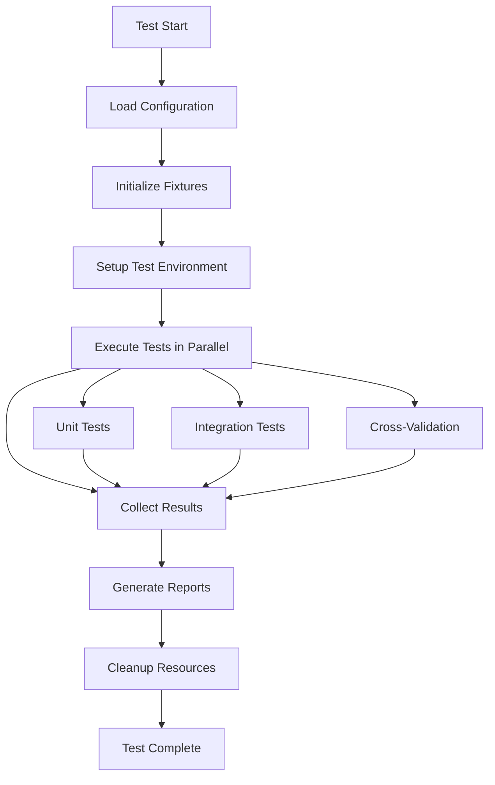

# Testing Framework Overview and Architecture

## Introduction

The BitNet.rs testing framework is a comprehensive testing solution designed to ensure the correctness, performance, and reliability of the BitNet.rs implementation. It provides multiple layers of testing including unit tests, integration tests, cross-implementation validation, and performance benchmarking.

## Architecture Overview

```
┌─────────────────────────────────────────────────────────────────┐
│                    Testing Framework Core                      │
├─────────────────────────────────────────────────────────────────┤
│ ┌─────────────────┐ ┌─────────────────┐ ┌─────────────────┐   │
│ │   Test Harness  │ │ Fixture Manager │ │  Config Manager │   │
│ │                 │ │                 │ │                 │   │
│ │ • Test execution│ │ • Data loading  │ │ • Test config   │   │
│ │ • Result collect│ │ • Caching       │ │ • Environment   │   │
│ │ • Parallel runs │ │ • Cleanup       │ │ • Validation    │   │
│ └─────────────────┘ └─────────────────┘ └─────────────────┘   │
├─────────────────────────────────────────────────────────────────┤
│ ┌─────────────────┐ ┌─────────────────┐ ┌─────────────────┐   │
│ │   Unit Tests    │ │ Integration     │ │ Cross-Impl      │   │
│ │                 │ │    Tests        │ │  Comparison     │   │
│ │ • Per-crate     │ │ • Workflows     │ │ • Rust vs C++   │   │
│ │ • API coverage  │ │ • Component     │ │ • Accuracy      │   │
│ │ • Edge cases    │ │   interaction   │ │ • Performance   │   │
│ └─────────────────┘ └─────────────────┘ └─────────────────┘   │
├─────────────────────────────────────────────────────────────────┤
│ ┌─────────────────┐ ┌─────────────────┐ ┌─────────────────┐   │
│ │   Reporting     │ │   CI/CD         │ │   Utilities     │   │
│ │                 │ │  Integration    │ │                 │   │
│ │ • Coverage      │ │ • GitHub Actions│ │ • Logging       │   │
│ │ • Metrics       │ │ • Caching       │ │ • Debugging     │   │
│ │ • Visualizations│ │ • Artifacts     │ │ • Helpers       │   │
│ └─────────────────┘ └─────────────────┘ └─────────────────┘   │
└─────────────────────────────────────────────────────────────────┘
```

## Core Components

### 1. Test Harness

The test harness (`tests/common/harness.rs`) is the central orchestrator for test execution:

- **Parallel Execution**: Manages concurrent test execution with configurable limits
- **Resource Management**: Handles test isolation and cleanup
- **Result Collection**: Aggregates test results and metrics
- **Error Handling**: Provides comprehensive error reporting and debugging information

Key features:
- Semaphore-based concurrency control
- Automatic fixture setup and cleanup
- Comprehensive metrics collection
- Pluggable reporter system

### 2. Fixture Management

The fixture manager (`tests/common/fixtures.rs`) handles test data lifecycle:

- **Automatic Downloads**: Downloads test models and data as needed
- **Integrity Verification**: Validates checksums and file integrity
- **Caching**: Efficient caching to avoid repeated downloads
- **Cleanup**: Automatic cleanup of old or unused fixtures

Supported fixture types:
- Model files (GGUF, SafeTensors)
- Test datasets
- Configuration files
- Reference outputs

### 3. Configuration System

The configuration manager (`tests/common/config.rs`) provides flexible test configuration:

- **Environment-based**: Supports different configurations for different environments
- **Hierarchical**: Allows override of default settings
- **Validation**: Ensures configuration consistency and validity
- **Documentation**: Self-documenting configuration schema

Configuration categories:
- Test execution parameters
- Fixture management settings
- Cross-validation configuration
- Reporting preferences

## Testing Layers

### Unit Tests

Unit tests focus on individual components and functions:

- **Per-crate Testing**: Each crate has comprehensive unit test coverage
- **API Coverage**: All public APIs are tested with various inputs
- **Edge Cases**: Boundary conditions and error scenarios
- **Property-based Testing**: Automated generation of test cases

Target coverage: >90% for all core crates

### Integration Tests

Integration tests validate component interactions:

- **Workflow Testing**: End-to-end inference workflows
- **Component Interaction**: Cross-crate communication
- **Configuration Testing**: Various configuration combinations
- **Resource Management**: Memory and resource usage validation

### Cross-Implementation Validation

Cross-validation ensures compatibility with the C++ reference implementation:

- **Accuracy Comparison**: Token-level output comparison
- **Performance Benchmarking**: Speed and memory usage comparison
- **Regression Detection**: Automated detection of performance regressions
- **First Mismatch Analysis**: Detailed analysis of differences

## Test Execution Flow



## Key Design Principles

### 1. Isolation
- Each test runs in isolation with its own resources
- No shared state between tests
- Automatic cleanup prevents test interference

### 2. Reproducibility
- Deterministic test execution
- Fixed random seeds where applicable
- Consistent test data and fixtures

### 3. Scalability
- Parallel execution for faster feedback
- Efficient resource utilization
- Configurable concurrency limits

### 4. Observability
- Comprehensive logging and metrics
- Detailed error reporting
- Performance monitoring

### 5. Maintainability
- Clear separation of concerns
- Modular architecture
- Extensive documentation

## Performance Characteristics

### Test Execution Times
- Unit tests: <5 minutes for full suite
- Integration tests: <10 minutes for full suite
- Cross-validation: <15 minutes for full suite
- Total test suite: <30 minutes

### Resource Usage
- Memory: Configurable limits per test
- CPU: Utilizes available cores efficiently
- Disk: Automatic cleanup of temporary files
- Network: Cached downloads minimize bandwidth usage

## Extension Points

The framework is designed for extensibility:

### Custom Test Types
- Implement `TestCase` trait for new test types
- Add custom metrics and reporting
- Integrate with external tools

### Custom Reporters
- Implement `TestReporter` trait
- Support for various output formats
- Integration with external systems

### Custom Fixtures
- Add new fixture types and sources
- Custom validation and processing
- Integration with external data sources

## Integration with CI/CD

The framework integrates seamlessly with continuous integration:

- **GitHub Actions**: Automated test execution on PR and push
- **Artifact Collection**: Test reports and coverage data
- **Caching**: Efficient caching of dependencies and test data
- **Notifications**: Automated notifications on test failures

## Monitoring and Observability

### Metrics Collection
- Test execution times
- Resource usage patterns
- Failure rates and trends
- Performance benchmarks

### Logging
- Structured logging with configurable levels
- Test execution tracing
- Error context and stack traces
- Performance profiling data

### Reporting
- HTML reports with interactive features
- JSON reports for machine processing
- JUnit XML for CI integration
- Markdown reports for documentation

This architecture provides a robust foundation for comprehensive testing while maintaining flexibility for future enhancements and extensions.
